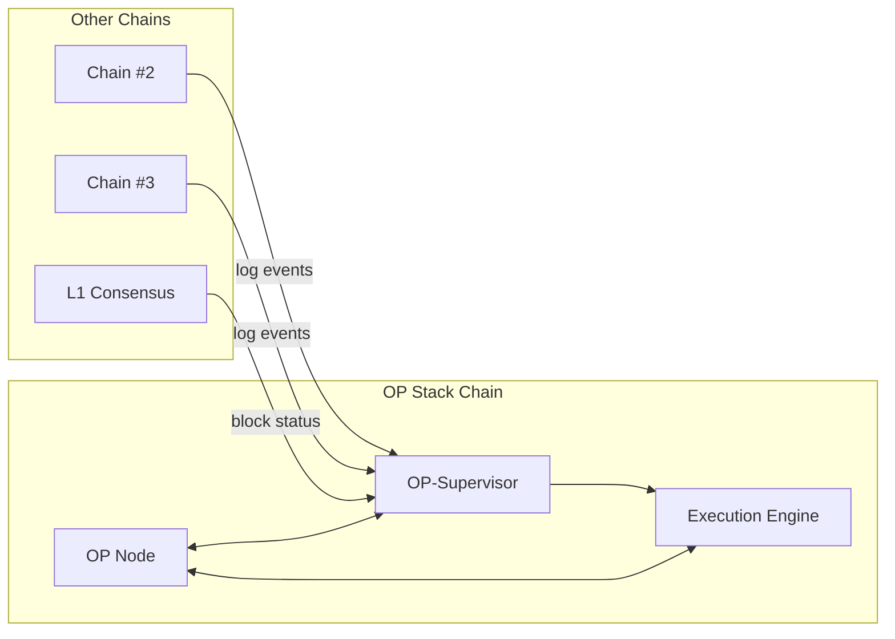

# Get Started with Superchain Interoperability

<Warning>
Superchain interoperability is currently in active development and not yet available in production.
</Warning>

Superchain interoperability is the next major scalability improvement to the OP Stack that enables a network of chains, the Superchain, to feel like a single blockchain.

## What is Superchain Interoperability?

Superchain interoperability is a set of protocols and services that lets OP Stack blockchains read each other's state. It provides:

- **Native Asset Movement**: ETH and ERC-20 tokens move securely between chains via native minting and burning
- **Cross-Chain Composability**: Apps can compose with data that exists on other chains  
- **Horizontal Scalability**: Applications can scale across multiple chains seamlessly

## Key Benefits

<CardGroup cols={2}>
  <Card title="Solve Liquidity Fragmentation" icon="droplet">
    No more wrapped tokens or complex liquidity pools - assets move natively between chains
  </Card>
  <Card title="1-Block Latency" icon="clock">
    Near-instant cross-chain interactions with minimal latency
  </Card>
  <Card title="Trust Minimized" icon="shield">
    Secure cross-chain messaging without additional trust assumptions
  </Card>
  <Card title="Seamless UX" icon="sparkles">
    Users experience the Superchain as a single unified blockchain
  </Card>
</CardGroup>

## Architecture Overview

Superchain interoperability is enabled by a new service called **OP Supervisor** that every node operator runs alongside their existing infrastructure:

## How Cross-Chain Messages Work

Cross-chain messages require two transactions:

1. **Initiating Message**: A transaction on the source chain creates a log event
2. **Executing Message**: A transaction on the destination chain calls `CrossL2Inbox` to execute or verify the message

<Steps>
  <Step title="Create Initiating Message">
    Execute a transaction on the source chain that emits a log event
  </Step>
  <Step title="Message Propagation">
    OP-Supervisor detects the log event and validates it happened on the source chain
  </Step>
  <Step title="Execute Message">
    Call `CrossL2Inbox` on the destination chain to execute the cross-chain message
  </Step>
</Steps>

## Safety Levels

Superchain interop introduces new safety levels for blocks:

- **Local Safe**: Block is written to L1
- **Cross Safe**: Block and all its dependencies are written to L1
- **Unsafe**: Block is shared via gossip protocol but not yet on L1

<Note>
Unsafe blocks require additional trust assumptions in the sequencer dependency set.
</Note>

## Next Steps

<CardGroup cols={2}>
  <Card title="Learn More" href="/interop/explainer" icon="book">
    Deep dive into the technical details of Superchain interoperability
  </Card>
  <Card title="Compatible Tokens" href="/interop/compatible-tokens" icon="coins">
    Understand which tokens work with native cross-chain transfers
  </Card>
  <Card title="Estimate Costs" href="/interop/estimate-costs" icon="calculator">
    Calculate the costs of cross-chain interactions
  </Card>
  <Card title="Development Tools" href="/interop/tools/supersim" icon="wrench">
    Set up your local development environment
  </Card>
</CardGroup> 