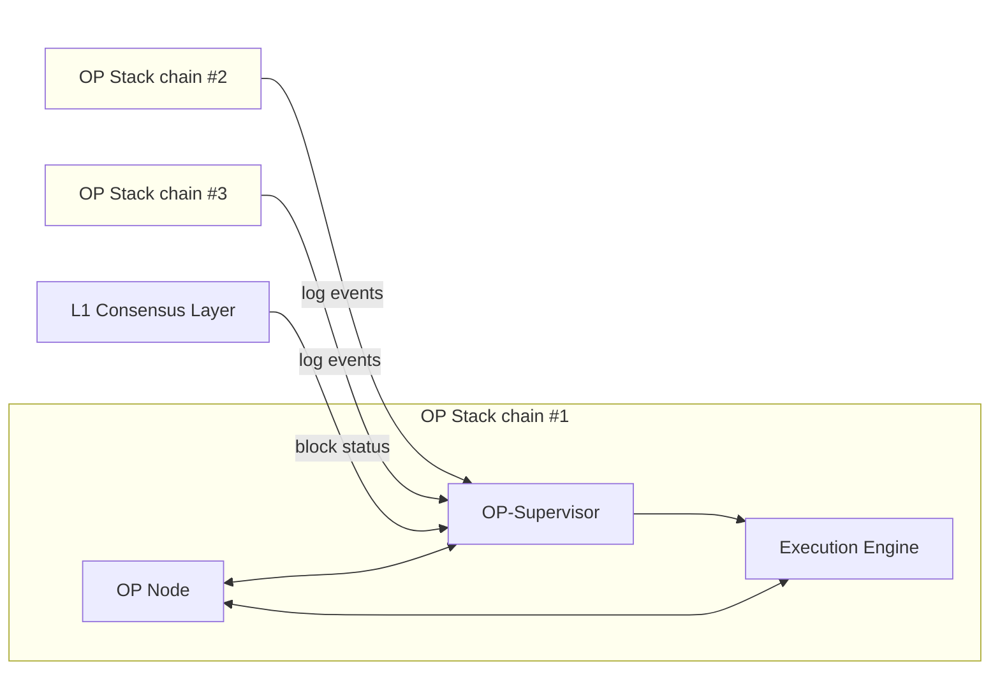
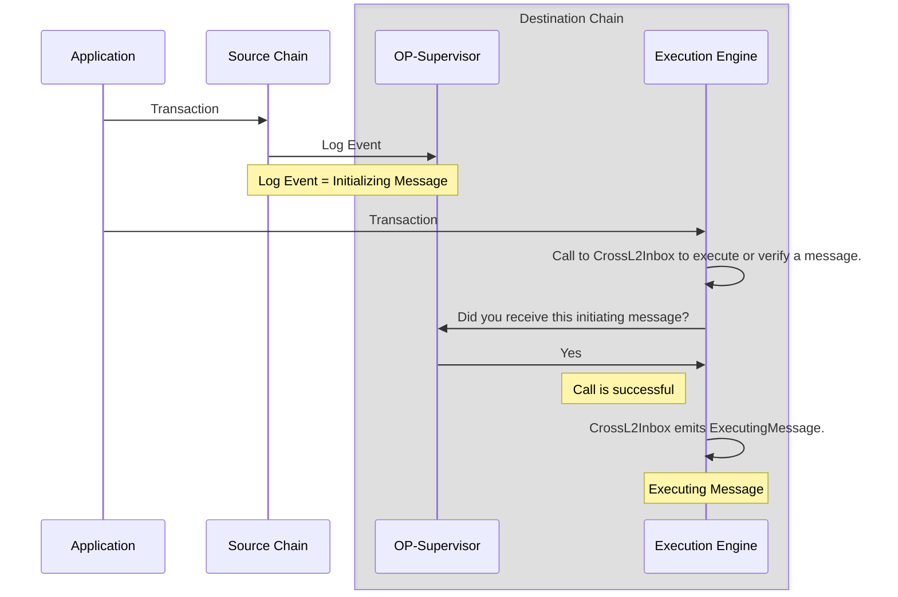

# Superchain Interoperability Explainer

<Warning>
Superchain interoperability is currently in active development and not yet available in production.
</Warning>

It is easy for a blockchain to be certain about information it generates itself. Information that comes from other sources is harder to provide in a safe, decentralized, and uncensorable manner (this is called [The Oracle Problem](https://chain.link/education-hub/oracle-problem)).

The next major scalability improvement to the OP Stack is to enable a network of chains, the Superchain, to feel like a single blockchain. This goal requires low-latency, seamless message passing and asset bridging.

## What is Superchain Interoperability?

*Superchain interoperability* is a set of protocols and services that lets OP Stack blockchains read each other's state. Superchain interoperability provides the following benefits:

- **Native Asset Movement**: ETH and ERC-20 tokens to move securely between chains via native minting and burning
- **Cross-Chain Composability**: Apps to compose with data that exist on other chains
- **Horizontal Scalability**: Applications can scale across multiple chains seamlessly

## Architecture

A pre-interop OP Stack node consists of two pieces of software: a consensus client (e.g. op-node) and an execution client, which is responsible for processing user transactions and constructing blocks (e.g. op-geth).

Superchain interoperability among OP Stack chains is enabled via a new service called **OP Supervisor**. Every node operator is expected to run this service in addition to the rollup node and execution client.

OP-Supervisor holds a database of all the log events of all the chains in the Superchain interoperability cluster. Every event can potentially initiate a cross-domain message, and it is the job of OP-Supervisor to validate that the log event really happened on the source chain.

## Cross-Chain Message Flow

Cross-domain messages require two transactions:

1. **Initiating Message**: Creates a log event on the source chain
2. **Executing Message**: Calls `CrossL2Inbox` on the destination chain

## Safety Levels

Superchain interop expands the scope of trust for unsafe blocks. The traditional safe level of a block is divided into two types:

<CardGroup cols={2}>
  <Card title="Local Safe" icon="check">
    Block is written to L1
  </Card>
  <Card title="Cross Safe" icon="shield">
    Block and all its dependencies are written to L1
  </Card>
</CardGroup>

### Trust Assumptions

- **Unsafe blocks**: Require trust in the sequencer dependency set
- **Safe blocks**: Trust minimized through L1 settlement
- **Finalized blocks**: Immune from reorgs

<Note>
Trust assumptions only apply to unsafe blocks, and only if the sequencer allows messages from unsafe blocks to be processed.
</Note>

## Interop Clusters

The interop protocol works via a dependency set which is configured on a per-chain basis. The dependency set defines the set of chains that can send and receive messages with a specific chain.

## Implementation Details

### CrossL2Inbox Contract

The `CrossL2Inbox` contract is a predeploy that handles cross-chain message execution. It can:

- Validate that a message exists on the source chain
- Execute contract calls if the message exists and is valid
- Emit events for successful message execution

### Message Identification

Messages are uniquely identified using:
- Chain ID of the source chain
- Block number containing the log event
- Index of the log event within that block
- Additional fields for sanity checking

## Next Steps

<CardGroup cols={2}>
  <Card title="Compatible Tokens" href="/interop/compatible-tokens" icon="coins">
    Learn about SuperchainERC20 tokens
  </Card>
  <Card title="Development Tools" href="/interop/tools/supersim" icon="wrench">
    Set up local development environment
  </Card>
  <Card title="Estimate Costs" href="/interop/estimate-costs" icon="calculator">
    Calculate cross-chain transaction costs
  </Card>
  <Card title="Get Started" href="/get-started/interop" icon="rocket">
    Start building with Superchain interoperability
  </Card>
</CardGroup> 