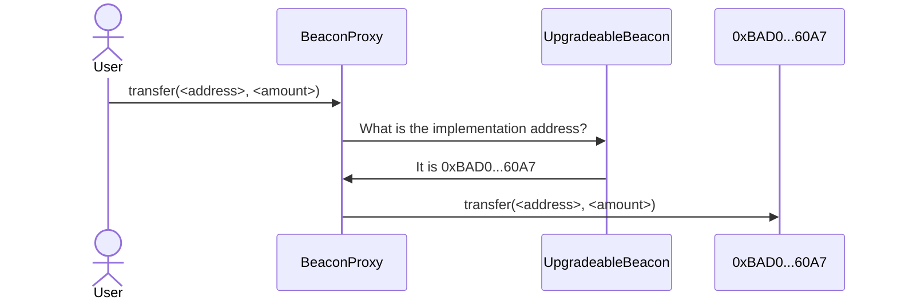
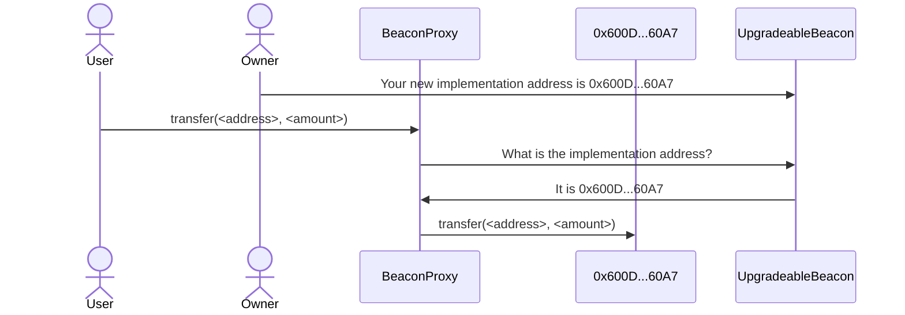

<Note>
  The SuperchainERC20 standard is ready for production deployments.
  Please note that the OP Stack interoperability upgrade, required for cross-chain messaging, is currently still in active development.
</Note>

# Contract upgrade

## Overview

This guide explains how to upgrade an ERC20 to a [`SuperchainERC20`](https://github.com/ethereum-optimism/optimism/blob/develop/packages/contracts-bedrock/src/L2/SuperchainERC20.sol) that can teleport across the [Superchain interop cluster](/interop/explainer#superchain-interop-cluster) when the original ERC20 contract was placed behind a proxy to enable future upgrades.

<details>
  <summary>About this tutorial</summary>

  **What you'll learn**

  *   How to upgrade an ERC20 token to enable Superchain interoperability when it was deployed with a proxy.

  **Prerequisite knowledge**

  *   You should already know how to [deploy SuperchainERC20 tokens with custom code](/interop/tutorials/).
</details>

<Callout type="warning">
  The code on the documentation site is sample code, *not* production code.
  This means that we ran it, and it works as advertised.
  However, it did not pass through the rigorous audit process that most Optimism code undergoes.
  You're welcome to use it, but if you need it for production purposes you should get it audited first.
</Callout>

{/* 

I put this warning here, when we don't have it on most pages, because this tutorial
has code that is a lot more likely to be used in production. It doesn't just
show what is possible, it does the exact job needed.

*/}

### What you'll do

*   Upgrade an existing ERC20 that uses [the proxy pattern](https://docs.openzeppelin.com/upgrades-plugins/proxies) to comply with interop requirements (with the proper authority).

## How beacon proxies work



A [beacon proxy](https://docs.openzeppelin.com/contracts/3.x/api/proxy#BeaconProxy) uses two contracts.
The [`UpgradeableBeacon`](https://github.com/OpenZeppelin/openzeppelin-contracts/blob/master/contracts/proxy/beacon/UpgradeableBeacon.sol) contract holds the address of the implementation contract.
The [`BeaconProxy`](https://github.com/OpenZeppelin/openzeppelin-contracts/blob/master/contracts/proxy/beacon/BeaconProxy.sol) contract is the one called for the functionality, the one that holds the storage.
When a user (or another contract) calls `BeaconProxy`, it asks `UpgradeableBeacon` for the implementation address and then uses [`delegatecall`](https://www.evm.codes/?fork=cancun#f4) to call that contract.



To upgrade the contract, an authorized address (typically the `Owner`) calls `UpgradeableBeacon` directly to specify the new implementation contract address.
After that happens, all new calls are sent to the new implementation.

## Instructions

Some steps depend on whether you want to deploy on [Supersim](/interop/tools/supersim) or on the [development network](/interop/tools/devnet).

<Steps>
  <Step title="Install and run Supersim">
  If you are going to use Supersim, [follow these instructions](/app-developers/tutorials/supersim/getting-started/installation) to install and run Supersim.
  
    <Callout>
      Make sure to run Supersim with autorelay on.
  
      ```sh
      ./supersim --interop.autorelay true
      ```
    </Callout>
  </Step>

  <Step title="Setup the ERC20 token on chain A">
  Download and run the setup script.
  
    ```sh
    curl https://docs.optimism.io/tutorials/setup-for-erc20-upgrade.sh > setup-for-erc20-upgrade.sh
    chmod +x setup-for-erc20-upgrade.sh
    ./setup-for-erc20-upgrade.sh
    ```
  
    If you want to deploy to the [development networks](/interop/tools/devnet), provide `setup-for-erc20-upgrade.sh` with the private key of an address with ETH on both devnets.
  
    ```sh
    ./setup-for-erc20-upgrade.sh <private key>
    ```
  </Step>

  <Step title="Store the addresses">
  Execute the bottom two lines of the setup script output to store the ERC20 address and the address of the beacon contract.
  
    ```sh
    BEACON_ADDRESS=0xe7f1725E7734CE288F8367e1Bb143E90bb3F0512
    export ERC20_ADDRESS=0x9fE46736679d2D9a65F0992F2272dE9f3c7fa6e0
    ```
  </Step>

  <Step title="Specify environment variables">
  Specify these variables, which we use later:
  
    <Tabs items={['Supersim', 'Devnets']}>
      <Tabs.Tab>
        Set these parameters for Supersim.
  
        ```sh
        PRIVATE_KEY=0xac0974bec39a17e36ba4a6b4d238ff944bacb478cbed5efcae784d7bf4f2ff80
        USER_ADDRESS=0xf39Fd6e51aad88F6F4ce6aB8827279cffFb92266
        URL_CHAIN_A=http://127.0.0.1:9545
        URL_CHAIN_B=http://127.0.0.1:9546
        INTEROP_BRIDGE=0x4200000000000000000000000000000000000028
        ```
      </Tabs.Tab>
  
      <Tabs.Tab>
        For Devnet, specify in `PRIVATE_KEY` the private key you used for the setup script and then these parameters.
  
        ```sh
        USER_ADDRESS=`cast wallet address --private-key $PRIVATE_KEY`
        URL_CHAIN_A=https://interop-alpha-0.optimism.io
        URL_CHAIN_B=https://interop-alpha-1.optimism.io
        INTEROP_BRIDGE=0x4200000000000000000000000000000000000028
        ```
      </Tabs.Tab>
    </Tabs>
  </Step>

  <Step title="Create a Foundry project">
  We create a [Foundry](https://book.getfoundry.sh/) project and import the [OpenZeppelin](https://www.openzeppelin.com/solidity-contracts) contracts, which were used for the original ERC20 and proxy deployment.
  
    ```sh
    mkdir proxy-upgrade
    cd proxy-upgrade
    forge init
    forge install OpenZeppelin/openzeppelin-contracts
    forge install OpenZeppelin/openzeppelin-contracts-upgradeable
    forge install ethereum-optimism/interop-lib
    ```
  </Step>

  <Step title="Create and run the deployment script">
  1.  Create an `script/LabSetup.s.sol` file with this content:
  
        ```solidity
cat > script/LabSetup.s.sol <<EOF
// SPDX-License-Identifier: UNLICENSED
pragma solidity ^0.8.20;

import {Script, console} from "forge-std/Script.sol";
import {UpgradeableBeacon} from "../lib/openzeppelin-contracts-upgradeable/lib/openzeppelin-contracts/contracts/proxy/beacon/UpgradeableBeacon.sol";
import {BeaconProxy} from "../lib/openzeppelin-contracts-upgradeable/lib/openzeppelin-contracts/contracts/proxy/beacon/BeaconProxy.sol";

import "@openzeppelin/contracts-upgradeable/token/ERC20/ERC20Upgradeable.sol";
import "@openzeppelin/contracts-upgradeable/access/OwnableUpgradeable.sol";
import "@openzeppelin/contracts-upgradeable/proxy/utils/Initializable.sol";

contract MyToken is Initializable, ERC20Upgradeable, OwnableUpgradeable {
    function initialize(string memory name, string memory symbol, uint256 initialSupply) public initializer {
        __ERC20_init(name, symbol);
        __Ownable_init(msg.sender);
        _mint(msg.sender, initialSupply);
    }
}

contract LabSetup is Script {
    function setUp() public {}

    function run() public {
        vm.startBroadcast();

        MyToken token = new MyToken();
        console.log("Token address:", address(token));
        console.log("msg.sender:", msg.sender);

        UpgradeableBeacon beacon = new UpgradeableBeacon(address(token), msg.sender);
        console.log("UpgradeableBeacon:", address(beacon));

        BeaconProxy proxy = new BeaconProxy(address(beacon),
            abi.encodeCall(MyToken.initialize, ("Test", "TST",
		(block.chainid == 901) || (block.chainid == 420120000) ? 10**18 : 0))
        );
        console.log("Proxy:", address(proxy));

        vm.stopBroadcast();
    }
```filename="script/LabSetup.s.sol"
        ```
  
        This is the same deployment script used for the original deployment on chain A.
  
    2.  Run this command to deploy the same contracts on chain B.
  
        ```sh
        forge script script/LabSetup.s.sol --rpc-url $URL_CHAIN_B --broadcast --private-key $PRIVATE_KEY --tc LabSetup
        ```
  
        Scroll up and see the Logs section of the output:
  
        ```
        == Logs ==
        Token address: 0x5FbDB2315678afecb367f032d93F642f64180aa3
        msg.sender: 0xf39Fd6e51aad88F6F4ce6aB8827279cffFb92266
        UpgradeableBeacon: 0xe7f1725E7734CE288F8367e1Bb143E90bb3F0512
        Proxy: 0x9fE46736679d2D9a65F0992F2272dE9f3c7fa6e0
        ```
  
        Verify that the proxy address is the same as `$ERC20_ADDRESS`, and that the beacon address is the same as `$BEACON_ADDRESS`.
  
        <details>
          <summary>What to do when the values are not the same</summary>
  
          This can happen when the nonce values of `0xf39Fd6e51aad88F6F4ce6aB8827279cffFb92266` (or your address in the case of using devnet) on chain A and chain B are different.
  
          You can see the nonce values using these commands:
  
          ```sh
          cast nonce $USER_ADDRESS --rpc-url $URL_CHAIN_A
          cast nonce $USER_ADDRESS --rpc-url $URL_CHAIN_B
          ```
  
          The easiest solution is to send transactions to the chain with the lower nonce until the nonces are equal, and then deploy to both chains.
  
          ```sh
          forge script script/LabSetup.s.sol --rpc-url $URL_CHAIN_A --broadcast --private-key $PRIVATE_KEY --tc LabSetup
          forge script script/LabSetup.s.sol --rpc-url $URL_CHAIN_B --broadcast --private-key $PRIVATE_KEY --tc LabSetup
          ```
  
          If you do this, remember to update `$ERC20_ADDRESS` and `$BEACON_ADDRESS`.
  
          If the nonce on chain B is already higher than the nonce was on chain A when the original proxy contract was deployed this method is not available and you have to either create a special bridge or [use a lockbox](/interop/tutorials/upgrade-to-superchain-erc20/lockbox).
        </details>
  </Step>

  <Step title="Deploy ERC7802 contracts">
  We need to replace the ERC20 contracts with contracts that:
  
    *   Support [ERC7802](https://eips.ethereum.org/EIPS/eip-7802) and [ERC165](https://eips.ethereum.org/EIPS/eip-165).
    *   Have the same storage layout as the ERC20 contracts they replace.
  
    <Callout>
      These contracts do *not* need to be deployed to the same address.
      The address that needs to be the same is not the address of the ERC20 contract itself, but of the proxy.
    </Callout>
  
    1.  Create a file, `src/InteropToken.sol`:
  
        ```solidity
pragma solidity ^0.8.28;

import "@openzeppelin/contracts-upgradeable/token/ERC20/ERC20Upgradeable.sol";
import "@openzeppelin/contracts-upgradeable/access/OwnableUpgradeable.sol";
import "@openzeppelin/contracts-upgradeable/proxy/utils/Initializable.sol";
import {IERC7802, IERC165} from "lib/interop-lib/src/interfaces/IERC7802.sol";
import {PredeployAddresses} from "lib/interop-lib/src/libraries/PredeployAddresses.sol";

contract InteropToken is Initializable, ERC20Upgradeable, OwnableUpgradeable, IERC7802 {
    function initialize(string memory name, string memory symbol, uint256 initialSupply) public initializer {
        __ERC20_init(name, symbol);
        __Ownable_init(msg.sender);
        _mint(msg.sender, initialSupply);
    }

    /// @notice Allows the SuperchainTokenBridge to mint tokens.
    /// @param _to     Address to mint tokens to.
    /// @param _amount Amount of tokens to mint.
    function crosschainMint(address _to, uint256 _amount) external {
        require(msg.sender == PredeployAddresses.SUPERCHAIN_TOKEN_BRIDGE, "Unauthorized");

        _mint(_to, _amount);

        emit CrosschainMint(_to, _amount, msg.sender);
    }

    /// @notice Allows the SuperchainTokenBridge to burn tokens.
    /// @param _from   Address to burn tokens from.
    /// @param _amount Amount of tokens to burn.
    function crosschainBurn(address _from, uint256 _amount) external {
        require(msg.sender == PredeployAddresses.SUPERCHAIN_TOKEN_BRIDGE, "Unauthorized");

        _burn(_from, _amount);

        emit CrosschainBurn(_from, _amount, msg.sender);
    }

    /// @inheritdoc IERC165
    function supportsInterface(bytes4 _interfaceId) public view virtual returns (bool) {
        return _interfaceId == type(IERC7802).interfaceId || _interfaceId == type(IERC20).interfaceId
            || _interfaceId == type(IERC165).interfaceId;
    }
}
```filename="src/InteropToken.sol"
        ```
  
        <details>
          <summary>Detailed explanation</summary>
  
          ```solidity
pragma solidity ^0.8.28;

import "@openzeppelin/contracts-upgradeable/token/ERC20/ERC20Upgradeable.sol";
import "@openzeppelin/contracts-upgradeable/access/OwnableUpgradeable.sol";
import "@openzeppelin/contracts-upgradeable/proxy/utils/Initializable.sol";
``````
  
          Most of the code is identical to the original `MyToken`.
  
          ```solidity
import {IERC7802, IERC165} from "lib/interop-lib/src/interfaces/IERC7802.sol";
import {PredeployAddresses} from "lib/interop-lib/src/libraries/PredeployAddresses.sol";
``````
  
          These are the imports needed for ERC7802 support.
          We need `IERC165` for documentation purposes, and `IERC7802` for the ERC7802 events.
  
          ```solidity
contract InteropToken is Initializable, ERC20Upgradeable, OwnableUpgradeable, IERC7802 {
``````
  
          We also implement [ERC165](https://eips.ethereum.org/EIPS/eip-165), but we don't need to import anything from there.
  
          ```solidity
    function initialize(string memory name, string memory symbol, uint256 initialSupply) public initializer {
        __ERC20_init(name, symbol);
        __Ownable_init(msg.sender);
        _mint(msg.sender, initialSupply);
    }
``````
  
          This function is identical to the one in `MyToken`.
  
          ```solidity
    /// @notice Allows the SuperchainTokenBridge to mint tokens.
    /// @param _to     Address to mint tokens to.
    /// @param _amount Amount of tokens to mint.
    function crosschainMint(address _to, uint256 _amount) external {
        require(msg.sender == PredeployAddresses.SUPERCHAIN_TOKEN_BRIDGE, "Unauthorized");

        _mint(_to, _amount);

        emit CrosschainMint(_to, _amount, msg.sender);
    }

    /// @notice Allows the SuperchainTokenBridge to burn tokens.
    /// @param _from   Address to burn tokens from.
    /// @param _amount Amount of tokens to burn.
    function crosschainBurn(address _from, uint256 _amount) external {
        require(msg.sender == PredeployAddresses.SUPERCHAIN_TOKEN_BRIDGE, "Unauthorized");

        _burn(_from, _amount);

        emit CrosschainBurn(_from, _amount, msg.sender);
    }
``````
  
          Standard [ERC7802](https://eips.ethereum.org/EIPS/eip-7802) behavior.
  
          ```solidity
    /// @inheritdoc IERC165
    function supportsInterface(bytes4 _interfaceId) public view virtual returns (bool) {
        return _interfaceId == type(IERC7802).interfaceId || _interfaceId == type(IERC20).interfaceId
            || _interfaceId == type(IERC165).interfaceId;
    }
``````
  
          Standard [ERC165](https://eips.ethereum.org/EIPS/eip-165) behavior.
        </details>
  
        <Callout>
          Copying the original ERC20 token code with minimal differences is one method to keep the storage layout identical.
          Alternatively, if you want to use a different contract, such as `SuperchainERC20`, you can modify the storage layout to match the old one using [the Solidity docs](https://docs.soliditylang.org/en/latest/internals/layout_in_storage.html).
        </Callout>
  
    2.  Deploy this contract on both chains, and store the addresses (which may or may not be the same).
  
        ```sh
        ERC7802_A=`forge create InteropToken --private-key $PRIVATE_KEY --rpc-url $URL_CHAIN_A --broadcast | awk '/Deployed to:/ {print $3}'`
        ERC7802_B=`forge create InteropToken --private-key $PRIVATE_KEY --rpc-url $URL_CHAIN_B --broadcast | awk '/Deployed to:/ {print $3}'`
        ```
  </Step>

  <Step title="Update proxies">
  Notify the beacon contracts of the new implementation contracts.
  
    ```sh
    cast send $BEACON_ADDRESS --private-key $PRIVATE_KEY "upgradeTo(address)" $ERC7802_A --rpc-url $URL_CHAIN_A
    cast send $BEACON_ADDRESS --private-key $PRIVATE_KEY "upgradeTo(address)" $ERC7802_B --rpc-url $URL_CHAIN_B  
    ```
  </Step>

  <Step title="Verification">
  1.  See your balance on chain A.
  
        ```sh
        cast call $ERC20_ADDRESS "balanceOf(address)" $USER_ADDRESS --rpc-url $URL_CHAIN_A | cast from-wei
        ```
  
    2.  See your balance on chain B.
  
        ```sh
        cast call $ERC20_ADDRESS "balanceOf(address)" $USER_ADDRESS --rpc-url $URL_CHAIN_B | cast from-wei
        ```
  
    3.  Transfer 0.1 token.
  
        ```sh
        AMOUNT=`echo 0.1 | cast to-wei`
        cast send $INTEROP_BRIDGE --rpc-url $URL_CHAIN_A --private-key $PRIVATE_KEY "sendERC20(address,address,uint256,uint256)" $ERC20_ADDRESS $USER_ADDRESS $AMOUNT `cast chain-id --rpc-url $URL_CHAIN_B`
        ```
  
    4.  See the new balances. Chain A should have 0.9 tokens, and Chain B should have 0.1 tokens.
  
        ```sh
        cast call $ERC20_ADDRESS "balanceOf(address)" $USER_ADDRESS --rpc-url $URL_CHAIN_A | cast from-wei
        cast call $ERC20_ADDRESS "balanceOf(address)" $USER_ADDRESS --rpc-url $URL_CHAIN_B | cast from-wei
        ```
  </Step>
</Steps>

## Next steps

*   Deploy a [SuperchainERC20](/interop/tutorials/deploy-superchain-erc20) to the Superchain
*   [Learn more about SuperchainERC20](/interop/superchain-erc20)
*   Build a [revolutionary app](/app-developers/get-started) that uses multiple blockchains within the Superchain
