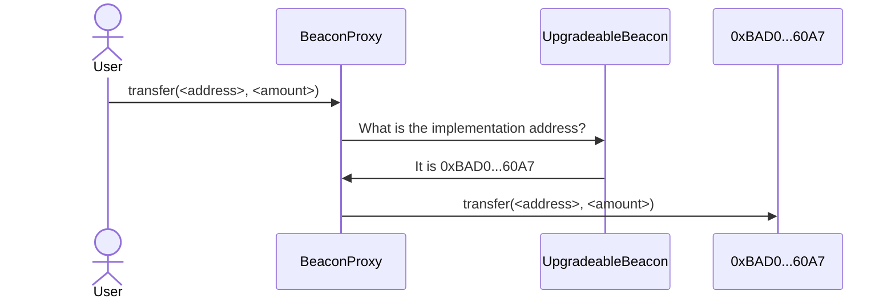
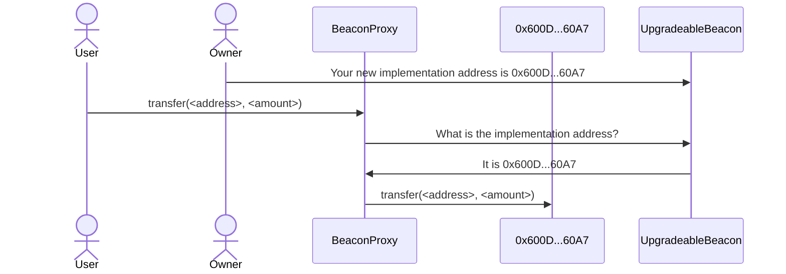

# Building a custom bridge

## Overview

Sometimes the address of an ERC20 contract is not available on a different chain.
This means that the [SuperchainTokenBridge](/interop/superchain-erc20) is not an option.
However, if the original ERC20 contract is behind a proxy (so we can add [ERC7802](https://eips.ethereum.org/EIPS/eip-7802) support), we can still use interop by writing our own bridge.

<details>
  <summary>About this tutorial</summary>

  **What you'll learn**

  *   How to use [interop message passing](/interop/tutorials/message-passing) to create a custom bridge.

  **Prerequisite knowledge**

  *   How to [deploy SuperchainERC20 tokens with custom code](/interop/tutorials/custom-superchain-erc20).
  *   How to [transfer interop messages](/interop/tutorials/message-passing).
</details>

<Info>
  The code on the documentation site is sample code, *not* production code.
  This means that we ran it, and it works as advertised.
  However, it did not pass through the rigorous audit process that most Optimism code undergoes.
  You're welcome to use it, but if you need it for production purposes you should get it audited first.
</Info>

<!-- 

I put this warning here, when we don't have it on most pages, because this tutorial
has code that is a lot more likely to be used in production. It doesn't just
show what is possible, it does the exact job needed.

-->

## How beacon proxies work



A [beacon proxy](https://docs.openzeppelin.com/contracts/3.x/api/proxy#BeaconProxy) uses two contracts.
The [`UpgradeableBeacon`](https://github.com/OpenZeppelin/openzeppelin-contracts/blob/master/contracts/proxy/beacon/UpgradeableBeacon.sol) contract holds the address of the implementation contract.
The [`BeaconProxy`](https://github.com/OpenZeppelin/openzeppelin-contracts/blob/master/contracts/proxy/beacon/BeaconProxy.sol) contract is the one called for the functionality, the one that holds the storage.
When a user (or another contract) calls `BeaconProxy`, it asks `UpgradeableBeacon` for the implementation address and then uses [`delegatecall`](https://www.evm.codes/?fork=cancun#f4) to call that contract.



To upgrade the contract, an authorized address (typically the `Owner`) calls `UpgradeableBeacon` directly to specify the new implementation contract address.
After that happens, all new calls are sent to the new implementation.

## Instructions

Some steps depend on whether you want to deploy on [Supersim](/interop/tools/supersim) or on the [development network](/interop/tools/devnet).

<Steps>
  <Step title="Install and run Supersim">
  If you are going to use Supersim, [follow these instructions](/app-developers/tutorials/supersim/getting-started/installation) to install and run Supersim.
  
    <Info>
      Make sure to run Supersim with autorelay on.
  
      ```sh
      ./supersim --interop.autorelay true
      ```
    </Info>
  </Step>

  <Step title="Set up the ERC20 token on chain A">
  Download and run the setup script.
  
    ```sh
    curl https://docs.optimism.io/tutorials/setup-for-erc20-upgrade.sh > setup-for-erc20-upgrade.sh
    chmod +x setup-for-erc20-upgrade.sh
    ./setup-for-erc20-upgrade.sh
    ```
  
    If you want to deploy to the [development networks](/interop/tools/devnet), provide `setup-for-erc20-upgrade.sh` with the private key of an address with ETH on both devnets.
  
    ```sh
    ./setup-for-erc20-upgrade.sh <private key>
    ```
  </Step>

  <Step title="Store the addresses">
  Execute the bottom two lines of the setup script output to store the ERC20 address and the address of the beacon contract.
  
    ```sh
    BEACON_ADDRESS=0xe7f1725E7734CE288F8367e1Bb143E90bb3F0512
    export ERC20_ADDRESS=0x9fE46736679d2D9a65F0992F2272dE9f3c7fa6e0
    ```
  </Step>

  <Step title="Specify environment variables">
  Specify these variables, which we use later:
  
    <Tabs items={['Supersim', 'Devnets']}>
      <Tabs.Tab>
        Set these parameters for Supersim.
  
        ```sh
        PRIVATE_KEY=0xac0974bec39a17e36ba4a6b4d238ff944bacb478cbed5efcae784d7bf4f2ff80
        USER_ADDRESS=0xf39Fd6e51aad88F6F4ce6aB8827279cffFb92266
        URL_CHAIN_A=http://127.0.0.1:9545
        URL_CHAIN_B=http://127.0.0.1:9546
        ```
      </Tabs.Tab>
  
      <Tabs.Tab>
        For Devnet, specify in `PRIVATE_KEY` the private key you used for the setup script and then these parameters.
  
        ```sh
        USER_ADDRESS=`cast wallet address --private-key $PRIVATE_KEY`
        URL_CHAIN_A=https://interop-alpha-0.optimism.io
        URL_CHAIN_B=https://interop-alpha-1.optimism.io
        ```
      </Tabs.Tab>
    </Tabs>
  </Step>

  <Step title="Advance the user's nonce on chain B">
  This solution is necessary when the nonce on chain B is higher than it was on chain A when the proxy for the ERC-20 contract was installed.
    To simulate this situation, we send a few meaningless transactions on chain B and then see that the nonce on B is higher than the nonce on A.
  
    ```sh
    cast send $USER_ADDRESS --private-key $PRIVATE_KEY --rpc-url $URL_CHAIN_B
    cast send $USER_ADDRESS --private-key $PRIVATE_KEY --rpc-url $URL_CHAIN_B
    cast send $USER_ADDRESS --private-key $PRIVATE_KEY --rpc-url $URL_CHAIN_B
    cast send $USER_ADDRESS --private-key $PRIVATE_KEY --rpc-url $URL_CHAIN_B
    echo -n Nonce on chain A:
    cast nonce $USER_ADDRESS --rpc-url $URL_CHAIN_A
    echo -n Nonce on chain B:
    cast nonce $USER_ADDRESS --rpc-url $URL_CHAIN_B
    ```
  </Step>

  <Step title="Create a Foundry project">
  Create a [Foundry](https://book.getfoundry.sh/) project and import the [OpenZeppelin](https://www.openzeppelin.com/solidity-contracts) contracts used for the original ERC20 and proxy deployment.
  
    ```sh
    mkdir custom-bridge
    cd custom-bridge
    forge init
    forge install OpenZeppelin/openzeppelin-contracts
    forge install OpenZeppelin/openzeppelin-contracts-upgradeable
    forge install ethereum-optimism/interop-lib
    ```
  </Step>

  <Step title="Deploy proxies">
  We need two contracts on each chain: an ERC20 and a bridge, and to enable future upgrades, we want to install each of those contracts behind a proxy.
    You already have one contract—the ERC20 on chain A—but need to create the other three.
  
    There's an interesting [chicken-and-egg](https://en.wikipedia.org/wiki/Chicken_or_the_egg) issue here.
    To create a proxy, we need the address of the implementation contract, the one with the actual code.
    However, the bridge and ERC20 code needs to have the proxy addresses.
    One possible solution is to choose a pre-existing contract, and use that as the implementation contract until we can upgrade.
    Every OP Stack chain has [predeploys](https://specs.optimism.io/protocol/predeploys.html) we can use for this purpose.
  
    ```sh
    DUMMY_ADDRESS=0x4200000000000000000000000000000000000000
    UPGRADE_BEACON_CONTRACT=lib/openzeppelin-contracts-upgradeable/lib/openzeppelin-contracts/contracts/proxy/beacon/UpgradeableBeacon.sol:UpgradeableBeacon
    PROXY_CONTRACT=lib/openzeppelin-contracts-upgradeable/lib/openzeppelin-contracts/contracts/proxy/beacon/BeaconProxy.sol:BeaconProxy
    BRIDGE_BEACON_ADDRESS_A=`forge create $UPGRADE_BEACON_CONTRACT --broadcast --rpc-url $URL_CHAIN_A --private-key $PRIVATE_KEY --constructor-args $DUMMY_ADDRESS $USER_ADDRESS | awk '/Deployed to:/ {print $3}'`
    BRIDGE_ADDRESS_A=`forge create $PROXY_CONTRACT --broadcast --rpc-url $URL_CHAIN_A --private-key $PRIVATE_KEY --constructor-args $BRIDGE_BEACON_ADDRESS_A 0x | awk '/Deployed to:/ {print $3}'`
    BRIDGE_BEACON_ADDRESS_B=`forge create $UPGRADE_BEACON_CONTRACT --broadcast --rpc-url $URL_CHAIN_B --private-key $PRIVATE_KEY --constructor-args $DUMMY_ADDRESS $USER_ADDRESS | awk '/Deployed to:/ {print $3}'`
    BRIDGE_ADDRESS_B=`forge create $PROXY_CONTRACT --broadcast --rpc-url $URL_CHAIN_B --private-key $PRIVATE_KEY --constructor-args $BRIDGE_BEACON_ADDRESS_B 0x | awk '/Deployed to:/ {print $3}'`
    ERC20_BEACON_ADDRESS_A=$BEACON_ADDRESS
    ERC20_ADDRESS_A=$ERC20_ADDRESS
    ERC20_BEACON_ADDRESS_B=`forge create $UPGRADE_BEACON_CONTRACT --broadcast --rpc-url $URL_CHAIN_B --private-key $PRIVATE_KEY --constructor-args $DUMMY_ADDRESS $USER_ADDRESS | awk '/Deployed to:/ {print $3}'`
    ERC20_ADDRESS_B=`forge create $PROXY_CONTRACT --broadcast --rpc-url $URL_CHAIN_B --private-key $PRIVATE_KEY --constructor-args $ERC20_BEACON_ADDRESS_B 0x | awk '/Deployed to:/ {print $3}'`  
    ```
  </Step>

  <Step title="Deploy ERC7802 contracts">
  Replace the ERC20 contracts with contracts that:
  
    *   Support [ERC7802](https://eips.ethereum.org/EIPS/eip-7802) and [ERC165](https://eips.ethereum.org/EIPS/eip-165).
    *   Allow the bridge address to mint and burn tokens.
        Normally this is `PredeployAddresses.SUPERCHAIN_TOKEN_BRIDGE`, but in our case it would be the bridge proxy address, which we'll store in `bridgeAddress`.
    *   Have the same storage layout as the ERC20 contracts they replace (in the case of chain A).
  
    1.  Create a file, `src/InteropToken.sol`.
  
        ```solidity
pragma solidity ^0.8.28;

import "@openzeppelin/contracts-upgradeable/token/ERC20/ERC20Upgradeable.sol";
import "@openzeppelin/contracts-upgradeable/access/OwnableUpgradeable.sol";
import "@openzeppelin/contracts-upgradeable/proxy/utils/Initializable.sol";
import {IERC7802, IERC165} from "lib/interop-lib/src/interfaces/IERC7802.sol";
import {PredeployAddresses} from "lib/interop-lib/src/libraries/PredeployAddresses.sol";

contract InteropToken is Initializable, ERC20Upgradeable, OwnableUpgradeable, IERC7802 {
    function initialize(string memory name, string memory symbol, uint256 initialSupply) public initializer {
        __ERC20_init(name, symbol);
        __Ownable_init(msg.sender);
        _mint(msg.sender, initialSupply);
    }

    /// @notice Allows the SuperchainTokenBridge to mint tokens.
    /// @param _to     Address to mint tokens to.
    /// @param _amount Amount of tokens to mint.
    function crosschainMint(address _to, uint256 _amount) external {
        require(msg.sender == PredeployAddresses.SUPERCHAIN_TOKEN_BRIDGE, "Unauthorized");

        _mint(_to, _amount);

        emit CrosschainMint(_to, _amount, msg.sender);
    }

    /// @notice Allows the SuperchainTokenBridge to burn tokens.
    /// @param _from   Address to burn tokens from.
    /// @param _amount Amount of tokens to burn.
    function crosschainBurn(address _from, uint256 _amount) external {
        require(msg.sender == PredeployAddresses.SUPERCHAIN_TOKEN_BRIDGE, "Unauthorized");

        _burn(_from, _amount);

        emit CrosschainBurn(_from, _amount, msg.sender);
    }

    /// @inheritdoc IERC165
    function supportsInterface(bytes4 _interfaceId) public view virtual returns (bool) {
        return _interfaceId == type(IERC7802).interfaceId || _interfaceId == type(IERC20).interfaceId
            || _interfaceId == type(IERC165).interfaceId;
    }
}
```filename="src/InteropToken.sol"
        ```
  
    2.  This `src/InteropToken.sol` is used for contract upgrades when the ERC20 contracts are at the same address.
        Here we need to edit it to allow our custom bridge to mint and burn tokens instead of the predeployed superchain token bridge.
  
        *   On lines 20 and 31 replace ~~`PredeployAddresses.SUPERCHAIN_TOKEN_BRIDGE`~~ with `bridgeAddress`.
  
            ```solidity
            require(msg.sender == bridgeAddress, "Unauthorized");
            ```
  
        *   Add these lines anywhere in the contract:
  
            ```solidity
                address public immutable bridgeAddress;
  
                constructor(address bridgeAddress_) {
                    bridgeAddress = bridgeAddress_;
                }
            ```
  
    3.  Deploy `InteropToken` on both chains, with the bridge address.
  
        ```sh
        INTEROP_TOKEN_A=`forge create InteropToken --private-key $PRIVATE_KEY --broadcast --rpc-url $URL_CHAIN_A --constructor-args $BRIDGE_ADDRESS_A | awk '/Deployed to:/ {print $3}'`
        INTEROP_TOKEN_B=`forge create InteropToken --private-key $PRIVATE_KEY --broadcast --rpc-url $URL_CHAIN_B --constructor-args $BRIDGE_ADDRESS_B | awk '/Deployed to:/ {print $3}'`
        ```
  
    4.  Update the proxies to the new implementations.
  
        ```sh
        cast send $ERC20_BEACON_ADDRESS_A "upgradeTo(address)" $INTEROP_TOKEN_A --private-key $PRIVATE_KEY --rpc-url $URL_CHAIN_A
        cast send $ERC20_BEACON_ADDRESS_B "upgradeTo(address)" $INTEROP_TOKEN_B --private-key $PRIVATE_KEY --rpc-url $URL_CHAIN_B
        ```
  </Step>

  <Step title="Deploy the actual bridge">
  1.  Create a file, `src/CustomBridge.sol`.
        This file is based on the standard `SuperchainERC20`  [`SuperchainTokenBridge.sol`](https://github.com/ethereum-optimism/optimism/blob/develop/packages/contracts-bedrock/src/L2/SuperchainTokenBridge.sol).
  
        ```solidity
// SPDX-License-Identifier: MIT
pragma solidity 0.8.25;

// Libraries
import { PredeployAddresses } from "interop-lib/src/libraries/PredeployAddresses.sol";

// Interfaces
import { IERC7802, IERC165 } from "interop-lib/src/interfaces/IERC7802.sol";
import { IL2ToL2CrossDomainMessenger } from "interop-lib/src/interfaces/IL2ToL2CrossDomainMessenger.sol";

/// @custom:proxied true
/// @title CustomBridge
contract CustomBridge {
    // Immutable configuration
    address public immutable tokenAddressHere;
    address public immutable tokenAddressThere;
    uint256 public immutable chainIdThere;
    address public immutable bridgeAddressThere;

    error ZeroAddress();
    error Unauthorized();

    /// @notice Thrown when attempting to relay a message and the cross domain message sender is not the
    /// SuperchainTokenBridge.
    error InvalidCrossDomainSender();

    /// @notice Emitted when tokens are sent from one chain to another.
    /// @param token         Address of the token sent.
    /// @param from          Address of the sender.
    /// @param to            Address of the recipient.
    /// @param amount        Number of tokens sent.
    /// @param destination   Chain ID of the destination chain.
    event SendERC20(
        address indexed token, address indexed from, address indexed to, uint256 amount, uint256 destination
    );

    /// @notice Emitted whenever tokens are successfully relayed on this chain.
    /// @param token         Address of the token relayed.
    /// @param from          Address of the msg.sender of sendERC20 on the source chain.
    /// @param to            Address of the recipient.
    /// @param amount        Amount of tokens relayed.
    /// @param source        Chain ID of the source chain.
    event RelayERC20(address indexed token, address indexed from, address indexed to, uint256 amount, uint256 source);

    /// @notice Address of the L2ToL2CrossDomainMessenger Predeploy.
    address internal constant MESSENGER = PredeployAddresses.L2_TO_L2_CROSS_DOMAIN_MESSENGER;

    // Setup the configuration
    constructor(
        address tokenAddressHere_,
        address tokenAddressThere_,
        uint256 chainIdThere_,
        address bridgeAddressThere_        
    ) {
        if (
            tokenAddressHere_ == address(0) ||
            tokenAddressThere_ == address(0) ||
            bridgeAddressThere_ == address(0)
        ) revert ZeroAddress();

        tokenAddressHere = tokenAddressHere_;
        tokenAddressThere = tokenAddressThere_;
        chainIdThere = chainIdThere_;
        bridgeAddressThere = bridgeAddressThere_;
    }    

    /// @notice Sends tokens to a target address on another chain.
    /// @dev Tokens are burned on the source chain.
    /// @param _to       Address to send tokens to.
    /// @param _amount   Amount of tokens to send.
    /// @return msgHash_ Hash of the message sent.
    function sendERC20(
        address _to,
        uint256 _amount
    )
        external
        returns (bytes32 msgHash_)
    {
        if (_to == address(0)) revert ZeroAddress();

        IERC7802(tokenAddressHere).crosschainBurn(msg.sender, _amount);

        bytes memory message = abi.encodeCall(this.relayERC20, (msg.sender, _to, _amount));
        msgHash_ = IL2ToL2CrossDomainMessenger(MESSENGER).sendMessage(chainIdThere, bridgeAddressThere, message);

        emit SendERC20(tokenAddressHere, msg.sender, _to, _amount, chainIdThere);
    }

    /// @notice Relays tokens received from another chain.
    /// @dev Tokens are minted on the destination chain.
    /// @param _from    Address of the msg.sender of sendERC20 on the source chain.
    /// @param _to      Address to relay tokens to.
    /// @param _amount  Amount of tokens to relay.
    function relayERC20(address _from, address _to, uint256 _amount) external {
        if (msg.sender != MESSENGER) revert Unauthorized();

        (address crossDomainMessageSender, uint256 source) =
            IL2ToL2CrossDomainMessenger(MESSENGER).crossDomainMessageContext();

        if (crossDomainMessageSender != bridgeAddressThere) revert InvalidCrossDomainSender();
        if (source != chainIdThere) revert InvalidCrossDomainSender();

        IERC7802(tokenAddressHere).crosschainMint(_to, _amount);

        emit RelayERC20(tokenAddressHere, _from, _to, _amount, chainIdThere);
    }
}
```filename="src/CustomBridge.sol"
        ```
  
        <details>
            <summary>Explanation</summary>
  
            These are the main differences between the generic bridge and our implementation.
  
            ```solidity
    // Immutable configuration
    address public immutable tokenAddressHere;
    address public immutable tokenAddressThere;
    uint256 public immutable chainIdThere;
    address public immutable bridgeAddressThere;
```
  
            The configuration is [`immutable`](https://docs.soliditylang.org/en/latest/contracts.html#immutable).
            We are deploying the contract behind a proxy, so if we need to change it we can deploy a different contract.
  
            These parameters assume there are only two chains in the interop cluster.
            If there are more, change the `There` variables to array.
  
            ```solidity
    // Setup the configuration
    constructor(
        address tokenAddressHere_,
        address tokenAddressThere_,
        uint256 chainIdThere_,
        address bridgeAddressThere_        
    ) {
        if (
            tokenAddressHere_ == address(0) ||
            tokenAddressThere_ == address(0) ||
            bridgeAddressThere_ == address(0)
        ) revert ZeroAddress();

        tokenAddressHere = tokenAddressHere_;
        tokenAddressThere = tokenAddressThere_;
        chainIdThere = chainIdThere_;
        bridgeAddressThere = bridgeAddressThere_;
    }    
```
  
            The constructor writes the configuration parameters.
  
            ```solidity
    function sendERC20(
        address _to,
        uint256 _amount
    )
```
  
            We don't need to specify the token address, or the chain ID on the other side, because they are hardwired in this bridge.
  
            ```solidity
        emit SendERC20(tokenAddressHere, msg.sender, _to, _amount, chainIdThere);
```
  
            Emit the same log entry that would be emitted by the standard bridge.
  
            ```solidity
        if (crossDomainMessageSender != bridgeAddressThere) revert InvalidCrossDomainSender();
        if (source != chainIdThere) revert InvalidCrossDomainSender();
```
  
            Make sure any relay requests come from the correct contract on the correct chain.
        </details>
  
    2.  Get the chainID values.
  
        ```sh
        CHAINID_A=`cast chain-id --rpc-url $URL_CHAIN_A`
        CHAINID_B=`cast chain-id --rpc-url $URL_CHAIN_B`
        ```
  
    3.  Deploy the bridges with the correct configuration.
  
        ```sh
        BRIDGE_IMPLEMENTATION_ADDRESS_A=`forge create CustomBridge --broadcast --rpc-url $URL_CHAIN_A --private-key $PRIVATE_KEY --constructor-args  $ERC20_ADDRESS_A $ERC20_ADDRESS_B $CHAINID_B $BRIDGE_ADDRESS_B | awk '/Deployed to:/ {print $3}'`
        BRIDGE_IMPLEMENTATION_ADDRESS_B=`forge create CustomBridge --broadcast --rpc-url $URL_CHAIN_B --private-key $PRIVATE_KEY --constructor-args  $ERC20_ADDRESS_B $ERC20_ADDRESS_A $CHAINID_A $BRIDGE_ADDRESS_A | awk '/Deployed to:/ {print $3}'`      
        ```
  
    4.  Inform the proxy beacons about the new addresses of the bridge implementation contracts.
  
        ```sh
        cast send $BRIDGE_BEACON_ADDRESS_A "upgradeTo(address)" $BRIDGE_IMPLEMENTATION_ADDRESS_A --private-key $PRIVATE_KEY --rpc-url $URL_CHAIN_A
        cast send $BRIDGE_BEACON_ADDRESS_B "upgradeTo(address)" $BRIDGE_IMPLEMENTATION_ADDRESS_B --private-key $PRIVATE_KEY --rpc-url $URL_CHAIN_B
        ```
  </Step>

  <Step title="Verification">
  1.  See your balance on chain A.
  
        ```sh
        cast call $ERC20_ADDRESS_A "balanceOf(address)" $USER_ADDRESS --rpc-url $URL_CHAIN_A | cast from-wei
        ```
  
    2.  See your balance on chain B.
  
        ```sh
        cast call $ERC20_ADDRESS_B "balanceOf(address)" $USER_ADDRESS --rpc-url $URL_CHAIN_B | cast from-wei
        ```
  
    3.  Transfer 0.1 token.
  
        ```sh
        AMOUNT=`echo 0.1 | cast to-wei`
        cast send $BRIDGE_ADDRESS_A --rpc-url $URL_CHAIN_A --private-key $PRIVATE_KEY "sendERC20(address,uint256)" $USER_ADDRESS $AMOUNT
        ```
  
    4.  See the new balances. The A chain should have 0.9 tokens, and the B chain should have 0.1 tokens.
  
        ```sh
        cast call $ERC20_ADDRESS_A "balanceOf(address)" $USER_ADDRESS --rpc-url $URL_CHAIN_A | cast from-wei
        cast call $ERC20_ADDRESS_B "balanceOf(address)" $USER_ADDRESS --rpc-url $URL_CHAIN_B | cast from-wei
        ```
  </Step>
</Steps>

## Next steps

*   Deploy a [SuperchainERC20](/interop/tutorials/deploy-superchain-erc20) to the Superchain
*   [Learn more about SuperchainERC20](/interop/superchain-erc20)
*   Build a [revolutionary app](/app-developers/get-started) that uses multiple blockchains within the Superchain
