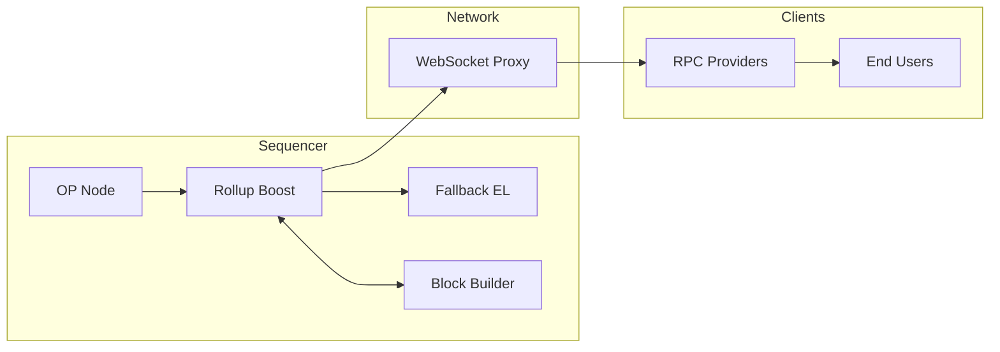

---
title: "Flashblocks: A Guide for Chain Operators"
description: "Technical guide for chain operators on Flashblocks, covering components, operation, transaction flow, and leader selection."
Flashblocks is a `rollup-boost` module that accelerates confirmation times by dividing block construction into smaller, incremental sections.
This enables pre-confirmations and improves user experience, while finalization still occurs at standard block intervals.

The Flashblocks setup involves three main components:

*   **`rollup-boost`**: Coordination layer with Flashblocks enabled
*   **`op-rbuilder`**: Execution client and builder with Flashblocks support
*   **`op-geth`**: Fallback builder, a standard EL node (can be `op-reth` as well)

Flashblocks are streamed from the `op-rbuilder` to `rollup-boost` over WebSockets, minimizing latency between the sequencer and the pre-confirmed state.

For full details on design choices, data structures, and invariants, see the [Flashblocks specification](https://specs.optimism.io/protocol/flashblocks.html).

## Flashblocks components

Flashblocks relies on several components working together:

*   **`op-node`**: Consensus layer, initiates `engine_forkchoiceUpdated` calls and leads block building.
*   **`op-geth`**: Default block builder, produces standard blocks.
*   **`op-rbuilder`**: Reth-based execution client that builds both standard blocks and flashblocks.
    *   Exposes flashblocks on a WebSocket stream (not recommended for public exposure).
    *   Each event on the stream corresponds to a 250 ms flashblock.
*   **`rollup-boost`**: Sits between `op-node` and execution layers, coordinating block building in flashblocks mode.
    *   Validates `op-rbuilder` payloads against `op-geth`
    *   Falls back to `op-geth` if `op-rbuilder` diverges or lags
*   **`flashblocks-websocket-proxy`**: Relays the flashblocks stream from the active sequencer to RPC providers.
*   **`op-node-rbuilder`** *(optional)*: `op-node` pointing only to `op-rbuilder`, used for syncing at startup.
*   **`op-conductor`** *(optional but recommended)*: Manages multiple sequencers, ensuring only one healthy leader streams blocks.

See the [System architecture section](https://specs.optimism.io/protocol/flashblocks.html#system-architecture) to learn more.

## Flashblocks lifecycle



*   Single-sequencer setup.
*   `op-node` coordinates block production through `rollup-boost`, targeting `op-rbuilder` instead of `op-geth`.
*   `op-rbuilder` acts as a full execution client: it builds blocks, exposes Ethereum JSON-RPC, and processes transactions.
*   In addition, `op-rbuilder` emits flashblocks every 250 ms, streamed over a WebSocket interface (e.g. `wss://`).
*   These flashblocks give early visibility into transaction inclusion before the final regular block is sealed.

For full details on construction rules, validation, and lifecycle steps, see [Flashblocks lifecycle in the specification](https://specs.optimism.io/protocol/flashblocks.html#flashblock-lifecycle).

## How to set up and run rollup-boost

Flashblocks relies on `rollup-boost` as the coordination layer for block building.
To run Flashblocks, you'll configure `rollup-boost` alongside your sequencer and execution clients.

*   [Running rollup-boost locally](https://rollup-boost.flashbots.net/operators/local.html)
*   [Running rollup-boost in production](https://rollup-boost.flashbots.net/operators/production.html)
*   [HA setup for rollup-boost](https://rollup-boost.flashbots.net/operators/ha-setup.html)

### Single‑sequencer setup

As suggested in the above links, in a single-sequencer setup, Flashblocks are streamed from `rollup-boost` (or `op-rbuilder`) to `flashblocks-websocket-proxy` by setting the following environment variable in flashblocks-websocket-proxy:

```jsx
UPSTREAM_WS: ws://<rbuilder-or-rollup-boost-url-exposing-flashblocks>/ws
```

### HA‑compliant multi‑sequencer setup

While Flashblocks can be enabled in a single-sequencer setup, we **highly recommend running a high-availability (HA) multi-sequencer setup** managed by [`op-conductor`](/operators/chain-operators/tools/op-conductor).

In an HA setup, multiple `op-conductor` instances form a [Raft](https://raft.github.io/) group. At any time, only one healthy sequencer acts as the active leader responsible for block building, while others remain in follower mode. Leadership changes automatically if the active sequencer becomes unhealthy.

For Flashblocks, each sequencer (leader and followers) runs its own dedicated components, including `rollup-boost` and `op-rbuilder`.
Only the leader's `op-rbuilder` produces flashblocks; follower instances remain idle.

In this setup, the connection between `rollup-boost` and the `flashblocks-websocket-proxy` is mediated by `op-conductor`.

*   `op-conductor` listens to Flashblocks from `rollup-boost` (or `op-rbuilder`).
*   If it is the active leader, it forwards the Flashblocks to `flashblocks-websocket-proxy`.
*   If it is not the leader, it does not forward anything.

The rest of the data flow remains unchanged.

### HA configuration

**1. Configure `op-conductor`** to listen for Flashblocks and forward them if leader:

```yaml
OP_CONDUCTOR_WEBSOCKET_SERVER_PORT: "8546"
OP_CONDUCTOR_ROLLUPBOOST_WS_URL: ws://<rbuilder-or-rollup-boost-url-exposing-flashblocks>/ws
OP_CONDUCTOR_ROLLUP_BOOST_ENABLED: "true"
OP_CONDUCTOR_EXECUTION_RPC: http://<execution-rpc-url-of-rollup-boost>:8551
```

*   **Variable descriptions:**
    *   `OP_CONDUCTOR_WEBSOCKET_SERVER_PORT`: Port where `op-conductor` exposes Flashblocks if it is the leader. For example: `ws://<op-conductor-url>:8546/ws`.
    *   `OP_CONDUCTOR_ROLLUPBOOST_WS_URL`: Direct URL of `rollup-boost` (or `op-rbuilder`) where Flashblocks are available. In a single-sequencer setup, this is the same URL you'd pass directly to `flashblocks-websocket-proxy`.
    *   `OP_CONDUCTOR_ROLLUP_BOOST_ENABLED`: Enables health checks for `rollup-boost` (and indirectly `op-rbuilder`) so leadership can fail over if either becomes unhealthy.
    *   `OP_CONDUCTOR_EXECUTION_RPC`: Execution RPC URL of `rollup-boost`. Same as `OP_NODE_L2_ENGINE_RPC` configured on `op-node`.

**2. Configure `flashblocks-websocket-proxy`** to consume Flashblocks from all sequencer conductors:

```yaml
UPSTREAM_WS: ws://<conductor-1>:8546/ws,ws://<conductor-2>:8546/ws,ws://<conductor-3>:8546/ws
```

This way, the proxy always connects to the active leader via its `op-conductor`.

Optional rate limits for `flashblocks-websocket-proxy`:

*   `PER_IP_CONNECTIONS_LIMIT`: Max connections allowed per client IP.
*   `INSTANCE_CONNECTION_LIMIT`: Max total connections allowed per proxy instance.
