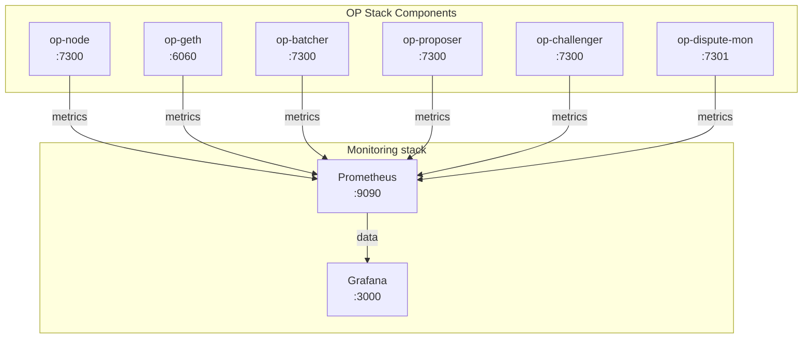

Now that you have a running OP Stack rollup, it's critical to set up monitoring to ensure your chain operates reliably and securely. This tutorial will guide you through setting up both onchain and offchain monitoring for your rollup.

<Info>
  This tutorial continues from [Creating Your Own L2 Rollup](/operators/chain-operators/tutorials/create-l2-rollup). Make sure you have completed that tutorial and have a running rollup before proceeding.
</Info>

## What you'll set up

By the end of this tutorial, you'll have comprehensive monitoring for:

*   **Onchain Components**: Dispute games, withdrawals, contract events
*   **Offchain Components**: op-node, op-geth, op-batcher, op-proposer, op-challenger
*   **Metrics Collection**: Prometheus scraping metrics from all components
*   **Visualization**: Grafana dashboards for real-time monitoring
*   **Alerting**: Basic alert rules for critical events

## Prerequisites

Before you begin, ensure you have:

*   Completed the [Creating Your Own L2 Rollup tutorial](/operators/chain-operators/tutorials/create-l2-rollup)
*   All OP Stack components running (sequencer, batcher, proposer, challenger)
*   Basic understanding of [monitoring concepts](/operators/chain-operators/tools/chain-monitoring)
*   Docker installed (for Prometheus and Grafana)
*   At least 10 GB of available disk space for monitoring data

## Monitoring architecture overview

Your monitoring setup will follow this architecture:



<Steps>
<Step title="Enable metrics on OP Stack components">

First, you need to enable metrics endpoints on all your OP Stack components. Most OP Stack services expose Prometheus-compatible metrics on port 7300 by default.

### Enable op-node metrics

Add these flags to your `op-node` startup script:

```bash
#!/bin/bash
# In your rollup/sequencer directory

# Add these metrics flags
--metrics.enabled=true \
--metrics.addr=0.0.0.0 \
--metrics.port=7300
```

<Expandable title="Complete op-node startup example">
```bash
#!/bin/bash
source ../.env

../../optimism/op-node/bin/op-node \
  --l1=$L1_RPC_URL \
  --l2=ws://localhost:8551 \
  --l2.jwt-secret=./jwt.txt \
  --sequencer.enabled=true \
  --sequencer.l1-confs=5 \
  --verifier.l1-confs=4 \
  --rollup.config=./rollup.json \
  --rpc.addr=0.0.0.0 \
  --rpc.port=8547 \
  --p2p.disable=true \
  --rpc.enable-admin=true \
  --p2p.sequencer.key=$SEQUENCER_KEY \
  --l1.rpckind=$L1_RPC_KIND \
  --metrics.enabled=true \
  --metrics.addr=0.0.0.0 \
  --metrics.port=7300
```
</Expandable>

### Enable op-geth metrics

Add these flags to your `op-geth` startup script:

```bash
#!/bin/bash
# In your rollup/sequencer directory

# Add these metrics flags
--metrics \
--metrics.addr=0.0.0.0 \
--metrics.port=6060
```

<Expandable title="Complete op-geth startup example">
```bash
#!/bin/bash
source ../.env

../../optimism/op-geth/build/bin/geth \
  --datadir=./geth-data \
  --http \
  --http.corsdomain="*" \
  --http.vhosts="*" \
  --http.addr=0.0.0.0 \
  --http.port=8545 \
  --http.api=web3,debug,eth,txpool,net,engine \
  --ws \
  --ws.addr=0.0.0.0 \
  --ws.port=8546 \
  --ws.origins="*" \
  --ws.api=debug,eth,txpool,net,engine \
  --syncmode=full \
  --gcmode=archive \
  --nodiscover \
  --maxpeers=0 \
  --networkid=$CHAIN_ID \
  --authrpc.vhosts="*" \
  --authrpc.addr=0.0.0.0 \
  --authrpc.port=8551 \
  --authrpc.jwtsecret=./jwt.txt \
  --rollup.disabletxpoolgossip=true \
  --metrics \
  --metrics.addr=0.0.0.0 \
  --metrics.port=6060
```
</Expandable>

### Enable op-batcher metrics

Add these flags to your `op-batcher` startup script:

```bash
#!/bin/bash
# In your rollup/batcher directory

# Add these metrics flags
--metrics.enabled=true \
--metrics.addr=0.0.0.0 \
--metrics.port=7300
```

### Enable op-proposer metrics

Add these flags to your `op-proposer` startup script:

```bash
#!/bin/bash
# In your rollup/proposer directory

# Add these metrics flags
--metrics.enabled=true \
--metrics.addr=0.0.0.0 \
--metrics.port=7300
```

### Enable op-challenger metrics

Your `op-challenger` should already have metrics enabled from the [op-challenger setup tutorial](/operators/chain-operators/tutorials/create-l2-rollup/op-challenger-setup), but verify these flags are present:

```bash
#!/bin/bash
# In your rollup/challenger directory

# Verify these metrics flags
--metrics.enabled=true \
--metrics.addr=0.0.0.0 \
--metrics.port=7300
```

<Warning>
  Make sure each component uses a unique metrics port if running on the same machine. The default is 7300 for most components, but op-geth uses 6060.
</Warning>

### Restart all components

After adding metrics flags, restart all your OP Stack components:

```bash
# Stop all components (Ctrl+C or kill processes)

# Restart in order
cd rollup/sequencer && ./scripts/start-geth.sh &
sleep 10
./scripts/start-node.sh &

cd ../batcher && ./scripts/start-batcher.sh &
cd ../proposer && ./scripts/start-proposer.sh &
cd ../challenger && ./scripts/start-challenger.sh &
```

### Verify metrics endpoints

Test that each component is exposing metrics:

```bash
# Test op-node metrics
curl http://localhost:7300/metrics

# Test op-geth metrics
curl http://localhost:6060/debug/metrics/prometheus

# Test op-batcher metrics (use appropriate port if changed)
curl http://localhost:7301/metrics

# Test op-proposer metrics
curl http://localhost:7302/metrics

# Test op-challenger metrics
curl http://localhost:7303/metrics
```

Each command should return Prometheus-formatted metrics.

</Step>

<Step title="Set up onchain monitoring with op-dispute-mon">

`op-dispute-mon` is essential for monitoring the fault proof system. It tracks all dispute games and provides visibility into their status.

<Tabs>
<Tab title="Use Docker">

### Docker Setup

The Docker setup provides a containerized environment for running op-dispute-mon with minimal configuration.

#### Create dispute-mon directory

```bash
# From your project root
cd rollup
mkdir dispute-mon
cd dispute-mon
```

#### Get contract addresses

```bash
# Get Game Factory address
export GAME_FACTORY_ADDRESS=$(jq -r '.disputeGameFactoryProxyAddress' ../.deployer/state.json)
echo "Game Factory Address: $GAME_FACTORY_ADDRESS"

# Get Challenger address from your private key (using cast from Foundry)
export CHALLENGER_ADDRESS=$(cast wallet address --private-key $PRIVATE_KEY)
echo "Challenger Address: $CHALLENGER_ADDRESS"
```

#### Create environment file

```bash
cat > .env << EOF
# Core Configuration
L1_RPC_URL=https://sepolia.infura.io/v3/YOUR_INFURA_KEY
ROLLUP_RPC=http://host.docker.internal:8547

# Contract Addresses
GAME_FACTORY_ADDRESS=$GAME_FACTORY_ADDRESS
HONEST_ACTORS=$CHALLENGER_ADDRESS

# Metrics Configuration
METRICS_PORT=7301
EOF
```

<Warning>
  Replace `YOUR_INFURA_KEY` with your actual Infura API key or other L1 RPC endpoint.
</Warning>

#### Create Docker Compose file

Create `docker-compose.yml`:

```yaml
version: '3.8'

services:
  op-dispute-mon:
    image: us-docker.pkg.dev/oplabs-tools-artifacts/images/op-dispute-mon:v1.5.1
    container_name: op-dispute-mon
    ports:
      - "7301:7301"
    environment:
      - OP_DISPUTE_MON_LOG_FORMAT=logfmt
      - OP_DISPUTE_MON_METRICS_ENABLED=true
      - OP_DISPUTE_MON_METRICS_ADDR=0.0.0.0
      - OP_DISPUTE_MON_METRICS_PORT=${METRICS_PORT}
      - OP_DISPUTE_MON_L1_ETH_RPC=${L1_RPC_URL}
      - OP_DISPUTE_MON_ROLLUP_RPC=${ROLLUP_RPC}
      - OP_DISPUTE_MON_GAME_FACTORY_ADDRESS=${GAME_FACTORY_ADDRESS}
      - OP_DISPUTE_MON_HONEST_ACTORS=${HONEST_ACTORS}
    restart: unless-stopped
    extra_hosts:
      - "host.docker.internal:host-gateway"
```

#### Start op-dispute-mon

```bash
# Start the service
docker-compose up -d

# View logs
docker-compose logs -f op-dispute-mon
```

#### Verify it's running

```bash
# Check metrics endpoint
curl http://localhost:7301/metrics | grep dispute

# Check Docker logs
docker-compose logs --tail=50 op-dispute-mon
```

You should see metrics like:
- `op_dispute_mon_games_total` - Total number of games
- `op_dispute_mon_games_status` - Game status counts
- `op_dispute_mon_claims_bond_total` - Total bonds

</Tab>

<Tab title="Build from source">

### Build from Source

For more control or custom builds, you can build op-dispute-mon from source.

#### Build op-dispute-mon

```bash
cd optimism/op-dispute-mon
make op-dispute-mon
```

#### Create directory structure

```bash
# From your project root
cd rollup
mkdir -p dispute-mon/{scripts,data}
cd dispute-mon
```

#### Configure environment

Create a `.env` file in `rollup/dispute-mon/`:

```bash
# Copy from parent .env
cp ../.env .env

# Add op-dispute-mon specific configuration
cat >> .env << 'EOF'

# op-dispute-mon Configuration
OP_DISPUTE_MON_LOG_FORMAT=logfmt
OP_DISPUTE_MON_METRICS_ENABLED=true
OP_DISPUTE_MON_METRICS_ADDR=0.0.0.0
OP_DISPUTE_MON_METRICS_PORT=7301

# L1 and L2 RPC endpoints (from parent .env)
OP_DISPUTE_MON_L1_ETH_RPC=$L1_RPC_URL
OP_DISPUTE_MON_ROLLUP_RPC=http://localhost:8547

# Game factory address (from deployment)
# Replace with your actual DisputeGameFactoryProxy address
OP_DISPUTE_MON_GAME_FACTORY_ADDRESS=$GAME_FACTORY_ADDRESS

# Honest actor addresses (CSV, no spaces)
# This should be your challenger address(es)
OP_DISPUTE_MON_HONEST_ACTORS=$CHALLENGER_ADDRESS

# Optional: Monitoring window (default is fine for most cases)
# OP_DISPUTE_MON_GAME_WINDOW=672h
# OP_DISPUTE_MON_MONITOR_INTERVAL=30s
# OP_DISPUTE_MON_MAX_CONCURRENCY=5
EOF
```

#### Get your Game Factory address

```bash
# From rollup/dispute-mon directory
cd ../.deployer
export GAME_FACTORY_ADDRESS=$(jq -r '.disputeGameFactoryProxyAddress' state.json)
echo "Game Factory Address: $GAME_FACTORY_ADDRESS"

# Add to dispute-mon .env
cd ../dispute-mon
echo "GAME_FACTORY_ADDRESS=$GAME_FACTORY_ADDRESS" >> .env
```

#### Get your Challenger address

```bash
# Get challenger address from your private key
# You can use cast (from Foundry) to derive the address
export CHALLENGER_ADDRESS=$(cast wallet address --private-key $PRIVATE_KEY)
echo "Challenger Address: $CHALLENGER_ADDRESS"

# Add to dispute-mon .env
echo "CHALLENGER_ADDRESS=$CHALLENGER_ADDRESS" >> .env
```

#### Create startup script

Create `scripts/start-dispute-mon.sh`:

```bash
#!/bin/bash
set -e

# Load environment variables
source .env

# Path to dispute-mon binary
DISPUTE_MON_BIN=../../optimism/op-dispute-mon/bin/op-dispute-mon

# Start op-dispute-mon
$DISPUTE_MON_BIN \
  --log.format=$OP_DISPUTE_MON_LOG_FORMAT \
  --metrics.enabled=$OP_DISPUTE_MON_METRICS_ENABLED \
  --metrics.addr=$OP_DISPUTE_MON_METRICS_ADDR \
  --metrics.port=$OP_DISPUTE_MON_METRICS_PORT \
  --l1-eth-rpc=$OP_DISPUTE_MON_L1_ETH_RPC \
  --rollup-rpc=$OP_DISPUTE_MON_ROLLUP_RPC \
  --game-factory-address=$OP_DISPUTE_MON_GAME_FACTORY_ADDRESS \
  --honest-actors=$OP_DISPUTE_MON_HONEST_ACTORS
```

Make it executable:

```bash
chmod +x scripts/start-dispute-mon.sh
```

#### Start op-dispute-mon

```bash
# From rollup/dispute-mon directory
./scripts/start-dispute-mon.sh
```

#### Verify it's running

```bash
# Check metrics endpoint
curl http://localhost:7301/metrics | grep dispute

# Check logs
tail -f data/dispute-mon.log
```

You should see metrics like:
- `op_dispute_mon_games_total` - Total number of games
- `op_dispute_mon_games_status` - Game status counts
- `op_dispute_mon_claims_bond_total` - Total bonds

</Tab>
</Tabs>

</Step>

<Step title="Install and configure Prometheus">

Prometheus will scrape metrics from all your OP Stack components.

### Install Prometheus with Docker

Create a monitoring directory:

```bash
# From your project root
mkdir -p monitoring/{prometheus,grafana}
cd monitoring
```

### Create Prometheus configuration

Create `prometheus/prometheus.yml`:

```yaml
global:
  scrape_interval: 15s
  evaluation_interval: 15s
  external_labels:
    chain: 'my-op-rollup'
    environment: 'testnet'

scrape_configs:
  # op-node metrics
  - job_name: 'op-node'
    static_configs:
      - targets: ['host.docker.internal:7300']
        labels:
          component: 'op-node'
          role: 'consensus'

  # op-geth metrics
  - job_name: 'op-geth'
    metrics_path: '/debug/metrics/prometheus'
    static_configs:
      - targets: ['host.docker.internal:6060']
        labels:
          component: 'op-geth'
          role: 'execution'

  # op-batcher metrics
  - job_name: 'op-batcher'
    static_configs:
      - targets: ['host.docker.internal:7301']
        labels:
          component: 'op-batcher'
          role: 'batcher'

  # op-proposer metrics
  - job_name: 'op-proposer'
    static_configs:
      - targets: ['host.docker.internal:7302']
        labels:
          component: 'op-proposer'
          role: 'proposer'

  # op-challenger metrics
  - job_name: 'op-challenger'
    static_configs:
      - targets: ['host.docker.internal:7303']
        labels:
          component: 'op-challenger'
          role: 'challenger'

  # op-dispute-mon metrics
  - job_name: 'op-dispute-mon'
    static_configs:
      - targets: ['host.docker.internal:7304']
        labels:
          component: 'op-dispute-mon'
          role: 'monitor'
```

<Info>
  **Port mapping note**: If you're running components on different ports, update the targets accordingly. The example above assumes standard ports with offsets for each component.
</Info>

### Create Docker Compose configuration

Create `docker-compose.yml` in the `monitoring` directory:

```yaml
version: '3.8'

services:
  prometheus:
    image: prom/prometheus:latest
    container_name: prometheus
    ports:
      - "9090:9090"
    volumes:
      - ./prometheus/prometheus.yml:/etc/prometheus/prometheus.yml
      - prometheus-data:/prometheus
    command:
      - '--config.file=/etc/prometheus/prometheus.yml'
      - '--storage.tsdb.path=/prometheus'
      - '--web.console.libraries=/usr/share/prometheus/console_libraries'
      - '--web.console.templates=/usr/share/prometheus/consoles'
      - '--web.enable-lifecycle'
    restart: unless-stopped
    extra_hosts:
      - "host.docker.internal:host-gateway"

  grafana:
    image: grafana/grafana:latest
    container_name: grafana
    ports:
      - "3000:3000"
    volumes:
      - grafana-data:/var/lib/grafana
      - ./grafana/provisioning:/etc/grafana/provisioning
      - ./grafana/dashboards:/var/lib/grafana/dashboards
    environment:
      - GF_SECURITY_ADMIN_PASSWORD=admin
      - GF_USERS_ALLOW_SIGN_UP=false
      - GF_SERVER_ROOT_URL=http://localhost:3000
    restart: unless-stopped
    depends_on:
      - prometheus

volumes:
  prometheus-data:
  grafana-data:
```

### Start Prometheus and Grafana

```bash
# From the monitoring directory
docker-compose up -d

# Check logs
docker-compose logs -f
```

### Verify Prometheus is scraping metrics

1. Open Prometheus in your browser: `http://localhost:9090`
2. Go to **Status > Targets**
3. Verify all targets show as "UP"

If any targets show as "DOWN":
- Check that the component is running
- Verify the port numbers match your configuration
- Check firewall rules if running on different machines

</Step>

<Step title="Configure Grafana dashboards">

### Access Grafana

1. Open Grafana: `http://localhost:3000`
2. Login with default credentials:
   - Username: `admin`
   - Password: `admin`
3. Change the password when prompted

### Add Prometheus as data source

1. Click **⚙️ Configuration** > **Data Sources**
2. Click **Add data source**
3. Select **Prometheus**
4. Configure:
   - **Name**: `Prometheus`
   - **URL**: `http://prometheus:9090`
   - **Access**: `Server (default)`
5. Click **Save & Test**

### Import OP Stack dashboards

#### Import Dispute Monitor Dashboard

1. Download the [Dispute Monitor JSON](/resources/grafana/dispute-monitor-1718214549035.json)
2. In Grafana, click **+ > Import**
3. Click **Upload JSON file** and select the downloaded file
4. Select **Prometheus** as the data source
5. Click **Import**

#### Create custom OP Node dashboard

Create a new dashboard for monitoring op-node:

1. Click **+ > Create Dashboard**
2. Click **Add visualization**
3. Select **Prometheus** data source
4. Add panels for key metrics:

**Panel 1: Sync Status**
- Metric: `op_node_default_refs_number`
- Visualization: Stat
- Title: "Sync Block Number"

**Panel 2: Peer Count**
- Metric: `op_node_p2p_peers`
- Visualization: Time series
- Title: "P2P Peer Count"

**Panel 3: L1 Head vs Unsafe L2 Head**
- Metrics:
  - `op_node_default_refs_l1_head`
  - `op_node_default_refs_unsafe_l2_head`
- Visualization: Time series
- Title: "L1 vs L2 Head"

**Panel 4: Derivation Pipeline**
- Metric: `op_node_derivation_idle`
- Visualization: Time series
- Title: "Derivation Idle Time"

5. Click **Save dashboard**
6. Name it "OP Node Metrics"

#### Create OP Geth dashboard

1. Create a new dashboard
2. Add visualizations for:

**Panel 1: Gas Price**
- Metric: `geth_tx_pool_basefee`
- Title: "Base Fee"

**Panel 2: Transaction Pool**
- Metric: `geth_tx_pool_pending`
- Title: "Pending Transactions"

**Panel 3: Block Processing**
- Metric: `geth_chain_head_block`
- Title: "Chain Head Block"

**Panel 4: State Database Size**
- Metric: `geth_db_chaindata_disk_size`
- Title: "Database Size"

3. Save as "OP Geth Metrics"

#### Create Batcher dashboard

1. Create a new dashboard
2. Add key metrics:

**Panel 1: Published Batches**
- Metric: `op_batcher_batch_submitted_count`
- Title: "Batches Submitted"

**Panel 2: Batch Size**
- Metric: `op_batcher_batch_size_bytes`
- Title: "Average Batch Size"

**Panel 3: Gas Used**
- Metric: `op_batcher_total_gas_used`
- Title: "Total Gas Used"

3. Save as "OP Batcher Metrics"

</Step>

<Step title="Set up monitoring for Monitorism (Optional)">

For additional security monitoring, you can set up [Monitorism](/operators/chain-operators/tools/chain-monitoring#monitorism).

### Clone Monitorism repository

```bash
cd ~/
git clone https://github.com/ethereum-optimism/monitorism.git
cd monitorism
```

### Configure Monitorism

Create a configuration file `config.toml`:

```toml
[server]
host = "0.0.0.0"
port = 7305

[l1]
rpc_url = "YOUR_L1_RPC_URL"

[l2]
rpc_url = "http://localhost:8545"

[[monitors]]
type = "fault_proof_withdrawal"
enabled = true
[monitors.config]
optimism_portal_address = "YOUR_OPTIMISM_PORTAL_ADDRESS"
l2_output_oracle_address = "YOUR_L2_OUTPUT_ORACLE_ADDRESS"
```

### Get contract addresses

```bash
# From your deployment state
cd your-project/rollup/.deployer
jq -r '{optimismPortal: .optimismPortalProxyAddress, l2OutputOracle: .l2OutputOracleProxyAddress}' state.json
```

### Build and run Monitorism

```bash
cd ~/monitorism
go build -o bin/monitorism ./cmd/monitorism

# Run monitorism
./bin/monitorism --config config.toml
```

### Add Monitorism to Prometheus

Add to `prometheus/prometheus.yml`:

```yaml
  - job_name: 'monitorism'
    static_configs:
      - targets: ['host.docker.internal:7305']
        labels:
          component: 'monitorism'
          role: 'monitor'
```

Reload Prometheus configuration:

```bash
curl -X POST http://localhost:9090/-/reload
```

</Step>

<Step title="Configure alerts">

Create alert rules in Prometheus for critical events.

### Create alert rules file

Create `prometheus/alerts.yml`:

```yaml
groups:
  - name: op_stack_alerts
    interval: 30s
    rules:
      # Sequencer health
      - alert: SequencerDown
        expr: up{job="op-node"} == 0
        for: 2m
        labels:
          severity: critical
        annotations:
          summary: "Sequencer (op-node) is down"
          description: "The sequencer has been down for more than 2 minutes"

      - alert: ExecutionClientDown
        expr: up{job="op-geth"} == 0
        for: 2m
        labels:
          severity: critical
        annotations:
          summary: "Execution client (op-geth) is down"
          description: "The execution client has been down for more than 2 minutes"

      # Batcher alerts
      - alert: BatcherDown
        expr: up{job="op-batcher"} == 0
        for: 5m
        labels:
          severity: critical
        annotations:
          summary: "Batcher is down"
          description: "The batcher has been down for more than 5 minutes"

      - alert: BatcherNotSubmitting
        expr: rate(op_batcher_batch_submitted_count[10m]) == 0
        for: 15m
        labels:
          severity: warning
        annotations:
          summary: "Batcher not submitting batches"
          description: "No batches have been submitted in the last 15 minutes"

      # Proposer alerts
      - alert: ProposerDown
        expr: up{job="op-proposer"} == 0
        for: 5m
        labels:
          severity: critical
        annotations:
          summary: "Proposer is down"
          description: "The proposer has been down for more than 5 minutes"

      # Challenger alerts
      - alert: ChallengerDown
        expr: up{job="op-challenger"} == 0
        for: 5m
        labels:
          severity: critical
        annotations:
          summary: "Challenger is down"
          description: "The challenger has been down for more than 5 minutes"

      # Dispute game alerts
      - alert: InvalidDisputeGame
        expr: op_dispute_mon_games_status{status="invalid"} > 0
        for: 1m
        labels:
          severity: critical
        annotations:
          summary: "Invalid dispute game detected"
          description: "An invalid dispute game has been detected and needs immediate attention"

      # Sync lag alerts
      - alert: SequencerSyncLag
        expr: (op_node_default_refs_l1_head - op_node_default_refs_unsafe_l2_head) > 100
        for: 10m
        labels:
          severity: warning
        annotations:
          summary: "Sequencer sync lag detected"
          description: "L2 is lagging behind L1 by more than 100 blocks"

      # Resource alerts
      - alert: HighMemoryUsage
        expr: process_resident_memory_bytes / 1e9 > 8
        for: 5m
        labels:
          severity: warning
        annotations:
          summary: "High memory usage detected"
          description: "Component {{ $labels.job }} is using more than 8GB of memory"
```

### Update Prometheus configuration

Update `prometheus/prometheus.yml` to include the alert rules:

```yaml
global:
  scrape_interval: 15s
  evaluation_interval: 15s

# Add this section
rule_files:
  - 'alerts.yml'

# ... rest of configuration ...
```

### Reload Prometheus

```bash
docker-compose restart prometheus
```

### Verify alerts in Prometheus

1. Open Prometheus: `http://localhost:9090`
2. Go to **Alerts**
3. Verify your alert rules are loaded

</Step>

<Step title="Set up Alertmanager (Optional)">

For alert notifications, you can configure Alertmanager.

### Add Alertmanager to Docker Compose

Update `docker-compose.yml`:

```yaml
  alertmanager:
    image: prom/alertmanager:latest
    container_name: alertmanager
    ports:
      - "9093:9093"
    volumes:
      - ./alertmanager/alertmanager.yml:/etc/alertmanager/alertmanager.yml
      - alertmanager-data:/alertmanager
    command:
      - '--config.file=/etc/alertmanager/alertmanager.yml'
      - '--storage.path=/alertmanager'
    restart: unless-stopped

volumes:
  prometheus-data:
  grafana-data:
  alertmanager-data:  # Add this
```

### Create Alertmanager configuration

Create `alertmanager/alertmanager.yml`:

```yaml
global:
  resolve_timeout: 5m

route:
  group_by: ['alertname', 'cluster']
  group_wait: 10s
  group_interval: 10s
  repeat_interval: 12h
  receiver: 'default'

receivers:
  - name: 'default'
    # Configure your preferred notification channel:
    
    # Slack example:
    # slack_configs:
    #   - api_url: 'YOUR_SLACK_WEBHOOK_URL'
    #     channel: '#alerts'
    #     title: 'OP Stack Alert'
    #     text: '{{ range .Alerts }}{{ .Annotations.summary }}\n{{ .Annotations.description }}{{ end }}'
    
    # Discord example:
    # discord_configs:
    #   - webhook_url: 'YOUR_DISCORD_WEBHOOK_URL'
    
    # Email example:
    # email_configs:
    #   - to: 'your-email@example.com'
    #     from: 'alertmanager@example.com'
    #     smarthost: 'smtp.gmail.com:587'
    #     auth_username: 'your-email@example.com'
    #     auth_password: 'your-app-password'

inhibit_rules:
  - source_match:
      severity: 'critical'
    target_match:
      severity: 'warning'
    equal: ['alertname', 'cluster']
```

### Update Prometheus to use Alertmanager

Update `prometheus/prometheus.yml`:

```yaml
# Add this section
alerting:
  alertmanagers:
    - static_configs:
        - targets: ['alertmanager:9093']

# ... rest of configuration ...
```

### Restart monitoring stack

```bash
docker-compose up -d
```

</Step>

<Step title="Monitor important metrics">

Here are the key metrics you should monitor for each component:

### OP Node (Sequencer) Metrics

<Accordion title="Critical op-node metrics">

| Metric | Description | Alert Threshold |
|--------|-------------|----------------|
| `op_node_default_refs_number` | Current sync block number | Should increase steadily |
| `op_node_default_refs_l1_head` | L1 head block | Track sync with L1 |
| `op_node_derivation_idle` | Derivation pipeline idle time | > 30s indicates issues |
| `op_node_p2p_peers` | Number of P2P peers | Should be > 0 if P2P enabled |
| `process_cpu_seconds_total` | CPU usage | Monitor for spikes |

[See complete list in Node Metrics guide](/operators/node-operators/management/metrics#important-metrics)

</Accordion>

### OP Geth Metrics

<Accordion title="Critical op-geth metrics">

| Metric | Description | Alert Threshold |
|--------|-------------|----------------|
| `geth_chain_head_block` | Current head block | Should increase |
| `geth_tx_pool_pending` | Pending transactions | Monitor for buildup |
| `geth_db_chaindata_disk_size` | Database size | Monitor growth rate |
| `geth_tx_pool_basefee` | Current base fee | Monitor for spikes |

</Accordion>

### OP Batcher Metrics

<Accordion title="Critical op-batcher metrics">

| Metric | Description | Alert Threshold |
|--------|-------------|----------------|
| `op_batcher_batch_submitted_count` | Number of batches submitted | Should increase regularly |
| `op_batcher_batch_size_bytes` | Average batch size | Monitor size trends |
| `op_batcher_total_gas_used` | Gas used for submissions | Track costs |
| `op_batcher_channel_open_duration` | Time channels are open | Alert if too high |

</Accordion>

### OP Proposer Metrics

<Accordion title="Critical op-proposer metrics">

| Metric | Description | Alert Threshold |
|--------|-------------|----------------|
| `op_proposer_proposals_total` | Total proposals submitted | Should increase |
| `op_proposer_gas_used` | Gas used for proposals | Track costs |
| `op_proposer_latest_proposal_block` | Latest proposed block | Should advance |

</Accordion>

### OP Challenger Metrics

<Accordion title="Critical op-challenger metrics">

| Metric | Description | Alert Threshold |
|--------|-------------|----------------|
| `op_challenger_games_total` | Total games tracked | Monitor activity |
| `op_challenger_moves_made` | Moves made in games | Track participation |
| `op_challenger_claims_invalid` | Invalid claims detected | Alert immediately if > 0 |

</Accordion>

### OP Dispute Mon Metrics

<Accordion title="Critical dispute-mon metrics">

| Metric | Description | Alert Threshold |
|--------|-------------|----------------|
| `op_dispute_mon_games_total` | Total games monitored | Track overall activity |
| `op_dispute_mon_games_status` | Games by status | Alert on invalid games |
| `op_dispute_mon_claims_bond_total` | Total bonds | Monitor economic activity |

</Accordion>

</Step>
</Steps>

## Monitoring checklist

Use this checklist to ensure comprehensive monitoring:

- ✅ All OP Stack components have metrics enabled
- ✅ Prometheus is scraping all targets successfully
- ✅ Grafana dashboards are displaying data
- ✅ Alert rules are configured and active
- ✅ op-dispute-mon is running and tracking games
- ✅ Disk space is monitored (Prometheus and component data)
- ✅ Backup monitoring data regularly
- ✅ Test alert notifications are working
- ✅ Document your monitoring setup for your team

## Troubleshooting

### Prometheus not scraping metrics

**Issue**: Targets show as "DOWN" in Prometheus

**Solutions**:
1. Verify component is running: `ps aux | grep op-node`
2. Test metrics endpoint directly: `curl http://localhost:7300/metrics`
3. Check firewall rules
4. Verify Docker network can reach `host.docker.internal`
5. Check Prometheus logs: `docker-compose logs prometheus`

### High memory usage

**Issue**: Components using excessive memory

**Solutions**:
1. Check database sizes: `du -sh rollup/*/data`
2. Consider pruning old data
3. Increase system resources
4. Check for memory leaks in logs

### Grafana not displaying data

**Issue**: Dashboards show "No data"

**Solutions**:
1. Verify Prometheus data source is configured correctly
2. Check that Prometheus is scraping metrics
3. Verify metric names in queries match actual metrics
4. Check time range in dashboard

### Dispute mon not tracking games

**Issue**: `op-dispute-mon` shows no games

**Solutions**:
1. Verify Game Factory address is correct
2. Check that challenger has created some games
3. Verify L1 and L2 RPC endpoints are working
4. Check `op-dispute-mon` logs for errors

## Production considerations

When running monitoring in production:

1. **Security**:
   - Restrict access to Grafana with proper authentication
   - Use TLS for all connections
   - Don't expose metrics ports publicly
   - Regularly update monitoring tools

2. **Reliability**:
   - Run Prometheus and Grafana on separate infrastructure
   - Set up Prometheus in HA mode for production
   - Configure retention policies based on your needs
   - Set up offsite backups of monitoring data

3. **Scalability**:
   - Consider using Prometheus federation for multiple chains
   - Use remote storage for long-term metrics
   - Implement proper resource limits in Docker

4. **Alerting**:
   - Configure multiple notification channels
   - Set up escalation policies
   - Test alerts regularly
   - Document runbooks for each alert

## Next steps

*   **Learn more about monitoring options**: [Chain Monitoring Reference](/operators/chain-operators/tools/chain-monitoring)
*   **Understand dispute games**: [Dispute Games Guide](/operators/chain-operators/tutorials/dispute-games)
*   **Set up additional monitors**: [Monitorism Repository](https://github.com/ethereum-optimism/monitorism)
*   **Optimize your setup**: [Operations Guide](/operators/chain-operators/management/operations)
*   **Get support**: [Developer Discussions](https://github.com/ethereum-optimism/developers/discussions)

## Additional resources

*   [Prometheus Documentation](https://prometheus.io/docs/)
*   [Grafana Documentation](https://grafana.com/docs/)
*   [Node Metrics Guide](/operators/node-operators/management/metrics)
*   [Monitorism GitHub](https://github.com/ethereum-optimism/monitorism)
*   [OP Dispute Mon](https://github.com/ethereum-optimism/optimism/tree/develop/op-dispute-mon)

