import { Callout, Steps } from 'nextra/components'
import { InteropCallout } from '@/components/WipCallout'

<InteropCallout />

# Making crosschain contract calls (ping pong)

This guide walks through the `CrossChainPingPong.sol` contract, focusing on high level design and steps to integrating the `L2ToL2CrossChainMessenger` contract. For more info, view the [source code](https://github.com/ethereum-optimism/supersim/blob/main/contracts/src/pingpong/CrossChainPingPong.sol).

## High level overview

`CrossChainPingPong.sol` implements a cross-chain ping-pong game using the `L2ToL2CrossDomainMessenger`.

*   Players hit a **virtual ball** back and forth between allowed L2 chains. The game starts with a serve
*   from a designated start chain, and each hit increases the rally count. The contract tracks the last hitter's address, chain ID, and the current rally count.

### Diagram

```mermaid
sequenceDiagram
    participant Chain1 as Chain 1
    participant Chain2 as Chain 2
    
    Note over Chain1: 🚀 Game Starts (starting chain)
    Note over Chain1: 🏓 Hit Ball
    Chain1->>Chain2: 📤 Send PingPongBall {rallyCount: 1, lastHitter: Chain1}
    Chain1-->>Chain1: Emit BallSent event
    activate Chain2
    Note over Chain2: 📥 Receive Ball
        Chain2-->>Chain2: Emit BallReceived event

    Note over Chain2: 🏓 Hit Ball
    Chain2->>Chain1: 📤 Send PingPongBall {rallyCount: 2, lastHitter: Chain2}
    Chain2-->>Chain2: Emit BallSent event
    deactivate Chain2
    activate Chain1
    Note over Chain1: 📥 Receive Ball
        Chain1-->>Chain1: Emit BallReceived event

    Note over Chain1,Chain2: Game continues...
```



### Flow

<Steps>
  ### Contract Deployment

  *   Deployed on all participating chains
  *   Utilizes CREATE2 with the same parameter, `_serverChainId`, resulting in the same address and initial state.

  ### Hit the Ball (Starting Move)

  *   Call `hitBallTo` on the chain with the ball, specifying a destination chain.
  *   Contract uses `L2ToL2CrossDomainMessenger` to send the ball data to the specified chain.
  *   The reference to the ball is deleted from the serving chain.

  ### Receive on Destination Chain

  *   `L2ToL2CrossDomainMessenger` on destination chain calls `receiveBall`.
  *   Contract verifies the message sender and origin.
  *   Ball data is stored, indicating its presence on this chain.

  ### Continue Game (Hit)

  *   Any user on the chain currently holding the ball calls `hitBallTo` to send it to another chain.
  *   Contract updates the `PingPongBall` data (increment rally count, update last hitter).
  *   Process repeats from step 2.
</Steps>

## Walkthrough

Here's an explanation of the functions in the contract, with a focus on how it interacts with `L2ToL2CrossChainMessenger`.

### Initialize contract state

#### Constructor Setup

```solidity
constructor(uint256 _serverChainId) {
    if (block.chainid == _serverChainId) {
        ball = PingPongBall(1, block.chainid, msg.sender);
    }
}
```

If the starting chain, initialize the ball allowing it to be hittable.

#### Reliance on CREATE2 for cross chain consistency

While not explicitly mentioned in the code, this contract's design implicitly assumes the use of CREATE2 for deployment. Here's why CREATE2 is crucial for this setup:

*   **Predictable Addresses**:
    CREATE2 enables deployment at the same address on all chains, crucial for cross-chain message verification:
    ```solidity
    if (messenger.crossDomainMessageSender() != address(this)) revert InvalidCrossDomainSender();
    ```

*   **Self-referential Messaging**:
    The contract sends messages to itself on other chains:
    ```solidity
    messenger.sendMessage(_toChainId, address(this), _message);
    ```
    This requires `address(this)` to be consistent across chains.

*   **Initialization State Considerations**:

    The starting chain id is part of the initcode, meaning a deployment with a differing value would result in a different address via CREATE2. This is a nice feature as there's an implicit agreement on the starting chain from the address.

    Without CREATE2, you would need to:

    *   Manually track contract addresses for each chain.
    *   Implement a more complex initialization process to register contract addresses across chains.
    *   Potentially redesign the security model that relies on address matching.

### Hit the ball

`hitBallTo`: This function is used to hit the ball, when present, to another chain

#### Hitting constraints

```solidity
function hitBallTo(uint256 _toChainId) public {
    if (ball.lastHitterAddress == address(0)) revert BallNotPresent();
    if (_toChainId == block.chainid) revert InvalidDestination();
    ...
}
```

*   The `ball` contract variable is populated on the chain, indicating its presence
*   The destination must be a different chain

### Define receiving handler

```solidity
modifier onlyCrossDomainCallback() {
    if (msg.sender != address(messenger)) revert CallerNotL2ToL2CrossDomainMessenger();
    if (messenger.crossDomainMessageSender() != address(this)) revert InvalidCrossDomainSender();

    _;
}

function receiveBall(PingPongBall memory _ball) onlyCrossDomainCallback() external {
    // Hold reference to the ball
    ball = _ball;

    emit BallReceived(messenger.crossDomainMessageSource(), block.chainid, _ball);
}
```

*   The handler simply stores reference to the received ball
*   The handler can only be invocable by the cross chain messenger
*   Since the contract is self-referential, the cross chain sender must be the same contract address

### Hit the ball cross-chain

```solidity
function hitBallTo(uint256 _toChainId) public {
    ...

    // Construct a new ball
    PingPongBall memory newBall = PingPongBall(ball.rallyCount + 1, block.chainid, msg.sender);

    // Delete current reference
    delete ball;

    // Send to the destination
    messenger.sendMessage(_toChainId, address(this), abi.encodeCall(this.receiveBall, (newBall)));

    emit BallSent(block.chainid, _toChainId, newBall);
}
```

*   Populate a new ball with updated properties
*   Delete reference to the current ball so it's no longer hittable
*   Invoke the contract on the destination chain matching the `receiveBall` handler defined in (2).

## Takeaways

This is just one of many patterns to use the `L2ToL2CrossDomainMessenger` in your contract to power cross chain calls. Key points to remember:

*   **Simple Message Passing**: This design sends simple messages between identical contracts on different chains. Each message contains only the essential game state (rally count, last hitter). More complex systems might involve multiple contracts, intermediary relayers.

*   **Cross Chain Sender Verification**: Always verify the sender of cross-chain messages. This includes checking both the immediate caller (the messenger) and the original sender on the source chain.

*   **Cross Chain Contract Coordination**: This design uses CREATE2 for consistent contract addresses across chains, simplifying cross-chain verification. Alternative approaches include:
    *   Beacon proxy patterns for upgradeable contracts
    *   Post-deployment setup where contract addresses are specified after deployment
