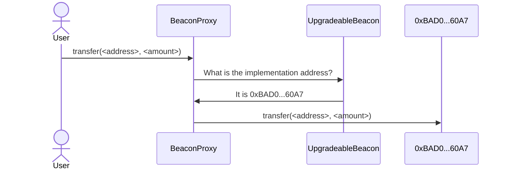
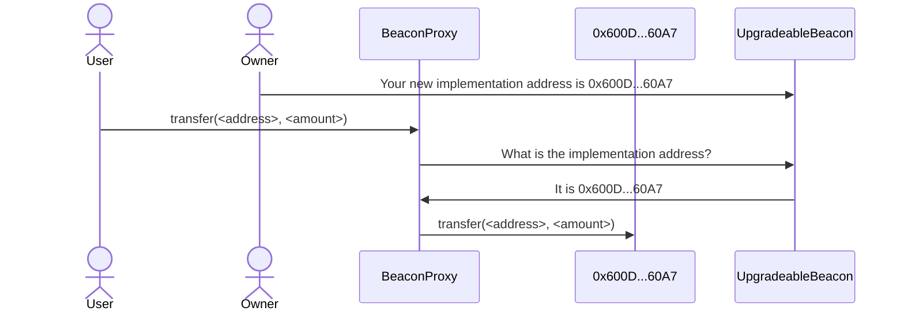

import { Steps, Callout, Tabs } from 'nextra/components'

<Callout>
  The SuperchainERC20 standard is ready for production deployments.
  Please note that the OP Stack interoperability upgrade, required for crosschain messaging, is currently still in active development.
</Callout>

# Custom interoperability bridges

## Overview

Sometimes the address of an ERC20 contract is not available on a different chain.
This means that the [standard bridge](/interop/superchain-erc20) is not an option.
However, if the original ERC20 contract is behind a proxy (so we can add [ERC7802](https://eips.ethereum.org/EIPS/eip-7802) support), we can still use interop by writing our own bridge.

<details>
  <summary>About this tutorial</summary>

  **What you'll learn**

  *   How to use [interop message passing](/interop/tutorials/message-passing) to create a custom bridge.

  **Prerequisite knowledge**

  *   How to [deploy SuperchainERC20 tokens with custom code](/interop/tutorials/custom-superchain-erc20).
  *   How to [transfer interop messages](/interop/tutorials/message-passing).
</details>

<Callout type="warning">
  The code on the documentation site is sample code, *not* production code.
  This means that we ran it, and it works as advertised.
  However, it did not pass through the rigorous audit process that most Optimism code undergoes.
  You're welcome to use it, but if you need it for production purposes you should get it audited first.
</Callout>

{/* 

I put this warning here, when we don't have it on most pages, because this tutorial
has code that is a lot more likely to be used in production. It doesn't just
show what is possible, it does the exact job needed.

*/}

## How beacon proxies work



A [beacon proxy](https://docs.openzeppelin.com/contracts/3.x/api/proxy#BeaconProxy) uses two contracts.
The [`UpgradeableBeacon`](https://github.com/OpenZeppelin/openzeppelin-contracts/blob/master/contracts/proxy/beacon/UpgradeableBeacon.sol) contract holds the address of the implementation contract.
The [`BeaconProxy`](https://github.com/OpenZeppelin/openzeppelin-contracts/blob/master/contracts/proxy/beacon/BeaconProxy.sol) contract is the one called for the functionality, the one that holds the storage.
When a user (or another contract) calls `BeaconProxy`, it asks `UpgradeableBeacon` for the implementation address and then uses [`delegatecall`](https://www.evm.codes/?fork=cancun#f4) to call that contract.



To upgrade the contract, an authorized address (typically the `Owner`) calls `UpgradeableBeacon` directly to specify the new implementation contract address.
After that happens, all new calls are sent to the new implementation.

## Instructions

Some steps depend on whether you want to deploy on [supersim](/interop/tools/supersim) or on the [development network](/interop/tools/devnet).

<Steps>
  ### Install and run Supersim

  If you are going to use Supersim, [follow these instructions](/app-developers/tutorials/supersim/getting-started/installation) to install and run Supersim.

  <Callout>
    Make sure to run Supersim with autorelay on.

    ```sh
    ./supersim --interop.autorelay true
    ```
  </Callout>

  ### Setup the ERC20 token on chain A

  Download and run the setup script.

  ```sh
  curl https://docs.optimism.io/tutorials/setup-for-erc20-upgrade.sh > setup-for-erc20-upgrade.sh
  chmod +x setup-for-erc20-upgrade.sh
  ./setup-for-erc20-upgrade.sh
  ```

  If you want to deploy to the [development networks](/interop/tools/devnet), provide `setup-for-erc20-upgrade.sh` with the private key of an address with ETH on both devnets.

  ```sh
  ./setup-for-erc20-upgrade.sh <private key>
  ```

  ### Store the addresses

  Execute the bottom two lines of the setup script output to store the ERC20 address and the address of the beacon contract.

  ```sh
  BEACON_ADDRESS=0xe7f1725E7734CE288F8367e1Bb143E90bb3F0512
  export ERC20_ADDRESS=0x9fE46736679d2D9a65F0992F2272dE9f3c7fa6e0
  ```

  ### Specify environment variables

  Specify these variables, which we use later:

  <Tabs items={['Supersim', 'Devnets']}>
    <Tabs.Tab>
      Set these parameters for Supersim.

      ```sh
      PRIVATE_KEY=0xac0974bec39a17e36ba4a6b4d238ff944bacb478cbed5efcae784d7bf4f2ff80
      USER_ADDRESS=0xf39Fd6e51aad88F6F4ce6aB8827279cffFb92266
      URL_CHAIN_A=http://127.0.0.1:9545
      URL_CHAIN_B=http://127.0.0.1:9546
      ```
    </Tabs.Tab>

    <Tabs.Tab>
      For Devnet, specify in `PRIVATE_KEY` the private key you used for the setup script and then these parameters.

      ```sh
      USER_ADDRESS=`cast wallet address --private-key $PRIVATE_KEY`
      URL_CHAIN_A=https://interop-alpha-0.optimism.io
      URL_CHAIN_B=https://interop-alpha-1.optimism.io
      ```
    </Tabs.Tab>
  </Tabs>

  ### Advance the user's nonoce on chain B

  This solution is necessary when the nonce on chain B is higher than it was on chain A when the proxy for the ERC-20 contract was installed.
  To simulate this situation we send a few meaningless transactions on chain B and then see that the nonce on B is higher than the nonce on A.

  ```sh
  cast send $USER_ADDRESS --private-key $PRIVATE_KEY --rpc-url $URL_CHAIN_B
  cast send $USER_ADDRESS --private-key $PRIVATE_KEY --rpc-url $URL_CHAIN_B
  cast send $USER_ADDRESS --private-key $PRIVATE_KEY --rpc-url $URL_CHAIN_B
  cast send $USER_ADDRESS --private-key $PRIVATE_KEY --rpc-url $URL_CHAIN_B
  echo -n Nonce on chain A:
  cast nonce $USER_ADDRESS --rpc-url $URL_CHAIN_A
  echo -n Nonce on chain B:  
  cast nonce $USER_ADDRESS --rpc-url $URL_CHAIN_B  
  ```

  ### Create a Foundry project

  We create a [Foundry](https://book.getfoundry.sh/) project and import the [OpenZeppelin](https://www.openzeppelin.com/solidity-contracts) contracts, which were used for the original ERC20 and proxy deployment.

  ```sh
  mkdir custom-bridge
  cd custom-bridge
  forge init
  forge install OpenZeppelin/openzeppelin-contracts
  forge install OpenZeppelin/openzeppelin-contracts-upgradeable
  forge install ethereum-optimism/interop-lib
  ```

  ### Deploy proxies

  We need two contracts on each chain: an ERC20 and a bridge, and to enable future upgrades, we want to install each of those contracts behind a proxy.
  We already have one contract, the ERC20 on chain A, but we need to create the other three.

  We have an interesting [chicken-and-egg](https://en.wikipedia.org/wiki/Chicken_or_the_egg) issue here.
  To create a proxy, we need the address of the implementation contract, the one with the actual code.
  However, the bridge and ERC20 code needs to have the proxy addresses.
  One possible solution is to choose a pre-existing contract, and use that as the implementation contract until we can upgrade.
  Every OP Stack chain has [predeploys](https://specs.optimism.io/protocol/predeploys.html) we can use for this purpose.

  ```sh
  DUMMY_ADDRESS=0x4200000000000000000000000000000000000000
  UPGRADE_BEACON_CONTRACT=lib/openzeppelin-contracts-upgradeable/lib/openzeppelin-contracts/contracts/proxy/beacon/UpgradeableBeacon.sol:UpgradeableBeacon
  PROXY_CONTRACT=lib/openzeppelin-contracts-upgradeable/lib/openzeppelin-contracts/contracts/proxy/beacon/BeaconProxy.sol:BeaconProxy
  BRIDGE_BEACON_ADDRESS_A=`forge create $UPGRADE_BEACON_CONTRACT --broadcast --rpc-url $URL_CHAIN_A --private-key $PRIVATE_KEY --constructor-args $DUMMY_ADDRESS $USER_ADDRESS | awk '/Deployed to:/ {print $3}'`
  BRIDGE_ADDRESS_A=`forge create $PROXY_CONTRACT --broadcast --rpc-url $URL_CHAIN_A --private-key $PRIVATE_KEY --constructor-args $BRIDGE_BEACON_ADDRESS_A 0x | awk '/Deployed to:/ {print $3}'`
  BRIDGE_BEACON_ADDRESS_B=`forge create $UPGRADE_BEACON_CONTRACT --broadcast --rpc-url $URL_CHAIN_B --private-key $PRIVATE_KEY --constructor-args $DUMMY_ADDRESS $USER_ADDRESS | awk '/Deployed to:/ {print $3}'`
  BRIDGE_ADDRESS_B=`forge create $PROXY_CONTRACT --broadcast --rpc-url $URL_CHAIN_B --private-key $PRIVATE_KEY --constructor-args $BRIDGE_BEACON_ADDRESS_B 0x | awk '/Deployed to:/ {print $3}'`
  ERC20_BEACON_ADDRESS_A=$BEACON_ADDRESS
  ERC20_ADDRESS_A=$ERC20_ADDRESS
  ERC20_BEACON_ADDRESS_B=`forge create $UPGRADE_BEACON_CONTRACT --broadcast --rpc-url $URL_CHAIN_B --private-key $PRIVATE_KEY --constructor-args $DUMMY_ADDRESS $USER_ADDRESS | awk '/Deployed to:/ {print $3}'`
  ERC20_ADDRESS_B=`forge create $PROXY_CONTRACT --broadcast --rpc-url $URL_CHAIN_B --private-key $PRIVATE_KEY --constructor-args $ERC20_BEACON_ADDRESS_B 0x | awk '/Deployed to:/ {print $3}'`  
  ```

  ### Deploy ERC7802 contracts

  We need to replace the ERC20 contracts with contracts that:

  *   Support [ERC7802](https://eips.ethereum.org/EIPS/eip-7802) and [ERC165](https://eips.ethereum.org/EIPS/eip-165).
  *   Allow the bridge address to mint and burn tokens.
      Normally this is `PredeployAddresses.SUPERCHAIN_TOKEN_BRIDGE`, but in our case it would be the bridge proxy address, which we'll store in `bridgeAddress`.
  *   Have the same storage layout as the ERC20 contracts they replace (in the case of chain A).

  1.  Create a file, `src/InteropToken.sol`.

      ```solidity file=<rootDir>/public/tutorials/InteropToken.sol hash=5e728534c265028c94d60dcb6550699d filename="src/InteropToken.sol"
      ```

  2.  This `src/InteropToken.sol` is used for contract upgrades.
      Edit it to allow our custom bridge to mint and burn tokens instead of the predeployed superchain token bridge.

      *   On lines 20 and 31 replace ~~`PredeployAddresses.SUPERCHAIN_TOKEN_BRIDGE`~~ with `bridgeAddress`.

          ```solidity
          require(msg.sender == bridgeAddress, "Unauthorized");
          ```

      *   Add these lines anywhere in the contract:

          ```solidity
              address public immutable bridgeAddress;

              constructor(address bridgeAddress_) {
                  bridgeAddress = bridgeAddress_;
              }
          ```

  3.  Deploy `InteropToken` on both chains, with the bridge address.

      ```sh
      INTEROP_TOKEN_A=`forge create InteropToken --private-key $PRIVATE_KEY --broadcast --rpc-url $URL_CHAIN_A --constructor-args $BRIDGE_ADDRESS_A | awk '/Deployed to:/ {print $3}'`
      INTEROP_TOKEN_B=`forge create InteropToken --private-key $PRIVATE_KEY --broadcast --rpc-url $URL_CHAIN_B --constructor-args $BRIDGE_ADDRESS_B | awk '/Deployed to:/ {print $3}'`
      ```

  4.  Update the proxies to the new implementations.

      ```sh
      cast send $ERC20_BEACON_ADDRESS_A "upgradeTo(address)" $INTEROP_TOKEN_A --private-key $PRIVATE_KEY --rpc-url $URL_CHAIN_A
      cast send $ERC20_BEACON_ADDRESS_B "upgradeTo(address)" $INTEROP_TOKEN_B --private-key $PRIVATE_KEY --rpc-url $URL_CHAIN_B
      ```

  ### Deploy the actual bridge

  1.  Create a file, `src/CustomBridge.sol`.

      ```solidity file=<rootDir>/public/tutorials/CustomBridge.sol hash=df5685626f96af100d608b5b94477888 filename="src/CustomBridge.sol"

      <details>

        <summary>Explanation</summary>

        blockchains

      </details>

      ```

  2.  Get the chainID values.

      ```sh
      CHAINID_A=`cast chain-id --rpc-url $URL_CHAIN_A`
      CHAINID_B=`cast chain-id --rpc-url $URL_CHAIN_B`
      ```

  3.  Deploy the bridges with the correct configuration.

      ```sh
      BRIDGE_IMPLEMENTATION_ADDRESS_A=`forge create CustomBridge --broadcast --rpc-url $URL_CHAIN_A --private-key $PRIVATE_KEY --constructor-args  $ERC20_ADDRESS_A $ERC20_ADDRESS_B $CHAINID_B $BRIDGE_ADDRESS_B | awk '/Deployed to:/ {print $3}'`
      BRIDGE_IMPLEMENTATION_ADDRESS_B=`forge create CustomBridge --broadcast --rpc-url $URL_CHAIN_B --private-key $PRIVATE_KEY --constructor-args  $ERC20_ADDRESS_B $ERC20_ADDRESS_A $CHAINID_A $BRIDGE_ADDRESS_A | awk '/Deployed to:/ {print $3}'`      
      ```

  4.  Inform the proxy beacons about the new addresses of the bridge implementation contracts.

      ```sh
      cast send $BRIDGE_BEACON_ADDRESS_A "upgradeTo(address)" $BRIDGE_IMPLEMENTATION_ADDRESS_A --private-key $PRIVATE_KEY --rpc-url $URL_CHAIN_A
      cast send $BRIDGE_BEACON_ADDRESS_B "upgradeTo(address)" $BRIDGE_IMPLEMENTATION_ADDRESS_B --private-key $PRIVATE_KEY --rpc-url $URL_CHAIN_B
      ```

  ### Verification

  1.  See your balance on chain A.

      ```sh
      cast call $ERC20_ADDRESS_A "balanceOf(address)" $USER_ADDRESS --rpc-url $URL_CHAIN_A | cast from-wei
      ```

  2.  See your balance on chain B.

      ```sh
      cast call $ERC20_ADDRESS_B "balanceOf(address)" $USER_ADDRESS --rpc-url $URL_CHAIN_B | cast from-wei
      ```

  3.  Transfer 0.1 token.

      ```sh
      AMOUNT=`echo 0.1 | cast to-wei`
      cast send $BRIDGE_ADDRESS_A --rpc-url $URL_CHAIN_A --private-key $PRIVATE_KEY "sendERC20(address,uint256)" $USER_ADDRESS $AMOUNT
      ```

  4.  See the new balances. The A chain should have 0.9 tokens, and the B chain should have 0.1 tokens.

      ```sh
      cast call $ERC20_ADDRESS_A "balanceOf(address)" $USER_ADDRESS --rpc-url $URL_CHAIN_A | cast from-wei
      cast call $ERC20_ADDRESS_B "balanceOf(address)" $USER_ADDRESS --rpc-url $URL_CHAIN_B | cast from-wei
      ```
</Steps>

## Next steps

*   Deploy a [SuperchainERC20](/interop/tutorials/deploy-superchain-erc20) to the Superchain
*   [Learn more about SuperchainERC20](/interop/superchain-erc20)
*   Build a [revolutionary app](/app-developers/get-started) that uses multiple blockchains within the Superchain
