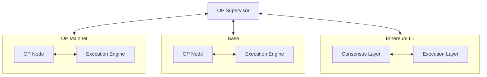
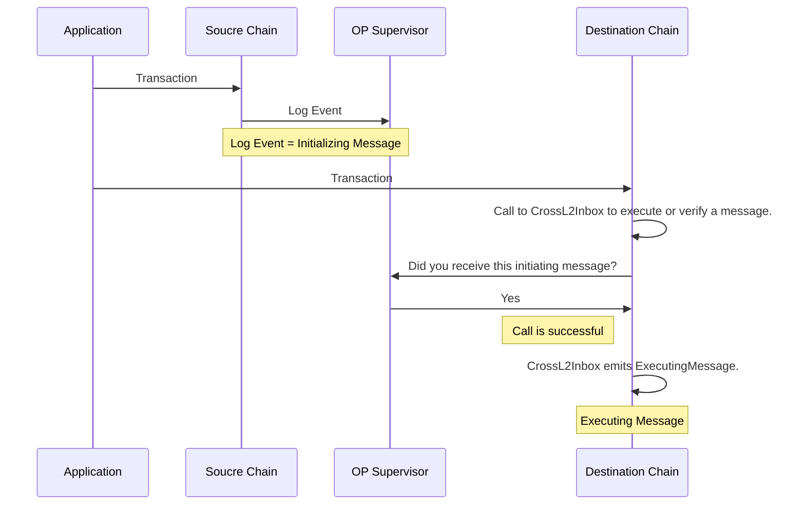
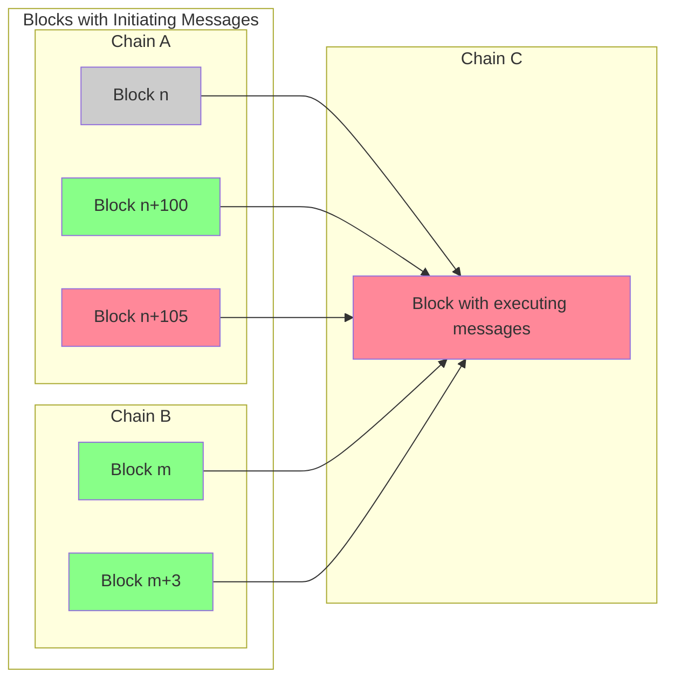

import { Callout } from 'nextra/components'
import Image from 'next/image'

import { InteropCallout } from '@/components/WipCallout'

<InteropCallout />

# Interoperability architecture 

Interoperability is provided by an [OP Supervisor](./op-supervisor).
This supervisor keeps a copy of the events for all the blockchains in the interoperability cluster, and can therefore validate that cross-chain messages (which are always initiated with an event on the source cluster).

## How messages get from one chain to the other

## Safety levels

- *Unsafe* - not yet written to L1, obtained through gossip channels, ultimately based on trust in a sequencer.
- *Cross unsafe* - verified that all executing messages have legitimate initiating messages, but otherwise still unsafe.
  Treated as unsafe for most purposes.
- *Safe* - the block and all the blocks on which it depends (those with initiating mesages to which it has executing messages) have been written to L1.
- *Finalized* - the block and all the blocks on which it depends have been on L1 for long enough to make a reorg impossible.

A block should only be written to L1 once the blocks on which it depends are all safe.