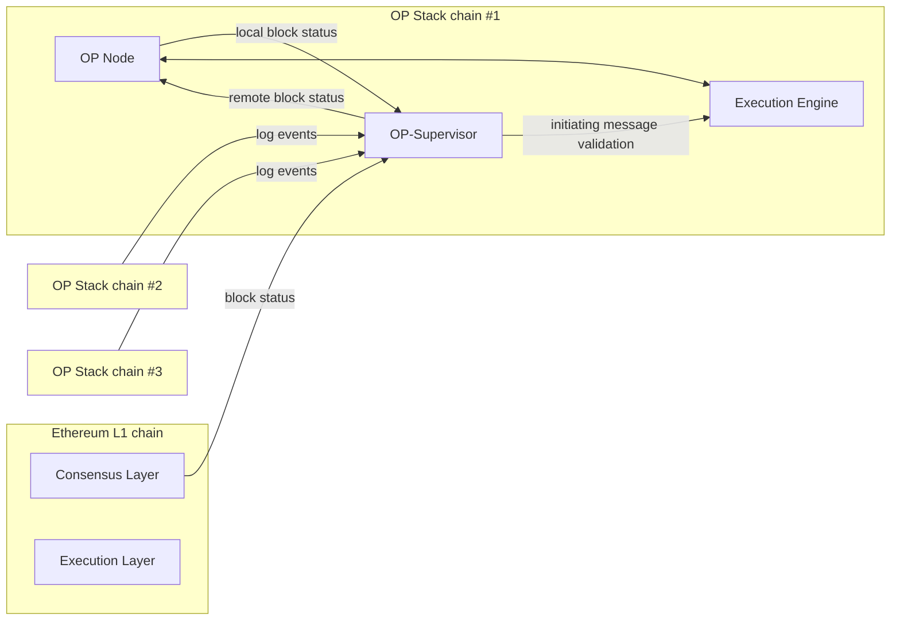
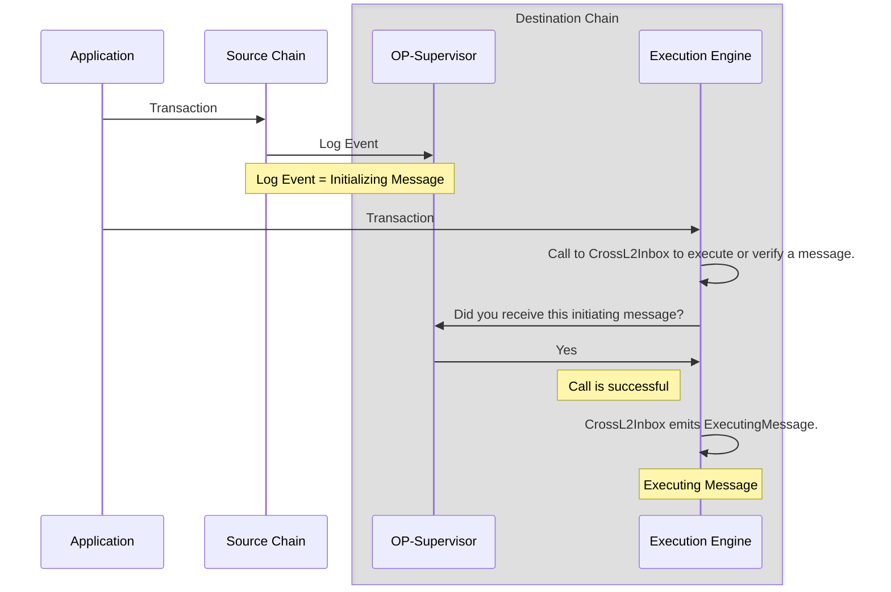
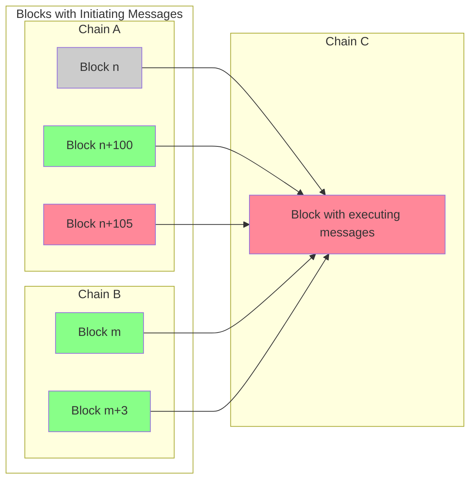

import { Callout } from 'nextra/components'
import Image from 'next/image'

import { InteropCallout } from '@/components/WipCallout'

<InteropCallout />

# Interoperability architecture

Interoperability among OP Stack chains is enabled via a new service called *OP-Supervisor*.
Every node operator is expected to run this service in addition to the [rollup node](/builders/node-operators/architecture#rollup-node) and [execution client](/builders/node-operators/architecture#execution-client).

OP-Supervisor holds a database of all the log events of all the chains in the interoperability cluster.
Every event can potentially initiate a cross domain message, and it is the job of OP-Supervisor to validate that the log event really happened on the source chain.
Additionally, OP-Supervisor reads information from L1's consensus layer to determine the transaction safety of L2 blocks.

## How messages get from one chain to the other

To understand *why* we need this additional component, it is useful to know how interop messages get from one blockchain to another.

Cross domain messages require two transactions.
The first transaction creates an *initiating message* on the source chain.
The second transaction creates an *executing message* on the destination chain.
This executing message could result in a contract function being executed on the destination chain.

The initiating message is simply a log event.
Any log event on any chain that inteoperates with the destination can initiate a cross domain message.

The transaction that receives the message calls a contract called [`CrossL2Inbox`](https://specs.optimism.io/interop/predeploys.html#crossl2inbox), directly or indirectly.
The call to `CrossL2Inbox`, also known as the *executing message*, needs to [identify the initiating message uniquely](https://github.com/ethereum-optimism/optimism/blob/develop/packages/contracts-bedrock/src/L2/CrossL2Inbox.sol#L35-L42), using the chain ID of the source chain, the block number, and the index of the log event within that block, as well as a few other fields as a sanity check.

`CrossL2Inbox` can either [validate the message exists](https://github.com/ethereum-optimism/optimism/blob/develop/packages/contracts-bedrock/src/L2/CrossL2Inbox.sol#L171-L185), or [call a contract if the message exists](https://github.com/ethereum-optimism/optimism/blob/develop/packages/contracts-bedrock/src/L2/CrossL2Inbox.sol#L171-L185).

## Safety levels

In addition to being written to L1, a *safe* block is one that only depends on other safe blocks.
For example, in the image below, most blocks are safe.
Block `n` in chain A is even finalized, and immune from reorgs.
However, block `n+105` in chain A is unsafe, it (or a block on which it depends is not written to L1).
Because the new block depends upon it, it is also unsafe.

## Next steps

- Want to learn more? 
  Read our guide on the anatomy of a [cross-chain message](./cross-chain-message) or check out this 
  [interop design video walk-thru]([https://www.youtube.com/watch?v=FKc5RgjtG](https://www.youtube.com/watch?v=FKc5RgjtG)
- Ready to get started? Use [Supersim](./supersim), a local dev environment that simulates interop for testing applications against a local version of the Superchain.
- For more info about how OP Stack interoperability works under the hood, 
  [check out the specs](https://specs.optimism.io/interop/overview.html).

{/* 
- *Unsafe* - not yet written to L1, obtained through gossip channels, ultimately based on trust in a sequencer.
- *Cross unsafe* - verified that all executing messages have legitimate initiating messages, but otherwise still unsafe.
  Treated as unsafe for most purposes.
- *Safe* - the block and all the blocks on which it depends (those with initiating mesages to which it has executing messages) have been written to L1.
- *Finalized* - the block and all the blocks on which it depends have been on L1 for long enough to make a reorg impossible.
*/}
