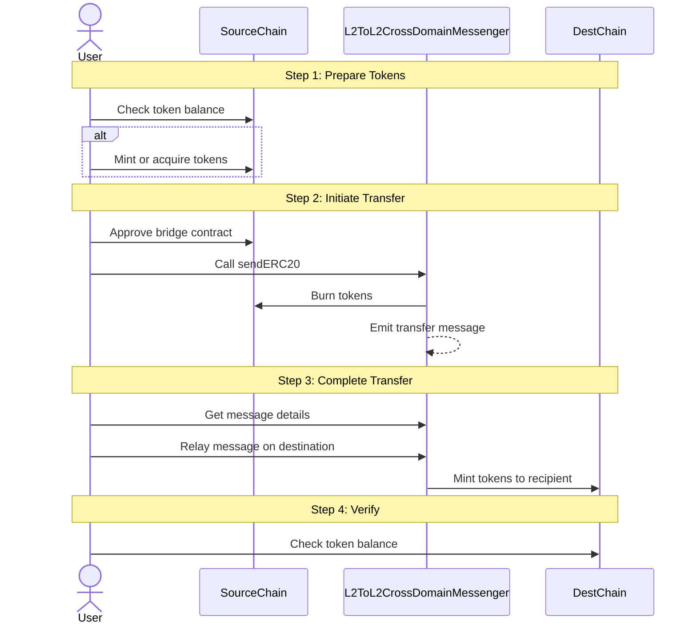

import { Callout, Steps } from 'nextra/components'

# How to transfer a SuperchainERC20

<Callout>
  Interop is currently in active development and not yet ready for production use. The information provided here may change. Check back regularly for the most up-to-date information.
</Callout>

This guide provides an overview of transferring `SuperchainERC20` tokens between chains.

## Overview

Transferring SuperchainERC20 tokens between chains involves two main phases:

1.  **Source Chain Operations**
    *   Mint tokens if needed
    *   Initiate the transfer using the bridge
2.  **Destination Chain Operations**
    *   Relay the transfer message
    *   Verify the transfer completion

<Callout type="warning">
  Always verify your addresses and amounts before sending transactions. Cross-chain transfers cannot be reversed.
</Callout>

## How it works

This diagram illustrates the process of a SuperchainERC20 token transfer between chains. 
Through the `L2ToL2CrossDomainMessenger` contract, tokens are burned on the source chain and a transfer message is emitted. 
This message must then be relayed to the destination chain, where an equivalent amount of tokens will be minted to the specified recipient address - ensuring secure cross-chain transfers while maintaining the total token supply across all chains.

<Steps>
  ### Step 1: Prepare your tokens

  Ensure you have tokens on the source chain using one of these methods:

  *   Use existing tokens you already own
  *   Mint new tokens using the [SuperchainERC20](https://github.com/ethereum-optimism/supersim/blob/main/contracts/src/L2NativeSuperchainERC20.sol) contract if you have minting permissions
  *   Acquire tokens through a supported exchange or transfer

  ### Step 2: Initiate the transfer

  To start the transfer:

  1.  Choose the destination chain where you want to receive the tokens
  2.  Specify the recipient address and the amount to transfer
  3.  Call the bridge contract, which will:
      *   Lock or burn your tokens on the source chain
      *   Emit a message that will be used to mint tokens on the destination chain

  ### Step 3: Complete the transfer

  To finalize the transfer on the destination chain:

  1.  Get the message details from the source chain event
  2.  Use the `L2ToL2CrossDomainMessenger` contract to relay the message
  3.  The message relay will trigger the minting of tokens on the destination chain

  <Callout type="info">
    The transfer isn't complete until the message is successfully relayed on the destination chain. See the [technical reference guide](https://supersim.pages.dev/guides/interop/cast) for specific relay instructions.
  </Callout>

  ### Step 4: Verify completion

  After relaying the message:

  1.  Check your token balance on the destination chain
  2.  Confirm the transferred amount matches what you sent
  3.  The tokens should now be available for use on the destination chain
</Steps>

For detailed technical instructions including contract addresses, specific commands, and message relaying details, refer to our [technical reference guide](https://supersim.pages.dev/guides/interop/cast).

## Alternative methods

You can also use:

*   [viem bindings/actions](https://supersim.pages.dev/guides/interop/viem) for TypeScript integration

## Next steps

*   Read the [Superchain Interop Explainer](/stack/interop/explainer#faqs) or check out this [Superchain interop design video walk-thru](https://www.youtube.com/watch?v=FKc5RgjtGes)
*   Use [Supersim](../../interop/supersim), a local dev environment that simulates Superchain interop for testing applications against a local version of the Superchain
