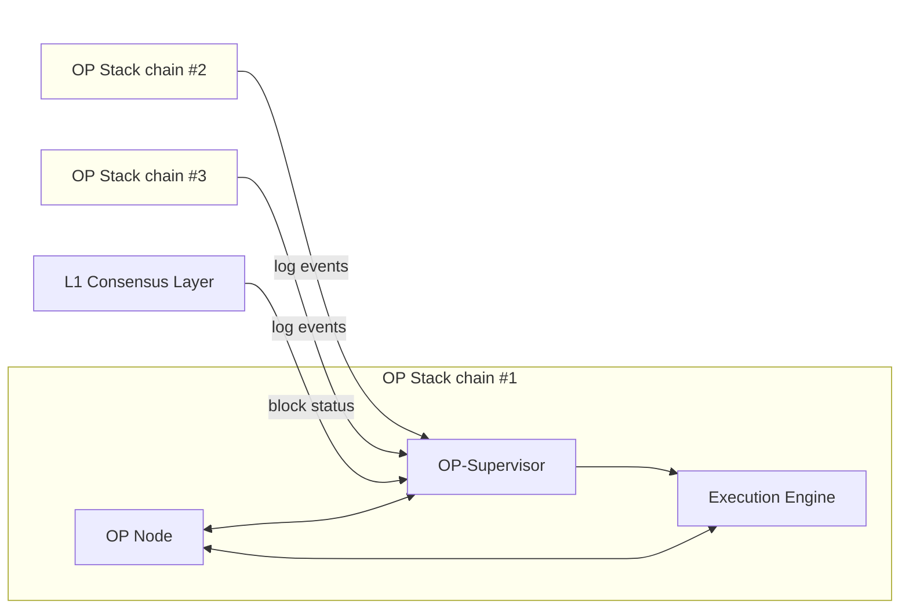
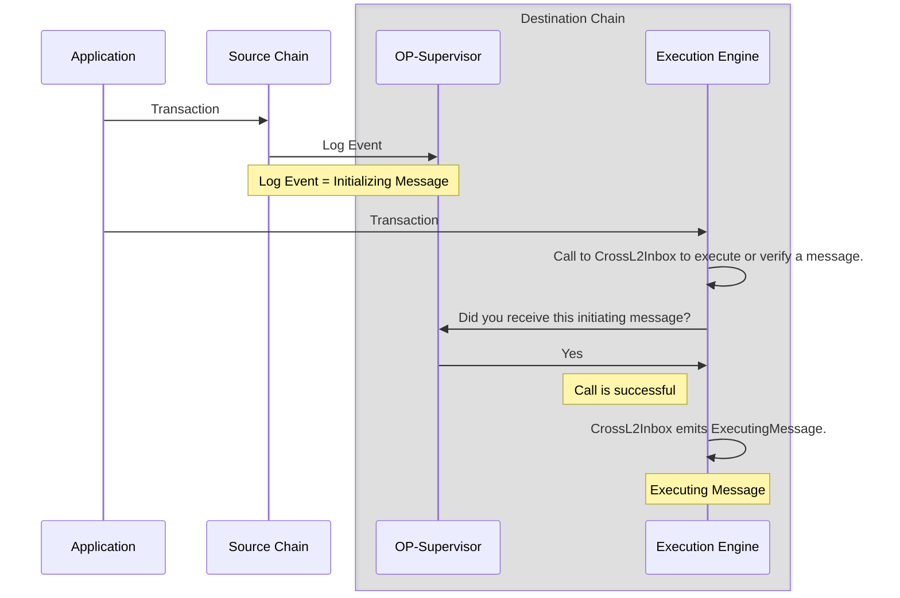
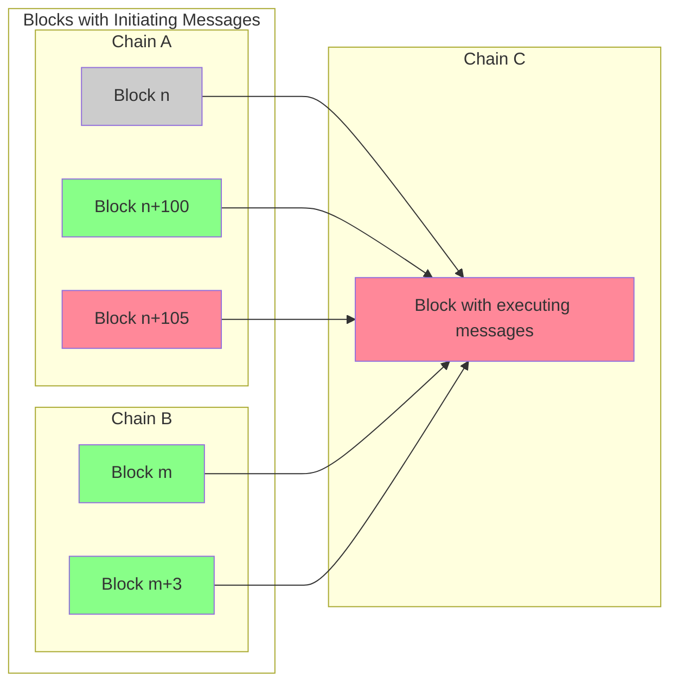
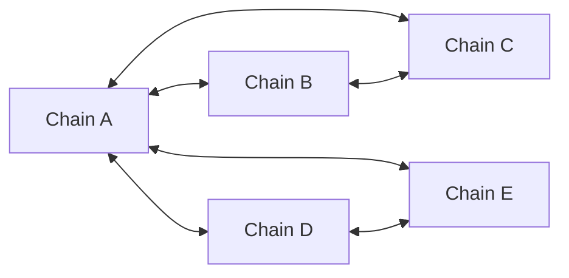
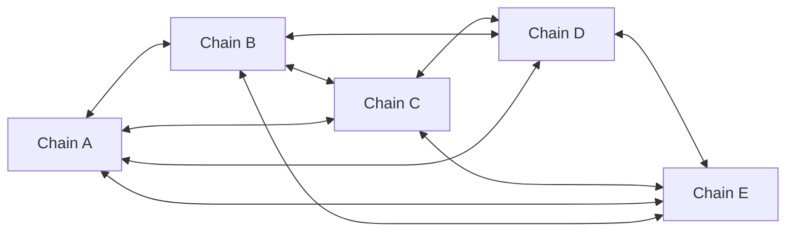

import { Callout } from 'nextra/components'
import Image from 'next/image'

import { InteropCallout } from '@/components/WipCallout'

<InteropCallout />

# Superchain interoperability explainer

## Why do we need Superchain interoperability?

It is easy for a blockchain to be certain about information it generates itself.
Information that comes from other sources is harder to provide in a safe, decentralized, and uncensorable manner (this is called [The Oracle Problem](https://chain.link/education-hub/oracle-problem)).
The next major scalability improvement to the OP Stack is to enable a network of chains, the Superchain, to feel like a single blockchain.
This goal requires low-latency, seamless message passing and asset bridging.

*Superchain interoperability* is a set of protocols and services that lets OP Stack blockchains read each other's state.
Superchain interoperability provides the following benefits:

*   ETH and ERC-20 tokens to move securely between chains via native minting and burning.  Asset interoperability solves the issues of liquidity fragmentation and poor user experiences caused by asset wrapping or liquidity pools.
*   Apps to compose with data that exist on other chains.
*   Horizontal scalability for applications that need it.

## Superchain interoperability architecture

A pre-interop OP Stack node consists of two pieces of software: a consensus client (e.g. op-node) and an execution client, which is responsible for processing user transactions and constructing blocks (e.g. op-geth).
Superchain interoperability among OP Stack chains is enabled via a new service called [*OP Supervisor*](/stack/interop/op-supervisor).
Every node operator is expected to run this service in addition to the [rollup node](/operators/node-operators/architecture#rollup-node) and [execution client](/operators/node-operators/architecture#execution-client).



OP-Supervisor holds a database of all the log events of all the chains in the Superchain interoperability cluster.
Every event can potentially initiate a cross-domain message, and it is the job of OP-Supervisor to validate that the log event really happened on the source chain.
Additionally, OP-Supervisor reads information from L1's consensus layer to determine the transaction safety of L2 blocks.

## How messages get from one chain to the other

To understand *why* we need this additional service, it is useful to know how interop messages get from one OP Stack chain to another.



Cross-domain messages require two transactions.
The first transaction creates an *initiating message* on the source chain.
The second transaction creates an *executing message* on the destination chain.
This executing message could result in a contract function being executed on the destination chain.

The initiating message is simply a log event.
Any log event on any chain that interoperates with the destination can initiate a cross-domain message.

The transaction that receives the message on the destination chain calls a contract called [`CrossL2Inbox`](https://specs.optimism.io/interop/predeploys.html#crossl2inbox).
This call can be at the top level, directly from the externally owned account, or come through a smart contract.
The call to `CrossL2Inbox`, also known as the *executing message*, needs to [identify the initiating message uniquely](https://github.com/ethereum-optimism/optimism/blob/develop/packages/contracts-bedrock/src/L2/CrossL2Inbox.sol#L35-L42), using the chain ID of the source chain, the block number, and the index of the log event within that block, as well as a few other fields as a sanity check.

`CrossL2Inbox` can either [validate the message exists](https://github.com/ethereum-optimism/optimism/blob/develop/packages/contracts-bedrock/src/L2/CrossL2Inbox.sol#L171-L185), or [call a contract if the message exists](https://github.com/ethereum-optimism/optimism/blob/develop/packages/contracts-bedrock/src/L2/CrossL2Inbox.sol#L171-L185).

## Block safety levels



Superchain interop expands the scope of trust for unsafe blocks (blocks that are shared through [the gossip protocol](/operators/chain-operators/architecture#sequencer)).
If a sequencer chooses to accept unsafe messages, the sequencer must trust the sequencer that produces the inbound message as well as any referenced unsafe messages produced from sequencers in the transitive dependency set.

<details>
  <summary>What is the transitive dependency set?</summary>

  The transitive dependency set of a blockchain is all the chains on which it depends, and all the chains that depend on them, and so on.
  For example, in the illustration above, the dependency set of chain A is just chain B.
  However, the *transitive* dependency set includes chain B, the chains that depend on it (C and D) and the chains that depend on them (E).
  If there was a chain that depended on E, that chain would be part of the transitive dependency set too.

  ```mermaid

  flowchart LR
      A[Chain A] <--> B[Chain B]
      B <--> C[Chain C]
      B <--> D[Chain D]
      D <--> E[Chain E]
      F[Chain F] <--> G[Chain G]
  ```

  For example, there could be a block in chain D that depends on an initiating message in chain E.
  If the block with that initiating message is still unsafe (not written to L1), then the block in chain D is also unsafe, even if it has been written to L1.
  As a result, a block in chain B that depends on the chain D block can also be unsafe, as can a block in chain A that depends on the block in chain B.
</details>

Notably this trust assumption is only for *unsafe* blocks, and *only* if the sequencer allows messages from unsafe blocks to be processed.

In Superchain interop, [the traditional safe level](https://docs.optimism.io/stack/transactions/transaction-finality#steps-to-finality) of a block is divided into two types of safety.
A block is *local safe* once it is written to L1.
But it is only *cross safe* when in addition to the block itself all of the blocks on which it depends (directly or indirectly) are written to L1, including the dependencies of previous blocks in the same chain.

For example, in the image above, most blocks are safe.
Block `n` in chain `A` is even finalized, and immune from reorgs.
However, block `n+105` in chain `A` is unsafe, it (or a block on which it depends) is not written to L1.
Because the new block depends upon it, it can be either unsafe or local safe, but it cannot be cross safe.

## Interop clusters

The interop protocol works via a dependency set which is configured on a per-chain basis.
The dependency set defines the set of chains that can send and receive messages with a specific chain.



For example, in the illustration above, the dependency set of chain B is chains A and C.
To move an asset from chain E to chain B, it is necessary to move the asset from chain E to chain A, and then from chain A to chain B, because there is no direct dependency between B and E.

### Superchain interop cluster

The Superchain builds on top of the interop protocol and implements a single mesh network with complete dependencies.
In this model, each blockchain in the Superchain interop cluster would have direct connections to every other blockchain, creating a fully connected mesh network.
This model provides the highest level of interoperability, as any blockchain can transact directly with any other.



Each blockchain in the Superchain interop cluster shares the same security model to mitigate the weakest-link scenario. As outlined in the [Standard Rollup Charter](/superchain/blockspace-charter), these chains share the same L1 `ProxyAdmin` Owner. Any changes to the Superchain interop cluster must follow the standard Protocol Upgrade vote procedure—the established governance process for Superchain modifications.

The Superchain interop cluster will be rolled out iteratively, but to see a list of eligible chains that could join the cluster visit the [Superchain Index](https://www.superchain.eco/superchain-index) and look at chains that have a `Standard` charter.

{/* 
## Superchain interop assets

Superchain interop includes both the protocol layer message passing asset interoperability for ETH and SuperchainERC20 tokens.

*   **Message passing protocol:** the initial + finalizing/executing [message-cross-chain-message] that fire events to be consumed by the chains in the [dependency set](https://specs.optimism.io/interop/dependency-set.html)
*   ****: the [SuperchainERC20 superchain-erc20] turns message passing into asset transfer between chains in the interop set. Learn more about how the SuperchainERC20 token standard enables asset interoperability in the Superchain [here](/stack/interop/superchain-erc20)

This means ETH and ERC-20s can seamlessly and securely move across L2s, and intent-based protocols (i.e., bridges) can build better experiences on top of the message passing protocol.
*/}

## Next steps

*   Build a [revolutionary app](/app-developers/get-started) that uses multiple blockchains within the Superchain
*   Deploy a [SuperchainERC20](/stack/interop/tutorials/deploy-superchain-erc20) to the Superchain
*   Learn [how messages get from one chain to another chain](/stack/interop/message-passing)
*   Watch [this video](https://www.youtube.com/watch?v=FKc5RgjtGes), which gives an overview of Superchain interoperability.
