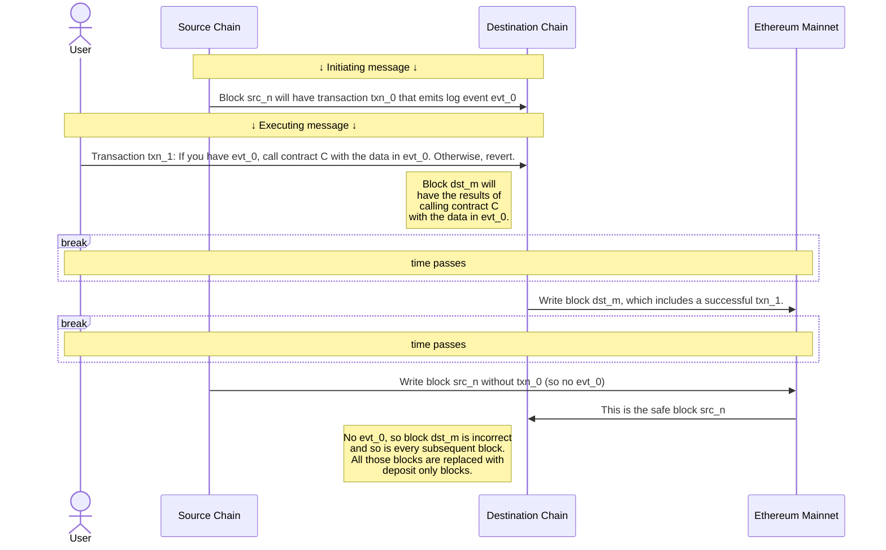
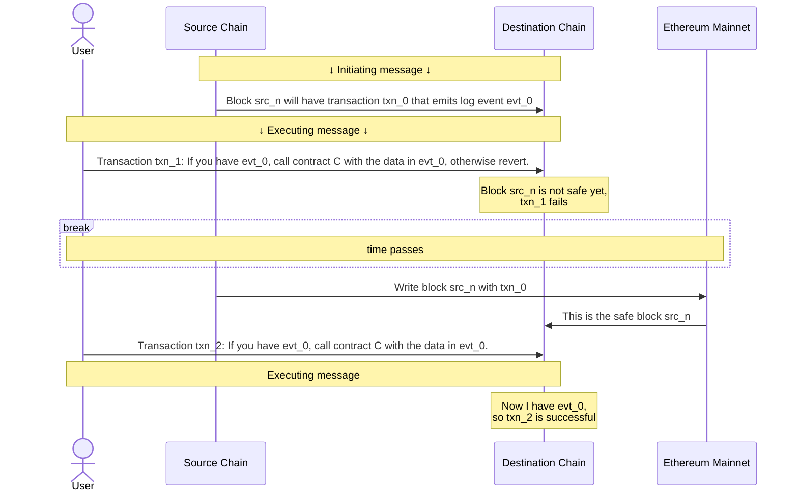

import { Callout } from 'nextra/components'
import Image from 'next/image'

import { InteropCallout } from '@/components/WipCallout'

<InteropCallout />

# Crosschain security measures for safe interoperability

## The trust model

This interop vulnerability arises when an initiating message seems to exist, prompting the processing of the executing message. However, the initiating message ends up not actually appearing in the canonical chain.
Excluding L1 reorgs, this can happen in two ways:

*   *Equivocation*. A sequencer publishes a block using the gossip protocol that is different from the one that eventually gets written to L1.
    The problem happens when the gossip protocol block includes a log entry that is used as an initiating message, but the real block (the one written to L1) doesn't.
    The way this is handled is that a block that depends on an unsafe block is, itself, unsafe.
    It does not get treated as safe until all the blocks on which it depends (directly or indirectly) are also written to L1.

*   *Faulty information*. The sequencer operator can run a verifier node for every chain in the dependency set, in which case it can deduce the initiating messages from the safe transactions of every chain.
    To save on resources, the sequencer can choose to query existing nodes of the source blockchain.
    In that case, if the information provided to sequencer is incorrect, of course the blocks posted by the sequencer will be also incorrect.

    In this case, invalid blocks will be replaced with deposit only blocks by other verifiers.

    

      
What are deposit only blocks?

      Normally the blocks that make it to the canonical blockchain are those posted to L1 by the sequencer.
      However, when those blocks are missing or invalid (for example because they rely on an initiating message that is missing), they're replaced by *deposit only blocks*, blocks whose content can be calculated from L1 without relying on the sequencer.

      The way this works is that there are two types of user transactions in an OP Stack block:

      *   Sequencer transactions, which go through the sequencer.
          These transactions are extremely cheap, but in theory a sequencer could censor them.
      *   Deposit transactions, which users submit through L1.
          These transactions have the cost of an L1 transaction, which is a lot higher, but they cannot be censored by the sequencer.

      A deposit only block only contains the deposit transactions and some internal transactions, not the sequencer transactions.

      For more information about this process, [see the technical specifications](https://specs.optimism.io/protocol/derivation.html#deriving-the-transaction-list).
    

## The latency/security tradeoff

The initiating message comes from a block on a different blockchain.
If we accept initiating messages as soon as the block is available through the gossip protocol, we have minimal latency but at a security cost (because the source sequencer can send incorrect information through gossip).
Alternatively, we can wait until the source sequencer posts the block to L1.
In that case we can be more certain that the block is correct, but at the cost of higher latency.

There are three different possibilities, at different levels of latency and security.

### Unsafe initiating messages

L2 blocks start as unsafe, meaning that there's no L1 evidence for them, and the sequencer for that blockchain can send out incorrect information.
Sending out incorrect information, for example that a certain transaction is included in a block when it isn't, is called *equivocation*.
A sequencer that builds blocks with interop can choose to accept messages from unsafe blocks (received through the gossip protocol), for minimal latency.

To minimize the risk of equivocation, a block written to L1 (*local safe*) is only considered fully safe (*cross safe*) once both that block and all preceding blocks in its blockchain are also written to L1.
If the source block is written to L1 first, the destination sequencer can detect it. 
If the source block is missing an initiating message that the sequencer relied on due to equivocation, the sequencer can identify the error and recalculate the state. In this scenario, no significant harm occurs.

However, if the destination block—containing the executing message that depends on the initiating message—is written to L1 first (e.g., due to higher traffic on the chain), a different risk arises. 
If the source block that is eventually written to L1 lacks the initiating message, verifiers will detect that the derivation of the destination block, and any blocks dependent on it, is incorrect. 
In this case, the destination block and all subsequent blocks on any chain that depend on it are classified as deposit-only blocks.

### Safe initiating messages

Alternatively, a sequencer can be configured to only accept executing messages once the initiating message is in a cross safe block.
A cross safe block is one that is written to L1, and whose dependencies (direct or indirect, including dependencies of previous blocks in the same chain) are all written to L1.

When a block is cross safe, the source sequencer cannot equivocate, and the state will only need to be recalculated if there's an [L1 reorg](https://www.alchemy.com/overviews/what-is-a-reorg#what-happens-to-reorgs-after-the-merge).
The cost of this enhanced security that it would take longer for a message to pass from one blockchain to the other.
Higher throughput OP Stack chains like Base and OP Mainnet submit a batch about every 5 minutes, so on average it takes about 2.5 minutes for an initiating message to become safe.

You can use [this dune dashboard](https://dune.com/oplabspbc/op-stack-chains-l1-activity#submission-frequency) to see how often OP Stack chains submit batches.

### Finalized initiating messages

A sequencer can also be configured to reject all executing messages until the initiating message is *finalized*, meaning it's irrevocably on L1 and immune to reorgs.
Currently, this adds [about 15 minutes](https://ethereum.org/en/roadmap/single-slot-finality/) to the message latency.

 

<Image src="/img/op-stack/protocol/safe-unsafe.png" alt="Safe and Unsafe Security Diagram" width={700} height={500} />

<Callout>
  Even if a sequencer accepts unsafe initiating messages, the blocks it constructs that rely on them are considered unsafe until the blocks with those initiating messages are written to L1 and become safe.
</Callout>

{/* 
## What is stopping a sequencer from censoring a cross-chain message?
There is nothing stopping a sequencer from censoring a transaction when it is sent directly to the sequencer. This does not mean the network has no censorship resistance, users can always send a deposit transaction for censorship resistance as strong as L1 guarantees. The tradeoff here is the latency, instead of being confirmed in ~2 seconds, the transaction can be confirmed at the rate of L1 block production. It may be possible to adopt something like [EIP-7547](https://eips.ethereum.org/EIPS/eip-7547) in the future to enable low latency censorship resistance.

## What is stopping a shared sequencer from including just the executing message and not the initiating message?
The protocol enforces the fact that all executing messages are valid. It does this by reorganizing out executing messages that have invalid initiating messages. Running software that does not enforce this would be non-standard behavior and would leave yourself at risk of accepting an invalid executing message and therefore running on a forked chain.

*/}

*   Build a [revolutionary app](/app-developers/get-started) that uses multiple blockchains within the Superchain
*   Deploy a [SuperchainERC20](/stack/interop/tutorials/deploy-superchain-erc20) to the Superchain
*   For more info about how Superchain interoperability works under the hood, [check out the specs](https://specs.optimism.io/interop/overview.html)
*   View more [interop tutorials](/stack/interop/tutorials)
