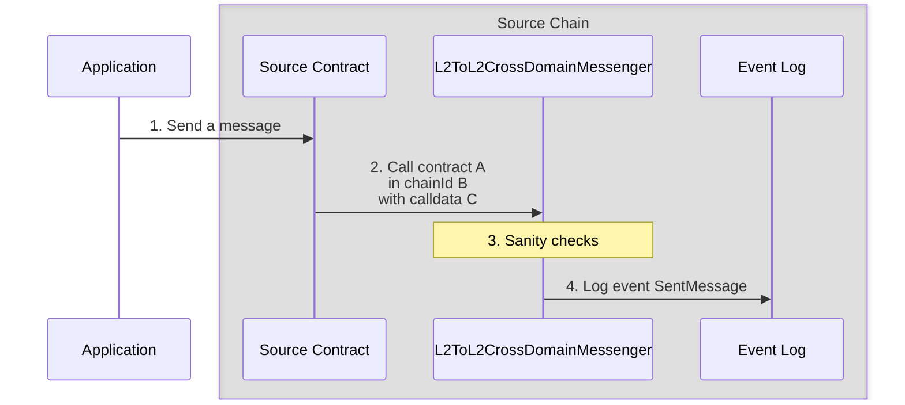
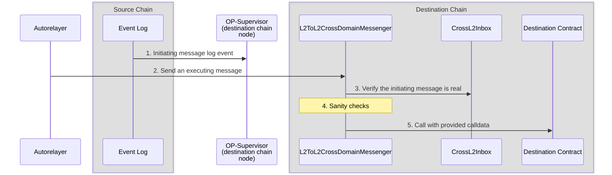

import { Callout, Steps } from 'nextra/components'

import { InteropCallout } from '@/components/WipCallout'

<InteropCallout />

# Interop message passing overview

<Callout>
  This is an explanation of how interop works.
  You can find a step by step tutorial [here](/stack/interop/tutorials/message-passing).
</Callout>

The low-level [`CrossL2Inbox`](https://github.com/ethereum-optimism/optimism/blob/develop/packages/contracts-bedrock/src/L2/CrossL2Inbox.sol) contract handles basic message execution. It verifies whether an initiating message exists but does not check the message's destination, processing status, or other attributes.

The [`L2ToL2CrossDomainMessenger`](https://github.com/ethereum-optimism/optimism/blob/develop/packages/contracts-bedrock/src/L2/L2ToL2CrossDomainMessenger.sol) contract extends `CrossL2Inbox` by providing complete cross-domain messaging functionality.

For high-level interoperability, both messages use the `L2ToL2CrossDomainMessenger` contract on their respective chains.

## Initiating message

1.  The application sends a transaction to a contract on the source chain.

2.  The contract calls [`L2ToL2CrossDomainMessenger.SendMessage`](https://github.com/ethereum-optimism/optimism/blob/develop/packages/contracts-bedrock/src/L2/L2ToL2CrossDomainMessenger.sol#L125-L142).
    The call requires these parameters:

    *   `_destination`: The chain ID of the destination blockchain.
    *   `_target`: The address of the contract on that blockchain.
    *   `_message`: The actual message.
    
    This message is provided to `_target` as calldata, which means it includes a function selector and the parameters for that function call.

3.  `L2ToL2CrossDomainMessenger` on the source chain verifies the message is legitimate:
    *   The destination chain is one to which this chain can send messages.
    *   The destination chain is *not* the source chain.
    *   The target is neither `CrossL2Inbox` nor `L2ToL2CrossDomainMessenger`.

4.  `L2ToL2CrossDomainMessenger` emits a log entry.
    In addition to the parameters, the log entry also includes:

    *   `_nonce`: A [nonce](https://en.wikipedia.org/wiki/Cryptographic_nonce) value to ensure the message is only executed once.

    *   `_sender`: The contract that sent the cross domain message.

## Executing message

1.  Before the executing message is processed, the log event of the initiating message has to get to `op-supervisor` on the destination chain.

2.  The autorelayer, the application, or a contract calling on the application's behalf calls [`L2ToL2CrossDomainMessenger.relayMessage`](https://github.com/ethereum-optimism/optimism/blob/develop/packages/contracts-bedrock/src/L2/L2ToL2CrossDomainMessenger.sol#L150-L203).
    This call includes the message that was sent (`_sentMessage`), as well as the [fields required to find that message (`_id`)](https://github.com/ethereum-optimism/optimism/blob/develop/packages/contracts-bedrock/interfaces/L2/ICrossL2Inbox.sol#L4-L10).

3.  The `L2ToL2CrossDomainMessenger` uses `CrossL2Inbox` to verify the message was sent from the source.

4.  `L2ToL2CrossDomainMessenger` on the destination chain verifies the message is legitimate:

    *   The origin (of the log entry) is `L2ToL2CrossDomainMessenger` on the other side.
    *   The destination chain ID is correct.
    *   The target is neither `CrossL2Inbox` nor `L2ToL2CrossDomainMessenger`.
    *   This message has not been relayed before.
    
    This is the reason we need the nonce value, to enable us to send multiple messages that would be otherwise identical.

5.  If everything checks out, `L2ToL2CrossDomainMessenger` calls the destination contract with the calldata provided in the message.

## Next steps

*   Build a [revolutionary app](/app-developers/get-started) that uses multiple blockchains within the Superchain
*   Learn how to [pass messages between blockchains](/stack/interop/tutorials/message-passing).
*   Deploy a [SuperchainERC20](/stack/interop/tutorials/deploy-superchain-erc20) to the Superchain.
