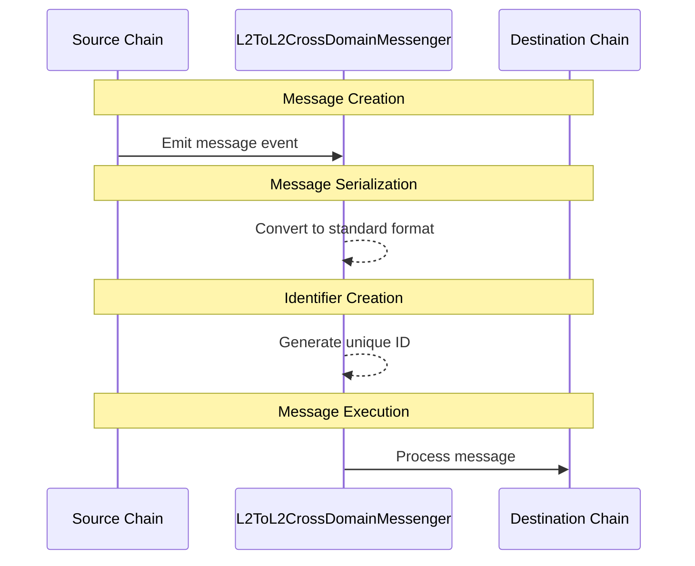

import { Callout, Steps } from 'nextra/components'

# Interop message passing overview

<Callout>
  Interop is currently in active development and not yet ready for production use. The information provided here may change. Check back regularly for the most up-to-date information.
</Callout>

This guide provides an overview of cross-chain message passing in the Superchain.

## Overview

The Superchain uses a pull-based event system for cross-chain communication. Messages are sent through the `L2ToL2CrossDomainMessenger` contract, which provides a secure and standardized way to pass information between chains.

## How it works

The following diagram illustrates how messages flow between chains through the `L2ToL2CrossDomainMessenger` contract, which acts as a bridge for cross-chain communication. When a contract on the source chain initiates a message, it's processed through several stages before reaching its destination, ensuring secure and reliable message delivery.

Cross-chain messaging involves four main phases:

1.  **Message Creation**: The source chain contract emits an event containing the message data and destination information. This event serves as the initiating message that will be relayed across chains.

2.  **Message Serialization**: The messenger contract converts the event data into a standardized format that can be consistently processed across different chains in the Superchain.

3.  **Identifier Creation**: A unique identifier is generated for the message, containing information about its `origin`, `timestamp`, and other `metadata`. This identifier helps track and verify the message.

4.  **Message Execution**: The destination chain receives and processes the message, executing any associated actions or state changes specified in the original message.

For detailed implementation steps and code examples, see our [message passing implementation guide](https://supersim.pages.dev/guides/interop/viem).

## Common Use Cases

*   Simple messages between identical contracts
*   Complex multi-contract interactions
*   Cross-chain state synchronization
*   Token transfers and bridging

For a practical example, see our [cross-chain ping pong tutorial](https://supersim.pages.dev/guides/interop/cross-chain-contract-calls-pingpong).

## Next steps

*   Read about the [anatomy of a cross-chain message](/stack/interop/cross-chain-message)
*   Try [Supersim](supersim) for testing cross-chain messages locally
*   Learn about [manually relaying messages](https://supersim.pages.dev/guides/interop/cast)
