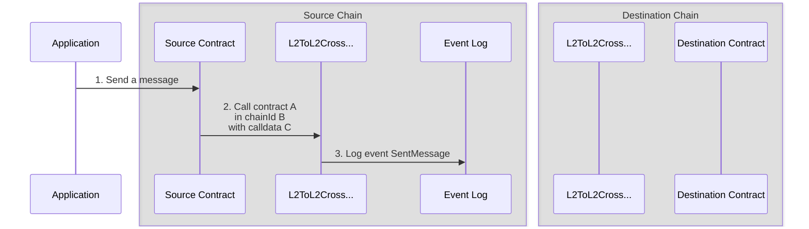
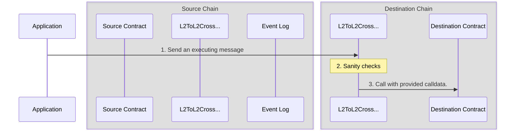

import { Callout, Steps } from 'nextra/components'

import { InteropCallout } from '@/components/WipCallout'

<InteropCallout />

# Interop message passing overview

The low level [`CrossL2Inbox`](https://github.com/ethereum-optimism/optimism/blob/develop/packages/contracts-bedrock/src/L2/CrossL2Inbox.sol) contract provides for basic executing message functionality, it verifies whether an initiating message is available or not.
However, this contract does not check what is the destination of a message, whether it has already been processed, etc. 
The [`L2ToL2CrossDomainMessenger`](https://github.com/ethereum-optimism/optimism/blob/develop/packages/contracts-bedrock/src/L2/L2ToL2CrossDomainMessenger.sol) contracts sits on top of `CrossL2Inbox` and provides the full functionality expected of a cross domain messenger.

## Initiating message

1. The application sends a transaction to a contract on the source chain.

2. The contract calls [`L2ToL2CrossDomainMessenger.SendMessage`](https://github.com/ethereum-optimism/optimism/blob/develop/packages/contracts-bedrock/src/L2/L2ToL2CrossDomainMessenger.sol#L127-L154). 
   The call requires these parameters:

   - `_destination`, the chain ID of the destination blockchain.
   - `_target`, the address of the contract on that blockchain.
   - `_message`, the actual message.
     This message is provided to `_target` as calldata, which means it includes a function selector and the parameters for that function call.

3. After a few sanity checks, `L2ToL2CrossDomainMessenger` emits a log entry.
   In addition to the parameters, the log entry also includes:

   - `_nonce`, a [nonce](https://en.wikipedia.org/wiki/Cryptographic_nonce) value to ensure the message is only executed once.

   - `_sender`, the contract that sent the cross domain message. 

## Executing message

1. The application (or a contract calling on the application's behalf) calls [`L2ToL2CrossDomainMessenger.SendMessage.relayMessage`](https://github.com/ethereum-optimism/optimism/blob/develop/packages/contracts-bedrock/src/L2/L2ToL2CrossDomainMessenger.sol#L156-L216).
   This call includes the message that was sent (`_sendMessage`), as well as the [fields required to find that message (`_id`)](https://github.com/ethereum-optimism/optimism/blob/develop/packages/contracts-bedrock/interfaces/L2/ICrossL2Inbox.sol#L4-L10).

2. `L2ToL2CrossDomainMessenger` on the destination chain verified the message is legitimate:

   - The origin (of the log entry) is `L2ToL2CrossDomainMessenger` on the other side.
   - Verify the message really was sent from the source (using `CrossL2Inbox`).
   - The destination chain ID is correct.
   - The target is neither `CrossL2Inbox` nor `L2ToL2CrossDomainMessenger`.
   - This message has not been relayed before.
     This is the reason we need the nonce value, to enable us to send multiple messages that would be otherwise identical.

3. If everything checks out, `L2ToL2CrossDomainMessenger` calls the destination contract with the calldata provided in the message.

## Next steps

- Read how [messages get from one blockchain to another (`CrossL2Inbox`)](explainer#how-messages-get-from-one-chain-to-the-other).
- Try [Supersim](tools/supersim) for testing cross-chain messages locally
*   Learn about [manually relaying messages](https://supersim.pages.dev/guides/interop/viem?#viem-to-send-and-relay-interop-messages)

{/*  After the tutorial for L2ToL2CrossDomainMessenger is written, need to add a link here */}
