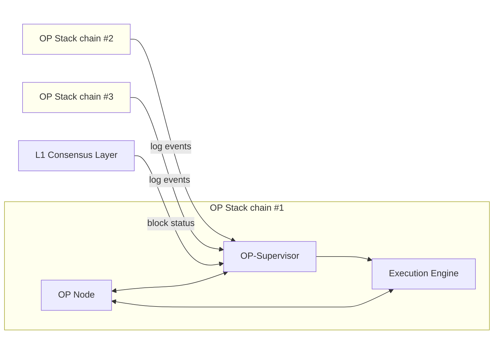

import { Callout, Tabs, Steps } from 'nextra/components'
import { InteropCallout } from '@/components/WipCallout'

<InteropCallout />

# OP-Supervisor

OP-Supervisor is a service that verifies cross-chain messages and manages interoperability between chains in the OP Stack.
The main information it contains about other blockchains is:

*   Log entries, which could be [initiating messages](./explainer#how-messages-get-from-one-chain-to-the-other) for cross-domain messages.
*   Blockchain heads, which are the latest blocks at various levels of confidence and safety:
    *   Unsafe (the latest block available through the gossip protocol)
    *   Local-safe (the latest block written to L1)
    *   Cross-safe (the latest block written to L1, and for which all the dependencies are written to L1)
    *   Finalized (the latest block written to L1, and that L1 block is safe from reorgs)

To do this, OP-Supervisor has to have RPC access to all the chains in the dependency set (all those that can contain an initiating message whose destination is this blockchain).

## How other components use OP-Supervisor

*   The execution client (typically `op-geth`) queries `op-supervisor` during block-building to verify if a message is sufficiently safe to include.
    To do this, the execution client looks at every executing message and  queries `op-supervisor` to see if there is a corresponding initiating message.

*   `op-node` queries cross-chain safety information and coordinates safety updates between OP stack nodes and `op-supervisor`. It uses the API provided by `op-supervisor` to:
    *   Retrieve the unsafe, local-safe, cross-safe, and finalized heads for other chains.
    *   Update the unsafe, local-safe, and finalized heads for its own chain.
    *   Attempt to promote blocks in its own chain to cross-safe status.
    *   Attempt to finalize L2 blocks based on L1 finality.

### API

Here are the most important API methods exposed by OP-Supervisor.
For a full listing of API names, see the [source code](https://github.com/ethereum-optimism/optimism/blob/develop/op-service/sources/supervisor_client.go).

| Method(s)                                 | Description                                                                           |
| ----------------------------------------- | ------------------------------------------------------------------------------------- |
| `UnsafeView` and `SafeView`               | Return the Local and Cross heads for their respective levels                          |
| `DerivedFrom`                             | OP Nodes use to check the L1 source of the Supervisor (needed for Safe Head tracking) |
| `UpdateLocalSafe` and `UpdateLocalUnsafe` | Tell the Supervisor when the Node's heads change                                      |
| `Finalized`                               | Returns the Finalized Head                                                            |
| `UpdateFinalizedL1`                       | Signals to the Supervisor new finality signals                                        |
| `CheckMessage`                            | Checks logs in the DB directly in tests                                               |

## Next steps

*   Build a [revolutionary app](/app-developers/get-started) that uses multiple blockchains within the Superchain
*   Deploy a [SuperchainERC20](/stack/interop/tutorials/deploy-superchain-erc20) to the Superchain
*   Learn [how ETH can move across chains](https://docs.optimism.io/stack/interop/superchain-weth)
*   For more info about how Superchain interoperability works under the hood, [check out the specs](https://specs.optimism.io/interop/overview.html).
