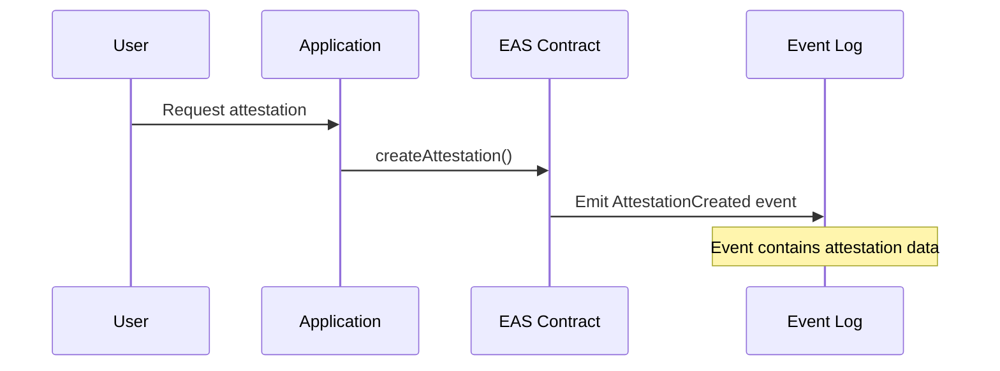
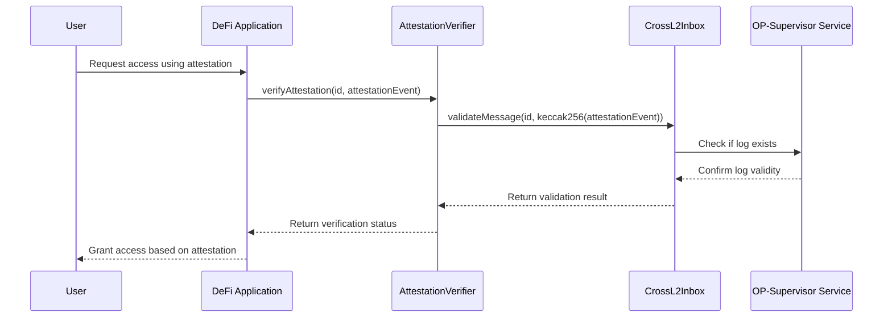
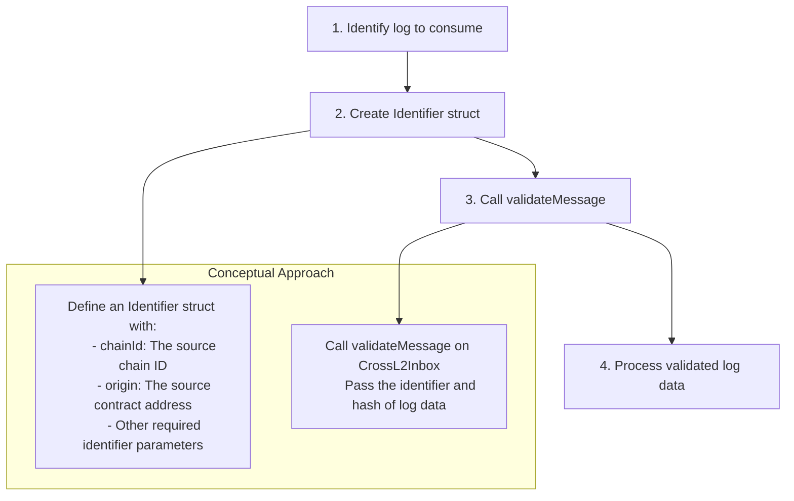
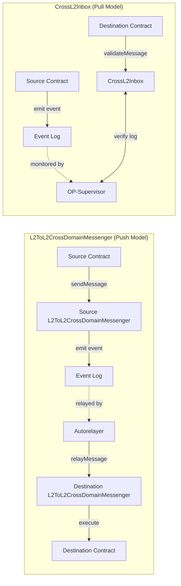

import { Callout } from 'nextra/components'
import { InteropCallout } from '@/components/WipCallout'

<InteropCallout />

# Reading Logs with Superchain Interop

Superchain interop enables developers to leverage current and historical logs from other blockchains within the [Superchain interop cluster](/stack/interop/explainer#superchain-interop-cluster) directly on their local chain.
This allows smart contracts to consume local and cross-chain logs with low latency in a trust-minimized way.

## Overview

Instead of relying solely on [`L2ToL2CrossDomainMessenger`](https://github.com/ethereum-optimism/optimism/blob/develop/packages/contracts-bedrock/src/L2/L2ToL2CrossDomainMessenger.sol), developers can use [`CrossL2Inbox#validateMessage`](https://github.com/ethereum-optimism/optimism/blob/af091753917c1d7101314cbfe8ac5cbc2efe0e5e/packages/contracts-bedrock/src/L2/CrossL2Inbox.sol#L49) and treat `CrossL2Inbox` as an oracle for logs that occurred on different chains or even their local chain.

This enables developers to:

*   Build cross-chain applications that react to events happening across the Superchain.
*   Create novel applications that leverage data from multiple chains.

## Why use `CrossL2Inbox`?

*   **Reference existing logs**: Allows contracts to verify and use logs that were already emitted, without requiring those logs to have been sent as cross-chain messages.
*   **Trust-minimized security**: Leverages the existing Superchain security model with no additional trust assumptions.
*   **Flexibility**: Can be used to validate events from another chain or even the local chain.

## How it works

### Architecture

The process works through the [`CrossL2Inbox`](https://github.com/ethereum-optimism/optimism/blob/af091753917c1d7101314cbfe8ac5cbc2efe0e5e/packages/contracts-bedrock/src/L2/CrossL2Inbox.sol#L33) contract, which serves as an oracle for logs from other chains in the Superchain:

1.  A smart contract on `Chain A` emits a log (event)
2.  Your contract on `Chain B` calls `CrossL2Inbox#validateMessage` with the log's identifier
3.  The `CrossL2Inbox` contract verifies the log's authenticity
4.  Your contract can then use the validated log data

### Key components

*   **[Identifier](/stack/interop/tutorials/relay-messages-cast#message-identifier)**: A struct containing information about the log, including `chainId`, `origin` (contract address), and other log metadata
*   **[validateMessage](https://github.com/ethereum-optimism/optimism/blob/develop/packages/contracts-bedrock/src/L2/CrossL2Inbox.sol#L79)**: Function that verifies a log's authenticity before allowing its use

## Example: cross-chain attestation verification

Let's walk through a conceptual example of verifying an Ethereum Attestation Service (EAS) attestation across chains.
EAS is a [predeploy](/stack/interop/predeploy) in the OP Stack for making attestations on or off-chain about anything.

### Source chain: creating an attestation

On the source chain (e.g., OP Mainnet), a user creates an attestation using EAS:

1.  The user initiates a request for an attestation through an application.

2.  The application calls the `createAttestation()` function on the EAS (Ethereum Attestation Service) contract on the source chain.

3.  The EAS contract processes the attestation request and emits an `AttestationCreated` event.

4.  The event is recorded in the chain's log, containing all necessary attestation data.

### Destination chain: verifying the attestation

On the destination chain (e.g., Unichain), a DeFi application wants to verify this attestation:

1.  The user requests access to a DeFi application on the destination chain, referencing an attestation created on the source chain.

2.  The DeFi application calls a verification function on an attestation verifier contract, passing the attestation's identifier and event data.

3.  The attestation verifier calls `validateMessage()` on the `CrossL2Inbox` contract, passing the attestation identifier and a hash of the event data.

4.  The [`CrossL2Inbox`](https://github.com/ethereum-optimism/optimism/blob/develop/packages/contracts-bedrock/src/L2/CrossL2Inbox.sol) contract interacts with the [`OP-Supervisor`](/stack/interop/op-supervisor) service to check if the specified log exists on the source chain.

5.  The `OP-Supervisor` confirms the validity of the log to the `CrossL2Inbox` contract.

6.  The `CrossL2Inbox` returns the validation result to the attestation verifier.

7.  The attestation verifier returns the verification status to the DeFi application.

8.  If validation is successful, the DeFi application grants the user access based on the verified attestation.

The primary benefit of this approach is that it allows your contract to verify attestations that already exist on another chain without requiring those attestations to have been explicitly sent as cross-chain messages.

## Overview of the process

To implement cross-chain log reading:

1.  First, identify which log from another chain you want to consume in your application.

2.  Create an Identifier struct that contains all necessary information about the log, including the chain ID and the contract address that emitted the log.

3.  Call the `validateMessage()` function on the `CrossL2Inbox` contract, passing the identifier and a hash of the log data.

4.  After validation, process the log data according to your application's requirements.

## Important considerations

*   This feature works between chains within the [Superchain interop cluster](/stack/interop/explainer#superchain-interop-cluster).
*   The same functionality can be used on a single chain (for example, to maintain a consistent architecture).

### Handling validation failures

*   The `validateMessage` call will revert the entire transaction if validation fails.
*   Consider implementing a try-catch pattern in your application's frontend to handle these failures.
*   Design your contract to allow for retry mechanisms where appropriate.

## Comparison with `L2ToL2CrossDomainMessenger`

| Feature    | L2ToL2CrossDomainMessenger                     | CrossL2Inbox#validateMessage                      |
| ---------- | ---------------------------------------------- | ------------------------------------------------- |
| Purpose    | Send messages between chains                   | Verify logs from other chains or local chain      |
| Initiation | Source explicitly sends message to destination | Destination queries for existing logs from source |
| Use Case   | Transfer tokens, trigger actions               | Verify attestations, reference events             |
| Flow       | Push model                                     | Pull model                                        |

## End-to-End flow comparison

This diagram compares the two approaches for cross-chain communication:

### L2ToL2CrossDomainMessenger (Push Model):

1.  A source contract calls `sendMessage()` on the `L2ToL2CrossDomainMessenger`.

2.  The messenger emits an event to the event log.

3.  An autorelayer detects the event and relays it to the destination chain.

4.  The destination `L2ToL2CrossDomainMessenger` receives the relayed message.

5.  The destination messenger executes the message on the target contract.

### CrossL2Inbox (Pull Model):

1.  A source contract emits an event to the event log.

2.  The `OP-Supervisor` service monitors events across chains.

3.  A destination contract calls `validateMessage()` on the `CrossL2Inbox`.

4.  The `CrossL2Inbox` verifies the log's existence by communicating with the `OP-Supervisor`.

5.  The destination contract receives verification and proceeds with its logic.

## Next steps

*   [Build a revolutionary app](/app-developers/get-started) that uses multiple blockchains within the Superchain
*   Learn how to [pass messages between blockchains](/stack/interop/tutorials/message-passing)
*   Deploy a [SuperchainERC20](/stack/interop/tutorials/deploy-superchain-erc20) to the Superchain
