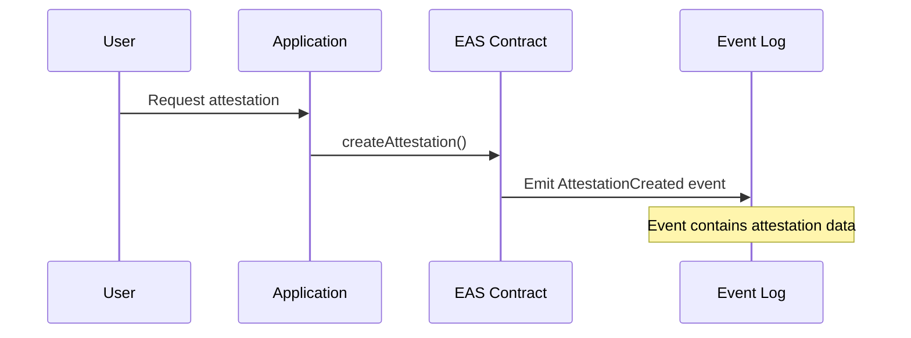
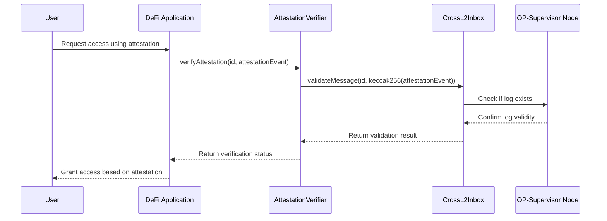
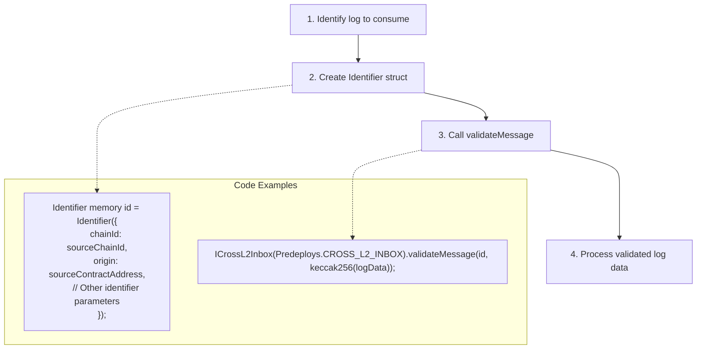
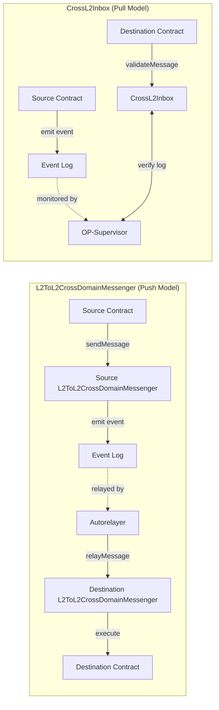

import { Callout } from 'nextra/components'
import { InteropCallout } from '@/components/WipCallout'

<InteropCallout />

# Reading logs in superchain interop

Superchain interop enables developers to leverage current and historical logs from other blockchains within the Superchain interop cluster directly on their local chain. This feature allows for cross-chain log consumption with low latency in a trust-minimized way.

## Overview

While the [L2ToL2CrossDomainMessenger](https://github.com/ethereum-optimism/optimism/blob/develop/packages/contracts-bedrock/src/L2/L2ToL2CrossDomainMessenger.sol) enables sending messages across chains, the [`CrossL2Inbox#validateMessage`](https://github.com/ethereum-optimism/optimism/blob/af091753917c1d7101314cbfe8ac5cbc2efe0e5e/packages/contracts-bedrock/src/L2/CrossL2Inbox.sol#L49) function allows smart contracts to verify and consume logs that were emitted on other chains within the Superchain ecosystem.

This capability enables developers to:

*   Reference attestations or events from other chains
*   Build cross-chain applications that react to events happening across the Superchain
*   Create novel financial products that leverage data from multiple chains

## Why use `CrossL2Inbox`?

*   **Lower latency**: Directly reference logs without waiting for cross-chain message confirmation.
*   **Trust-minimized**: Uses cryptographic validation rather than relying on off-chain relayers.
*   **Flexibility**: Can be used to validate events from another chain or even the same chain.

## How it works

### Architecture

The process works through the [`CrossL2Inbox`](https://github.com/ethereum-optimism/optimism/blob/af091753917c1d7101314cbfe8ac5cbc2efe0e5e/packages/contracts-bedrock/src/L2/CrossL2Inbox.sol#L33) contract, which serves as an oracle for logs from other chains in the Superchain:

1.  A smart contract on Chain A emits a log (event)
2.  Your contract on Chain B calls `CrossL2Inbox#validateMessage` with the log's identifier
3.  The `CrossL2Inbox` contract verifies the log's authenticity
4.  Your contract can then use the validated log data

### Key components

*   **Identifier**: A struct containing information about the log, including `chainId`, `origin` (contract address), and other log metadata
*   **validateMessage**: Function that verifies a log's authenticity before allowing its use

## Example: cross-chain attestation verification

Let's walk through a practical example of verifying an Ethereum Attestation Service (EAS) attestation across chains.

### Source chain: creating an attestation

On the source chain (e.g., OP Mainnet), a user creates an attestation using EAS:



### Destination chain: verifying the attestation

On the destination chain (e.g., Base), a DeFi application wants to verify this attestation:



### Sample code for attestation verification

```solidity
// SPDX-License-Identifier: MIT
pragma solidity 0.8.25;

import { ICrossL2Inbox, Identifier } from "interfaces/L2/ICrossL2Inbox.sol";
import { Predeploys } from "src/libraries/Predeploys.sol";

contract AttestationVerifier {
    address constant CROSS_L2_INBOX = 0x4200000000000000000000000000000000000014;
    address constant EAS_CONTRACT = 0x4200000000000000000000000000000000000EAS; // Example address
    
    // Event selector for AttestationCreated event
    bytes32 constant ATTESTATION_CREATED_EVENT_SELECTOR = 
        0x831531dabaca5375ba77364edc9627be5638660e8b613d921b86766021d3c165; // Example selector
    
    function verifyAttestation(
        Identifier calldata _id,
        bytes calldata _attestationEvent
    ) external returns (bool) {
        // Ensure the log came from the EAS contract
        require(_id.origin == EAS_CONTRACT, "Not from EAS contract");
        
        // Validate the message through CrossL2Inbox
        ICrossL2Inbox(CROSS_L2_INBOX).validateMessage(_id, keccak256(_attestationEvent));
        
        // Decode the attestation event data
        // (implementation depends on EAS event structure)
        
        // Process the attestation
        // For example, grant special permissions or better rates
        
        return true;
    }
}
```

## Implementation guide

To implement cross-chain log reading:



## Important considerations

*   This feature works between chains within the same Superchain interop cluster
*   The same functionality can be used on a single chain (for example, to maintain a consistent architecture)
*   The `CrossL2Inbox` contract needs to be able to verify logs from the source chain
*   Ensure your contract handles validation failures gracefully

## Comparison with `L2ToL2CrossDomainMessenger`

| Feature    | L2ToL2CrossDomainMessenger       | CrossL2Inbox#validateMessage          |
| ---------- | -------------------------------- | ------------------------------------- |
| Purpose    | Send messages between chains     | Verify logs from other chains         |
| Initiation | Active sending from source       | Passive reading from destination      |
| Use Case   | Transfer tokens, trigger actions | Verify attestations, reference events |
| Flow       | Push model                       | Pull model                            |

## End-to-End flow comparison



## Next steps

*   [Build a revolutionary app](/app-developers/get-started) that uses multiple blockchains within the Superchain
*   Learn how to [pass messages between blockchains](/stack/interop/tutorials/message-passing)
*   Deploy a [SuperchainERC20](/stack/interop/tutorials/deploy-superchain-erc20) to the Superchain
