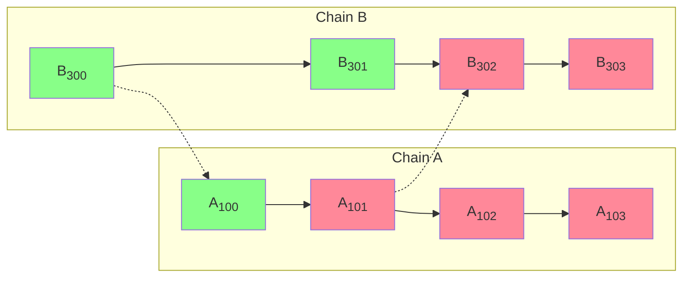
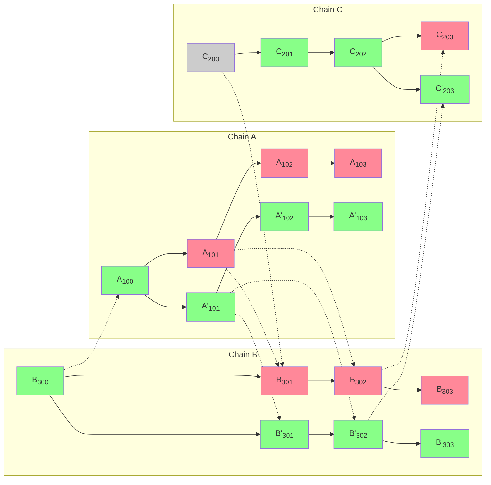

import { Callout } from 'nextra/components'
import Image from 'next/image'

import { InteropCallout } from '@/components/WipCallout'

<InteropCallout />

# Interop reorg awareness

[A chain reorganization, or "reorg",](https://www.alchemy.com/overviews/what-is-a-reorg#what-happens-to-reorgs-after-the-merge) happens when validators disagree on the most accurate version of the blockchain.
If not handled correctly, reorgs in a cross-chain context could result in a [double-spend problem](https://en.wikipedia.org/wiki/Double-spending).
The most frequent solution to mitigate the double-spend problem is to wait for Ethereum finality; however, that solution results in high latency cross-chain communication and a poor user experience.

<details>
  <summary>What is double-spending?</summary>

  ```mermaid

  flowchart LR 
      subgraph init ["Initiating transaction (source chain)"]
          burn(tokens burned)
          burn-->send(send)
      end
      subgraph exec ["Executing transaction (destination chain)"]
          send==initiating message==>receive(receive)
          receive-->mint(tokens minted)
      end
  ```

  In a normal asset transfer tokens are burned on the source chain first, then a message is sent to the destination chain.
  When that message is received, the tokens are minted on the destination chain, where the user can now use those tokens.

  ```mermaid

  flowchart LR 
      subgraph init ["Not really the source chain"]
          err((error))
      end
      subgraph exec ["Executing transaction (destination chain)"]
          err==initiating message==>receive(receive)
          receive-->mint(tokens minted)
      end
  ```

  A double-spend problem occurs when the destination chain receives a valid initiating message, but due to issues on the source chain, such as a reorg, that initiating transaction is no longer valid.
  When that happens, the tokens are still on the source chain, but they are also on the destination chain.
</details>

Most solutions to mitigate the double-spend problem rely on [L1 finality](https://ethereum.org/en/developers/docs/consensus-mechanisms/pos/#finality). However, that solution results in high latency and poor user experience.

To mitigate the double-spend problem while delivering a low-latency cross-chain experience, Superchain interop uses [block safety levels](./explainer#block-safety-levels).
This means users can transfer assets across chains in the Superchain with 1-block latency, and should a reorg happen, either both the source and destination transactions would remain, or both of them would revert.
In every case, there is no window of opportunity to double spend.

## Block safety levels



In the diagram above, solid arrows are the derivation of a block from the previous block in the chain.
Dotted arrows go from the block with the initiating message (the source) to the block with the executing message (the destination).
Blocks can either be finalized (grey), cross-safe (green), or unsafe (red).
Blockchain A has only written block A<sub>100</sub> to the blockchain.
As a result, block A<sub>101</sub> is unsafe, and so are all the blocks that depend on it, directly (A<sub>102</sub> and B<sub>302</sub>) or indirectly (A<sub>103</sub> and B<sub>303</sub>).
Blocks B<sub>302</sub> and B<sub>303</sub> may be *local-safe* (if they are written to L1), but they cannot be *cross-safe* because they depend on a block that isn't.
If all goes well, eventually A<sub>101</sub> will be written to L1, turn safe, and then the blocks that depend on it can become safe as well.

The message between A<sub>101</sub> and B<sub>302</sub> can be an asset moving across the bridge.
In that case, the initiating message (A<sub>101</sub>) burns `n` tokens on the source chain (A), and the executing message (B<sub>302</sub>) mints `n` tokens on the destination chain (B).

### L1 reorg

In this case, an L1 block is replaced, and the new block either contains the same blob with chain data that was contained in the old block, or it doesn't.
If the new block contains the same blob, the change is meaningless from the L2 perspective.
If the new block does not contain the same blob, then the sequencer on the chain will know it is missing and reposts it.

So L1 reorgs are basically invisible to L2.

### Equivocation

Sequencers inform the rest of the Superchain about a new block in two ways:

*   The gossip protocol, which is typically used as soon as the block is created.
    The problem is that the gossip protocol does not create a commitment.
*   Posting to L1, which typically happens a few minutes after the block is created.
    The reason is cost, it is a lot cheaper if compression and L1 posting are done in large batches, rather than for each individual block.

Equivocation happens when a sequencer publishes a block using the gossip protocol that is different from the one that eventually gets written to L1.
In this case, the block that is written to L1 (let's call it A'<sub>101</sub>) is the valid one, and that causes every dependent block to be recalculated.



Note that a block can only depend directly on a block in a separate chain if the block includes an executing message that uses an initiating message from that block.
So the change from A<sub>101</sub> to A'<sub>101</sub> cannot invalidate any existing safe blocks.

### Invalid block

If a block is invalid, even if it is posted on L1, the canonical chain replaces it with a block that only includes the deposit transactions, those transactions posted to L1.

<details>
  <summary>What makes a block invalid?</summary>

  There are several potential reasons:

  *   The block posted to L1 includes incorrect information, for example because it relied on a node on a different blockchain for interop and that node reported incorrect information.
  *   The block was never posted.
      After a timeout of twelve hours all the verifiers will assume that the block that should have been posted is a deposit-only block.
</details>

This is functionally equivalent to equivocation, and dealt with the same way, so it can change unsafe blocks but only those blocks.

{/* 
### L2 reorg

An L2 reorg could happen after the sequencer is decentralized.
In that case, there is a deterministic FCU (fork choice update), just as there is on L1.
At worst, some unsafe blocks need to be recalculated (if one fork is chosen over another).
*/}

## Next steps

*   Build a [revolutionary app](/app-developers/get-started) that uses multiple blockchains within the Superchain.
*   Deploy a [SuperchainERC20](./tutorials/deploy-superchain-erc20) to the Superchain.
*   View more [interop tutorials](./tutorials).
