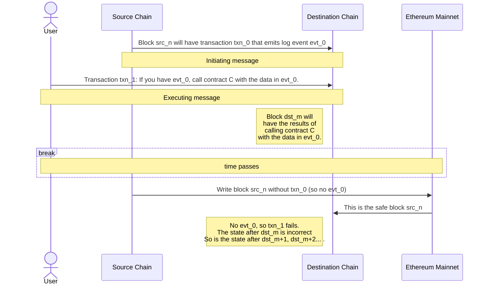
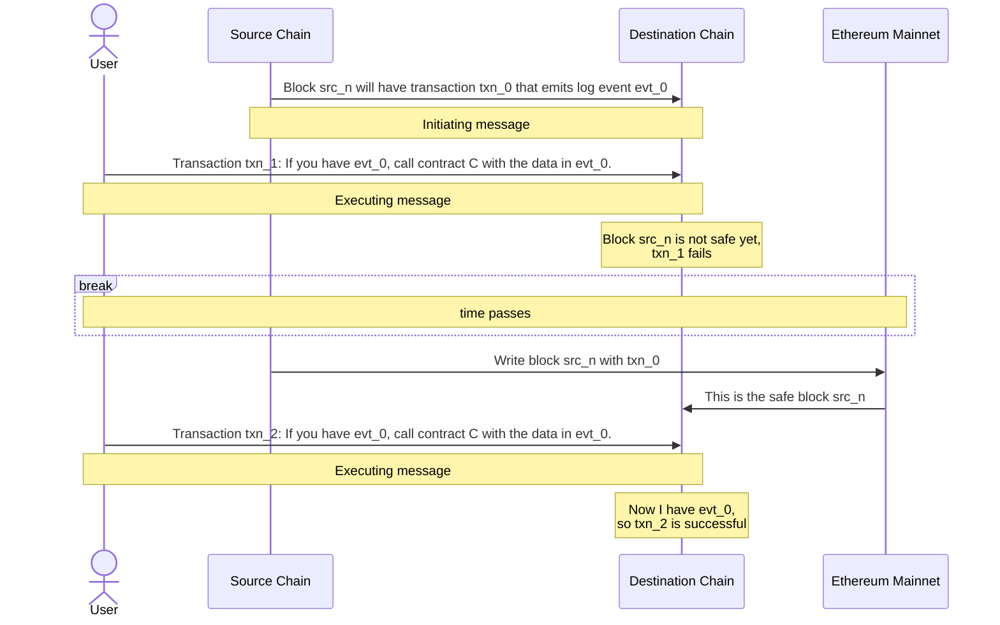

import { Callout } from 'nextra/components'
import Image from 'next/image'

import { InteropCallout } from '@/components/WipCallout'

<InteropCallout />

# Security considerations

## The latency/security tradeoff

### Unsafe initiating messages

L2 blocks start as unsafe, meaning that there is no L1 evidence for them, and the sequencer for that blockchain can send out incorrect information.
Sending out incorrect information, for example that a certain transaction is included in a block when it isn't, is called *equivocation*. 
A sequencer that builds blocks with interop can choose to accept messages from unsafe blocks (received through the gossip protocol), for minimal latency.

However, because of equivocation risk, a block that is written to L1 (*local safe*) can only be considered truly safe (the techincal term is *cross safe*), once all the source blocks of the messages are written to L1 as well.
The cost of this approach is that the state calculated by the sequencer may not be correct, and it will have to be recalculated if the other sequencer equivocates.

### Safe initiating messages

Alternatively, a sequencer can be configured to only accept executing messages once the initiating message is in a cross safe block (one which is written to L1, and whose own dependencies are all written to L1).
In this case, the source sequencer cannot equivocate, and the state will only need to be recalculated if there is an [L1 reorg](https://www.alchemy.com/overviews/what-is-a-reorg#what-happens-to-reorgs-after-the-merge). 
The cost is that it would take longer for a message to pass from one blockchain to the other.
Higher throughput OP Stack chains like Base and OP Mainnet submit a batch about every 5 minutes, so on average it takes about 2.5 minutes for an initiating message to become safe.

You can use [this dune dashboard](https://dune.com/oplabspbc/op-stack-chains-l1-activity#submission-frequency) to see how often OP Stack chains submit batches.

### Finalized initiating messages

A sequencer can also be configured to reject all executing messages until the initiating message is *finalized*, meaning it is irrevocably on L1 and immune to reorgs.
Currently, this adds [about 15 minutes](https://ethereum.org/en/roadmap/single-slot-finality/) to the message latency.

 

<Image src="/img/op-stack/protocol/safe-unsafe.png" alt="Safe and Unsafe Security Diagram" width={700} height={500} />

<Callout>

Even if a sequencer accepts unsafe initiating messages, the blocks it constructs that rely on them cannot be promoted until equivocation is impossible.

</Callout>

{/* 
## What is stopping a sequencer from censoring a cross-chain message?
There is nothing stopping a sequencer from censoring a transaction when it is sent directly to the sequencer. This does not mean the network has no censorship resistance, users can always send a deposit transaction for censorship resistance as strong as L1 guarantees. The tradeoff here is the latency, instead of being confirmed in ~2 seconds, the transaction can be confirmed at the rate of L1 block production. It may be possible to adopt something like [EIP-7547](https://eips.ethereum.org/EIPS/eip-7547) in the future to enable low latency censorship resistance.

*/}

## The trust model

Barring L1 reorgs, there are two ways in which interop can fail.

- *equivocation*
- *reporting false information*

## What is the weakest link scenario?

The information 

Without shared security, there is a risk that interacting chains could enter a conflicting state due to cross-chain interactions. If a weaker chain in the network is attacked or experiences a reorganization, it could change its state independently. This would leave the entire interop cluster in an inconsistent state, as the security of interactions across chains is only as strong as the weakest chain.

## What is stopping a shared sequencer from including just the executing message and not the initiating message?
The protocol enforces the fact that all executing messages are valid. It does this by reorganizing out executing messages that have invalid initiating messages. Running software that does not enforce this would be non-standard behavior and would leave yourself at risk of accepting an invalid executing message and therefore running on a forked chain.

## What is the trust/verification model? Do sequencers that opt into this interop system have to trust each other fully?
Sequencers only have to trust each other, if they are accepting executing messages where the initiating message is unsafe. This is because the sequencer's ability to equivocate on unsafe data, i.e., batch submit something different from what they gossip over the p2p network. Once data is submitted to L1, it is considered final relative to the L2 and therefore there is no longer an equivocation risk.