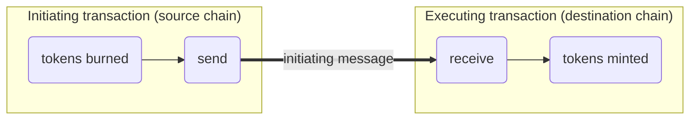
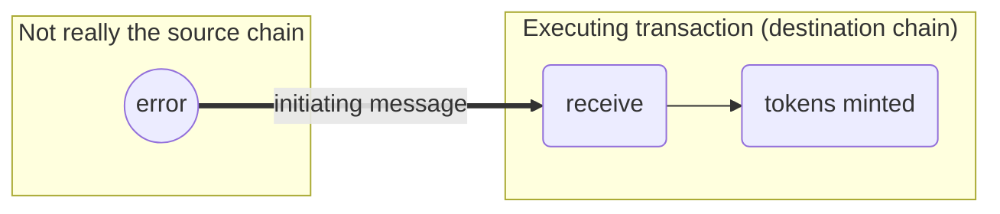
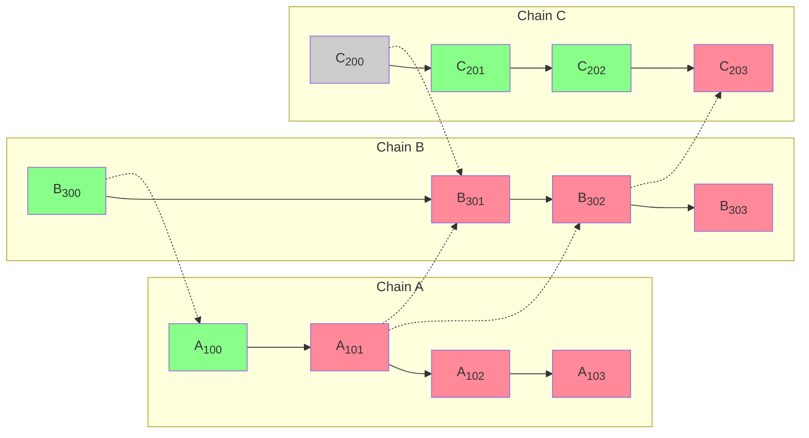

import { Callout } from 'nextra/components'
import Image from 'next/image'

import { InteropCallout } from '@/components/WipCallout'

<InteropCallout />

# Reorgs and sequencing errors

Sequencing errors happen when, for some reason or another (possibly a [reorg](https://www.alchemy.com/overviews/what-is-a-reorg#what-happens-to-reorgs-after-the-merge)), a system such as a blockchain has an incorrect view of another system and thinks that assets were transferred when they have not been.
This could result in [double spending](https://en.wikipedia.org/wiki/Double-spending), which happens when an asset appears in two places at once.

What is double-spending?

In a normal asset transfer tokens are burned on the source chain first, then a message is sent to the destination chain.
When that message is received, the tokens are minted on the destination chain, where the user can now use those tokens.

Double spending occurs when the destination chain "thinks" that it received the initiating message, but that message was not really sent.
When that happens, the tokens are still on the source chain, but they are also on the destination chain, allowing the user to spend them twice.

In Ethereum incorrect state is usually a transient phenomena.
If a sequencer equivocates (sends one block through gossip, and then posts another to L1), once the block is posted to L1 that is the correct block.
A new block can be replaced through a reorg, but after sufficient time has passed the block is finalized, and is nearly impossible to remove from the blockchain.  

The simplest solution to double-spending is to wait.
For maximum security, a bridge could wait until the block with the initiating message is written to L1, finalized, and then wait until the [challenge period](/connect/resources/glossary#challenge-period) is over before minting the tokens.
This is how the [Optimism L1 bridge](https://app.optimism.io/bridge/withdraw) works.
That solution is really bad from the usability perspective.

## Block safety levels

Instead, interop allows for one block transfers optimistically, but restricts their validity using [block safety levels](explainer#block-safety-levels).
A block is only as safe as the least safe block on which it depends.

In the diagram above, solid arrows are the derivation of a block from the previous block in the chain. 
Dotted arrows go from the block with the initiating message (the source) to the block with the executing message (the destination).
Blocks can either be finalized (grey), cross-safe (green), or unsafe (red).
Blockchains B and C are high traffic, so they write their blocks to L1 quickly, and they are all *local-safe* (written to L1).
However, blockchain A has only written block A100 to the blockchain. 
As a result, block A101 is unsafe, and so are all the blocks that depend on it, directly (A102, B301, and B302) or indirectly (A103, B303, and C203).
Some of these blocks may be *local-safe* because they are written to L1, but none of them are *cross-safe* because they depends on a block that isn't.