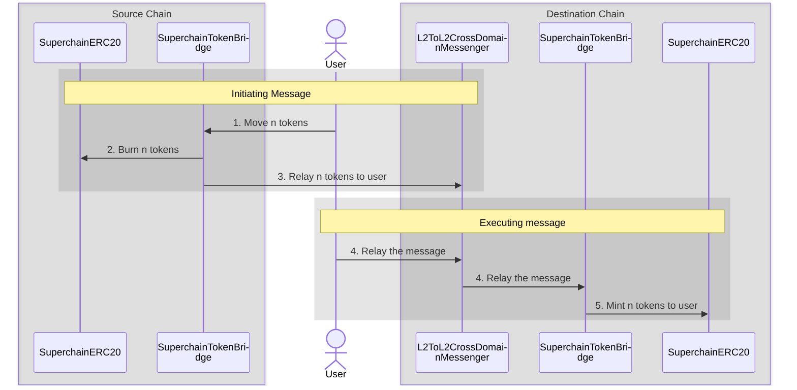

import { Callout } from 'nextra/components'

import { InteropCallout } from '@/components/WipCallout'

<InteropCallout />

# SuperchainERC20

The [`SuperchainERC20`](https://github.com/ethereum-optimism/optimism/blob/develop/packages/contracts-bedrock/src/L2/SuperchainERC20.sol) contract implements [ERC-7802](https://ethereum-magicians.org/t/erc-7802-crosschain-token-interface/21508) to enable asset interoperability within the Superchain.

Asset interoperability allows tokens to move securely across the Superchain by burning tokens on the source chain and minting an equivalent amount on the destination chain. This approach addresses issues such as liquidity fragmentation and poor user experiences caused by asset wrapping or reliance on liquidity pools.

Instead of wrapping assets, this mechanism effectively "teleports" tokens between chains in the Superchain. It provides users with a secure and capital-efficient method for transacting across chains.

Additional features:

*   **Simplified deployments**: Zero infrastructure cost to make your token cross-chain.
    Provides a consistent, unified implementation for tokens across all Superchain-compatible networks and a common cross-chain interface for the EVM ecosystem at large.
*   **Common standard**: Implements ERC-7802, a unified interface that can be used across all of Ethereum to enable cross-chain mint/burn functionality.

## How it works

[`SuperchainERC20`](https://github.com/ethereum-optimism/optimism/blob/develop/packages/contracts-bedrock/src/L2/SuperchainERC20.sol) and [`SuperchainTokenBridge`](https://github.com/ethereum-optimism/optimism/blob/develop/packages/contracts-bedrock/src/L2/SuperchainTokenBridge.sol) work together to allow ERC-20 tokens to be transferred from one chain to the other.

The initiating message burns tokens on the source chain.
The executing message then mints them on the destination chain.

#### Initiating message (source chain)

1.  The user (or a contract) calls [`SuperchainTokenBridge.sendERC20`](https://github.com/ethereum-optimism/optimism/blob/develop/packages/contracts-bedrock/src/L2/SuperchainTokenBridge.sol#L52-L78).

2.  The token bridge calls [`SuperchainERC20.crosschainBurn`](https://github.com/ethereum-optimism/optimism/blob/develop/packages/contracts-bedrock/src/L2/SuperchainERC20.sol#L37-L46) to burn those tokens on the source chain.

3.  The source token bridge calls [`SuperchainTokenBridge.relayERC20`](https://github.com/ethereum-optimism/optimism/blob/develop/packages/contracts-bedrock/src/L2/SuperchainTokenBridge.sol#L80-L97) on the destination token bridge.
    This call is relayed using [`L2ToL2CrossDomainMessenger`](./message-passing).

#### Executing message (destination chain)

4.  The user, or a relayer, sends an executing message to [`L2ToL2CrossDomainMessenger`](./message-passing) to relay the message.

5.  The destination token bridge calls [`SuperchainERC20.crosschainMint`](https://github.com/ethereum-optimism/optimism/blob/develop/packages/contracts-bedrock/src/L2/SuperchainERC20.sol#L26-L35) to mint tokens for the user/contract that called `SuperchainTokenBridge.sendERC20` originally.

## Requirements

Application developers must complete two steps to make their tokens compatible with `SuperchainERC20`.
Setting this up in advance ensures tokens will benefit from interop when it becomes available.

*   Grant permission to `SuperchainTokenBridge` (address `0x4200000000000000000000000000000000000028`) to call `crosschainMint` and `crosschainBurn`.
    If you are using [`SuperchainERC20`](https://github.com/ethereum-optimism/optimism/blob/develop/packages/contracts-bedrock/src/L2/SuperchainERC20.sol) this is already done for you.

    {/* 

      Add this after the tutorial is written

      For detailed, step-by-step instructions on implementing SuperchainERC20, refer to [Deploy assets using SuperchainERC20](/stack/interop/assets/deploy-superchain-erc20).

      */}

*   Deploy the ERC-20 contract at the same address on every chain in the Superchain.
    This is easiest when using [`create2`](https://book.getfoundry.sh/tutorials/create2-tutorial).

<Callout type="warning">
  To ensure security, you must either design the deployer to allow only a specific trusted ERC-20 contract, such as `SuperchainERC20`, to be deployed through it, or call `CREATE2` to deploy the contract directly from an EOA you control.

  This precaution is critical because if an unauthorized ERC-20 contract is deployed at the same address on any Superchain network, it could allow malicious actors to mint unlimited tokens and bridge them to the network where the original ERC-20 contract resides.
</Callout>

## Comparison to other token implementations

`SuperchainERC20` differs from other token implementations in both focus and design:

*   It implements `ERC-7802`, a minimal cross-chain mint/burn interface designed to establish a common standard across the EVM ecosystem.
*   It relies on the shared trust assumptions of the Superchain. All traffic originating from any chain within the Superchain is trusted because these chains [share the same security standard](/superchain/standard-configuration).

<Callout type="info">
  Projects moving from other token implementations may need to adapt to the `SuperchainERC20` specification.
</Callout>

## FAQ

### What happens if I bridge to a chain that does not have the ERC-20 contract?

The initiating message will successfully burn the tokens on the source chain.
However, the executing message will fail because it attempts to call `crosschainMint` on a non-existent contract.
Once a `SuperchainERC20` contract is properly deployed on the destination chain, you can retry the executing message to retrieve your tokens.

## Next steps

*   Watch the [ERC20 to SuperchainERC20 video walkthrough](https://www.youtube.com/watch?v=Gb8glkyBdBA) to learn how to modify an existing ERC20 contract to make it interoperable within the Superchain.
*   Explore the [SuperchainERC20 specifications](https://specs.optimism.io/interop/token-bridging.html) for in-depth implementation details.
*   Check out the [SuperchainERC20 starter kit](https://github.com/ethereum-optimism/superchainerc20-starter) to get started with implementation.

{/*

Add this back when the tutorial is written.

*   Review the [Deploy SuperchainERC20 tutorial](/stack/interop/tutorials/deploy-superchain-erc20) to learn how to deploy a SuperchainERC20.

*/}
