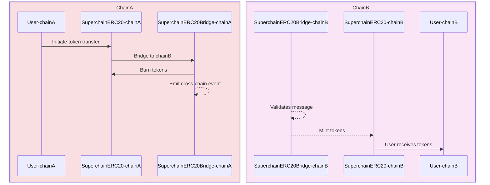

import { Callout } from 'nextra/components'

# SuperchainERC20

<Callout>
  Interop is currently in active development and not yet ready for production use. The information provided here may change. Check back regularly for the most up-to-date information.
</Callout>

`SuperchainERC20` is an implementation of [ERC-7802](https://ethereum-magicians.org/t/erc-7802-crosschain-token-interface/21508) designed to enable asset interoperability in the Superchain.
Asset interoperability allows for tokens to securely move across chains without asset wrapping or liquidity pools for maximal capital efficiency, thus unifying liquidity and simplifying the user experience.

Additional features:

*   **Simplified deployments**: 0-infrastructure cost to make your token cross-chain. Provides a consistent, unified implementation for tokens across all Superchain-compatible networks and a common cross-chain interface for the EVM ecosystem at large.
*   **Permissionless propagation**: Easily clone an existing token contract to a new OP Stack chain using `create2` without requiring the original owner, which enables movement of assets to the new chain once Interop goes live. Importantly, permissionless propagation retains the integrity of the original owner on the contract and preserves security but proliferates the contract's availability to new chains.
*   **Common standard**: Implements ERC-7802, a unified interface that can be used across all of Ethereum to enable cross-chain mint/burn functionality.

## How it works

`SuperchainERC20` facilitates secure token transfers between chains in the Superchain networks via native burning and minting.

*   **Token Burning**: Initiating message where token is **burned** on the source chain. A user initiates a transfer of token from one blockchain to another and specifies the recipient wallet address on the destination chain. A specified amount of token is burned on the source chain.
*   **Token Minting**: Executing message where token is **minted** on the destination chain. The specified amount of token is minted on the destination chain directly to the recipient wallet address.

An important thing to note is using `crosschainBurn` and `crosschainMint` on the `SuperchainERC20` to move your asset across the Superchain only affects which chain your asset is located on and does not change the overall supply of the token. This keeps the token's total amount the same across all networks, ensuring its value stays stable during the move and that the `SuperchainERC20` retains a unified, global supply count.

This diagram illustrates the process where tokens are burned on the source chain and minted on the destination chain, enabling seamless cross-chain transfers without the need for asset wrapping or liquidity pools.

## Major components

*   **Token Contract**: implements `SuperchainERC20` with bridging functionality.
*   **Factory Predeploy**: uses a `create2`-based factory for deploying `SuperchainERC20` tokens consistently across chains.
*   **Bridging Functions**: using methods like `sendERC20` and `relayERC20` for cross-chain transfers.

## Comparison to other token implementations

`SuperchainERC20` differs from other token implementations in its focus and implementation:

*   `SuperchainERC20` implements ERC-7802, which provides a minimal crosschain mint/burn interface designed to be a common pattern for the EVM ecosystem.
*   `SuperchainERC20` shares trust assumptions across all chains in the Superchain, such that custom assumptions around security and latency are not required to account for when executing transfers.

<Callout type="info">
  Projects moving from other token implementations may need to adapt to the `SuperchainERC20` specification.
</Callout>

## Implementation details

Application developers must do two things to make their tokens `SuperchainERC20` compatible. Doing this setup now ensures that tokens can benefit from Interop once the Interop upgrade happens.

1.  Permission only `SuperchainERC20Bridge` to call `crosschainMint` and `crosschainBurn`.
2.  Deployment at same address on every chain in the Superchain using `create2` function.

For now, application developers should view `SuperchainERC20`as ERC20 tokens with additional built-in functions that allow cross-chain asset movement that will be enabled once Interop goes live.

<Callout type="warning">
  To enable asset interoperability, `SuperchainERC20` must give access to the address where the future `SuperchainERC20Bridge` will live.
</Callout>

## Next steps

*   Explore the [SuperchainERC20 specifications](https://specs.optimism.io/interop/token-bridging.html) for in-depth implementation details.
*   Watch the [Superchain interop design video walkthrough](https://www.youtube.com/watch?v=FKc5RgjtGes) for a visual explanation of the concepts.
*   Review the [Superchain Interop Explainer](explainer) for answers to common questions about interoperability.
