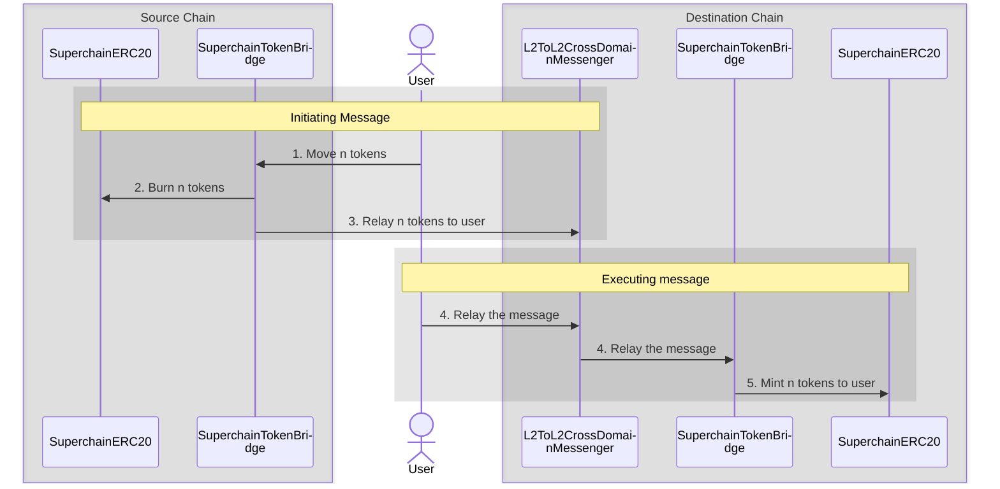

import { Callout } from 'nextra/components'

import { InteropCallout } from '@/components/WipCallout'

<InteropCallout />

# SuperchainERC20

[`SuperchainERC20`](https://github.com/ethereum-optimism/optimism/blob/develop/packages/contracts-bedrock/src/L2/SuperchainERC20.sol) is an implementation of [ERC-7802](https://ethereum-magicians.org/t/erc-7802-crosschain-token-interface/21508) designed to enable asset interoperability in the Superchain.
Asset interoperability allows tokens to move securely in the Superchain by burning tokens on the source chain and minting the same number of tokens that were burned on the destination chain.
Asset interoperability solves the issues of liquidity fragmentation and poor user experiences caused by asset wrapping or liquidity pools.
Instead, assets essentially teleport from one chain in the Superchain to another, providing users with a secure and capital-efficient way to transact within the Superchain.

Additional features:

*   **Simplified deployments**: Zero infrastructure cost to make your token cross-chain.
    Provides a consistent, unified implementation for tokens across all Superchain-compatible networks and a common cross-chain interface for the EVM ecosystem at large.
*   **Common standard**: Implements ERC-7802, a unified interface that can be used across all of Ethereum to enable cross-chain mint/burn functionality.

## How it works

[`SuperchainERC20`](https://github.com/ethereum-optimism/optimism/blob/develop/packages/contracts-bedrock/src/L2/SuperchainERC20.sol) and [`SuperchainTokenBridge`](https://github.com/ethereum-optimism/optimism/blob/develop/packages/contracts-bedrock/src/L2/SuperchainTokenBridge.sol) work together to allow ERC-20 tokens to be transferred from one chain to the other.

The initiating message burns tokens on the source chain.
The executing message then mints them on the destination chain.

#### Initiating message (source chain)

1.  The user (or a contract) calls [`SuperchainTokenBridge.sendERC20`](https://github.com/ethereum-optimism/optimism/blob/develop/packages/contracts-bedrock/src/L2/SuperchainTokenBridge.sol#L52-L78).

2.  The token bridge calls [`SuperchainERC20.crosschainBurn`](https://github.com/ethereum-optimism/optimism/blob/develop/packages/contracts-bedrock/src/L2/SuperchainERC20.sol#L37-L46) to burn those tokens on the source chain.

3.  The source token bridge calls [`SuperchainTokenBridge.relayERC20`](https://github.com/ethereum-optimism/optimism/blob/develop/packages/contracts-bedrock/src/L2/SuperchainTokenBridge.sol#L80-L97) on the destination token bridge.
    This call is relayed using [`L2ToL2CrossDomainMessenger`](./message-passing).

#### Executing message (destination chain)

4.  The user, or a relayer, sends an executing message to [`L2ToL2CrossDomainMessenger`](./message-passing) to relay the message.

5.  The destination token bridge calls [`SuperchainERC20.crosschainMint`](https://github.com/ethereum-optimism/optimism/blob/develop/packages/contracts-bedrock/src/L2/SuperchainERC20.sol#L26-L35) to mint tokens for the user/contract that called `SuperchainTokenBridge.sendERC20` originally.

## Requirements

Application developers must do two things to make their tokens `SuperchainERC20` compatible.
Doing this setup now ensures that tokens benefit from interop (once it is available).

*   Grant permission to `SuperchainTokenBridge` (address `0x4200000000000000000000000000000000000028`) to call `crosschainMint` and `crosschainBurn`.
    If you are using [`SuperchainERC20`](https://github.com/ethereum-optimism/optimism/blob/develop/packages/contracts-bedrock/src/L2/SuperchainERC20.sol) this is already done for you.

    {/* 
    
    Link to tutorial here
    
    */}

*   Deploy the ERC-20 contract at the same address on every chain in the Superchain.
    This is easiest when using [`create2`](https://book.getfoundry.sh/tutorials/create2-tutorial).

    <Callout type="warning">
      To do this securely you must either write the deployer in such a way that only a specific trusted ERC-20 contract, such as `SuperchainERC20`, can be deployed through it,
      or call the contract with `CREATE2` directly from an EOA you control.
      This is critical because if somebody can deploy a different ERC-20 contract at the same address, on any superchain network, they can mint themselves as many tokens as they'd like and then bridge them to the network where the original ERC-20 contract is located.
    </Callout>

{/* 

Add this after the tutorial is written

For step-by-step information on implementing SuperchainERC20, see [Deploy assets using SuperchainERC20](/stack/interop/assets/deploy-superchain-erc20)

*/}

## Comparison to other token implementations

`SuperchainERC20` differs from other token implementations in its focus and implementation:

*   `SuperchainERC20` implements ERC-7802, which provides a minimal crosschain mint/burn interface designed to be a common pattern for the EVM ecosystem.
*   `SuperchainERC20` uses the shared trust assumptions of the Superchain.
    Traffic originating in any of the Superchain's chains is trusted, because all those chains [share the same security standard](https://docs.optimism.io/superchain/standard-configuration).

<Callout type="info">
  Projects moving from other token implementations may need to adapt to the `SuperchainERC20` specification.
</Callout>

## FAQ

### What happens if I bridge to a chain that does not have the ERC-20 contract?

The initiating message will successfully burn the tokens on the source chain.
However, the executing message will try to call `crosschainMint` on a non-existent contract and fail.
Once a `SuperchainERC20` contract is properly deployed at the destination chain, you can attempt the executing message again and get your tokens.

## Next steps

*   Watch the [ERC20 to SuperchainERC20 video walkthrough](https://www.youtube.com/watch?v=Gb8glkyBdBA) to learn how to modify an existing ERC20 contract to make it interoperable within the Superchain.
*   Explore the [SuperchainERC20 specifications](https://specs.optimism.io/interop/token-bridging.html) for in-depth implementation details.
*   Check out the [SuperchainERC20 starter kit](https://github.com/ethereum-optimism/superchainerc20-starter) to get started with implementation.

{/*

Add this back when the tutorial is written.

*   Review the [Deploy SuperchainERC20 tutorial](../assets/deploy-superchain-erc20) to learn how to deploy a SuperchainERC20.

*/}
