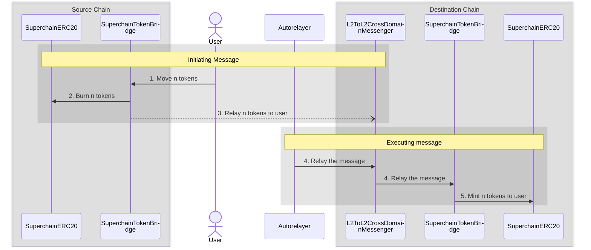

import { Callout } from 'nextra/components'

<Callout>
  The SuperchainERC20 standard is ready for production deployments.
  Please note that the OP Stack interoperability upgrade, required for crosschain messaging, is currently still in active development.
</Callout>

<Callout>
SuperchainERC20s can be deployed on any chain, but will only be interoperable within the [Superchain interop cluster](/stack/interop/explainer#superchain-interop-cluster).
</Callout>

# SuperchainERC20

<Callout>
  This tutorial provides a behind the scenes explanation of how `SuperchainERC20` tokens are transferred.

  *   [See the tutorial](tutorials/transfer-superchainERC20) for how your application can transfer `SuperchainERC20` tokens.
  *   For a sample UI that bridges a `SuperchainERC20` token, [see here](https://interop-alpha-app.superchain.tools/).
</Callout>

The [`SuperchainERC20`](https://github.com/ethereum-optimism/optimism/blob/develop/packages/contracts-bedrock/src/L2/SuperchainERC20.sol) contract implements [ERC-7802](https://ethereum-magicians.org/t/erc-7802-crosschain-token-interface/21508) to enable asset interoperability within the Superchain.

Asset interoperability allows tokens to move securely across the Superchain by burning tokens on the source chain and minting an equivalent amount on the destination chain. This approach addresses issues such as liquidity fragmentation and poor user experiences caused by asset wrapping or reliance on liquidity pools.

Instead of wrapping assets, this mechanism effectively "teleports" tokens between chains in the Superchain. It provides users with a secure and capital-efficient method for transacting across chains.

Additional features:

*   **Simplified deployments**: Zero infrastructure cost to make your token cross-chain.
    Provides a consistent, unified implementation for tokens across all Superchain-compatible networks and a common cross-chain interface for the EVM ecosystem at large.
*   **Common standard**: Implements [ERC-7802](https://eips.ethereum.org/EIPS/eip-7802), a unified interface that can be used across all of Ethereum to enable cross-chain mint/burn functionality.

## How it works

[`SuperchainERC20`](https://github.com/ethereum-optimism/optimism/blob/develop/packages/contracts-bedrock/src/L2/SuperchainERC20.sol) and [`SuperchainTokenBridge`](https://github.com/ethereum-optimism/optimism/blob/develop/packages/contracts-bedrock/src/L2/SuperchainTokenBridge.sol) work together to allow ERC-20 tokens to be transferred from one chain to the other.

The initiating message burns tokens on the source chain.
The executing message then mints them on the destination chain.

#### Initiating message (source chain)

1.  The user (or a contract) calls [`SuperchainTokenBridge.sendERC20`](https://github.com/ethereum-optimism/optimism/blob/develop/packages/contracts-bedrock/src/L2/SuperchainTokenBridge.sol#L52-L78).

2.  The token bridge calls [`SuperchainERC20.crosschainBurn`](https://github.com/ethereum-optimism/optimism/blob/develop/packages/contracts-bedrock/src/L2/SuperchainERC20.sol#L37-L46) to burn those tokens on the source chain.

3.  The source token bridge calls [`SuperchainTokenBridge.relayERC20`](https://github.com/ethereum-optimism/optimism/blob/develop/packages/contracts-bedrock/src/L2/SuperchainTokenBridge.sol#L80-L97) on the destination token bridge.
    This call is relayed using [`L2ToL2CrossDomainMessenger`](./message-passing).
    The call is *initiated* here, by emitting an initiating message. 
    It will be executed later, after the destination chain receives an executing message to [`L2ToL2CrossDomainMessenger`](./message-passing).

#### Executing message (destination chain)

4.  The autorelayer (or the user, or any offchain entity) sends an executing message to [`L2ToL2CrossDomainMessenger`](./message-passing) to relay the message.

5.  The destination token bridge calls [`SuperchainERC20.crosschainMint`](https://github.com/ethereum-optimism/optimism/blob/develop/packages/contracts-bedrock/src/L2/SuperchainERC20.sol#L26-L35) to mint tokens for the user/contract that called `SuperchainTokenBridge.sendERC20` originally.

## Requirements

Application developers must complete two steps to make their tokens compatible with `SuperchainERC20`.
Setting this up in advance ensures tokens will benefit from interop when it becomes available.

*   Grant permission to `SuperchainTokenBridge` (address `0x4200000000000000000000000000000000000028`) to call `crosschainMint` and `crosschainBurn`.
    If you are using [`SuperchainERC20`](https://github.com/ethereum-optimism/optimism/blob/develop/packages/contracts-bedrock/src/L2/SuperchainERC20.sol) this is already done for you.

    {/* 

      Add this after the tutorial is written

      For detailed, step-by-step instructions on implementing SuperchainERC20, refer to [Deploy assets using SuperchainERC20](/stack/interop/tutorials/deploy-superchain-erc20).

      */}

*   Deploy the `SuperchainERC20` at the same address on every chain in the Superchain where you want your token to be available. If you do not deploy the contract to a specific destination chain, users will be unable to successfully move their tokens to that chain. 

<Callout type="warning">
  To ensure security, you must either design the deployer to allow only a specific trusted ERC-20 contract, such as `SuperchainERC20`, to be deployed through it, or call `CREATE2` to deploy the contract directly from an EOA you control.

  This precaution is critical because if an unauthorized ERC-20 contract is deployed at the same address on any Superchain network, it could allow malicious actors to mint unlimited tokens and bridge them to the network where the original ERC-20 contract resides.
</Callout>

## Next steps

*   Deploy a [SuperchainERC20](/stack/interop/tutorials/deploy-superchain-erc20) to the Superchain.
*   Learn about [other token standards that can benefit from Superchain interop](/stack/interop/compatible-tokens).
*   Learn how to [modify an existing ERC20 contract](/stack/interop/tutorials/custom-superchain-erc20) to make it interoperable within the Superchain.
