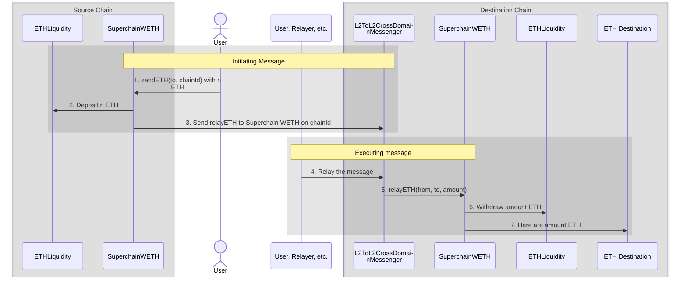

import { Callout } from 'nextra/components'

import { InteropCallout } from '@/components/WipCallout'

<InteropCallout />

# Interoperable ETH

InteroperableETH is implemented using the [`SuperchainWETH`](https://github.com/ethereum-optimism/optimism/blob/develop/packages/contracts-bedrock/src/L2/SuperchainWETH.sol) contract, along with[`ETHLiquidity`](https://github.com/ethereum-optimism/optimism/blob/develop/packages/contracts-bedrock/src/L2/ETHLiquidity.sol), and [`L2ToL2CrossDomainMessenger`](https://github.com/ethereum-optimism/optimism/blob/develop/packages/contracts-bedrock/src/L2/L2ToL2CrossDomainMessenger.sol) to enable ETH interoperability within the Superchain.
IteroperableETH works by depositing ETH on the source chain's `ETHLiquidity` and withdrawing an equivalent amount on the destination chain.
This approach addresses issues such as liquidity fragmentation and poor user experiences caused by asset wrapping or reliance on liquidity pools.

## Features and benefits

*   Enables seamless ETH transfers across different chains in the Superchain
*   Maintains fungibility of ETH across the Superchain
*   Provides liquidity for cross-chain transactions
*   Improves user experience by abstracting complex bridging processes

## How it works

#### Initiating message

1.  The user (or a contract operating on a user's behalf) calls `SuperchainWETH.sendETH` with a destination address and a chainId.
    This call should have an attached amount of ETH.

2.  `SuperchainWETH` sends the amount of ETH to `ETHLiquidity`, removing it from circulation on the source chain.

3.  `SuperchainWETH` on the source chain sends a [`relayETH`](https://github.com/ethereum-optimism/optimism/blob/develop/packages/contracts-bedrock/src/L2/SuperchainWETH.sol#L125-L145) call to the `SuperchainWETH` on the destination chain using [`L2ToL2CrossDomainMessenger`](./message-passing).

#### Executing message

4.  Some offchain entity submits a transaction with the executing message.
    Any address can submit such a transaction, but it has to have ETH on the destination chain to do so.
    We expect that in many cases this will be a relayer rather than the user, because the user won't have ETH on the destination chain yet.

5.  `L2ToL2CrossDomainMessenger` on the destination chain calls `SuperchainWETH` with the source of the ETH, the destination address, and the amount.

    `SuperchainWETH` runs several sanity checks:

    *   The `relayETH` call has to come directly from `L2ToL2CrossDomainMessenger`.
    *   The introp message has to have been sent by `SuperchainWETH`

6.  `SuperchainWETH` withdraws the requested amount of ETH from `ETHLiquidity`.
    It is the only contract allowed to withdraw from `ETHLiquidity`, which adds to the ETH in circulation on the destination chain.

7.  `SuperchainWETH` uses [`SafeSend`](https://github.com/ethereum-optimism/optimism/blob/develop/packages/contracts-bedrock/src/universal/SafeSend.sol) to send the ETH.
    This means that even if the destination is a smart contract, its custom logic does not get called, [in contrast to normal ETH transfers](https://docs.base.org/base-learn/docs/address-and-payable/#receiving-ether-with-payable-addresses).

## Next steps

*   Explore [the `SuperchainWETH` specs](https://specs.optimism.io/interop/superchain-weth.html) for in-depth implementation details.
*   Read the [interop message passing](./message-passing) page for more information about how `L2ToL2CrossDomainMessenger` passes messages.
