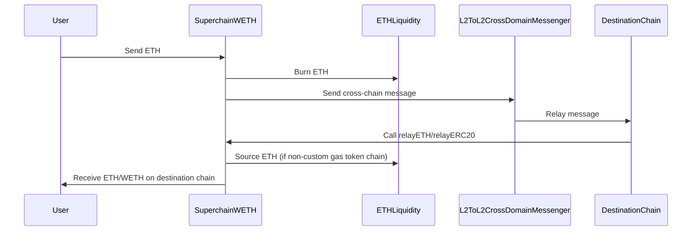

import { Callout } from 'nextra/components'

# SuperchainWETH (Interoperable ETH)

<Callout>
  Interop is currently in active development and not yet ready for production use. The information provided here may change. Check back regularly for the most up-to-date information.
</Callout>

Superchain WETH or Interoperable ETH is a specialized version of the standard WETH (Wrapped Ether) contract designed to enable seamless movement of ETH across the Superchain. It addresses the liquidity constraints and usability issues that arise when transferring ETH between different chains.

## Features and benefits

*   Enables seamless ETH transfers across different chains in the Superchain
*   Maintains fungibility of ETH across the Superchain
*   Provides liquidity for cross-chain transactions
*   Improves user experience by abstracting complex bridging processes

## How it works

Superchain WETH (Interoperable ETH) facilitates secure movement of ETH across the Superchain via `crosschainBurn` and `crosschainMint`.

*   **`crosschainBurn`**: Facilitates cross-chain transfers by **burning** WETH. The cross-chain message is created using the `SendERC20` function on `SuperchainTokenBridge`. 
    *   In the deposit step, the user sends their ETH to the `SuperchainWETH` contract, which calls the deposit function on `SuperchainWETH`. This results in the user being given the amount of `SuperchainWETH` equivalent to the amount of ETH they sent (this step is also known as "wrapping" your ETH). 
    *   After depositing, the user can call `SuperchainTokenBridge#SendERC20` to transfer any amount of `SuperchainWETH` (within their SuperchainWETH balance) to a recipient on the destination chain.
    *   In `SendERC20`, the `SuperchainTokenBridge` calls `crosschainBurn` and sends a cross-chain message via the `L2ToL2CrossDomainMessenger` to the destination chain. 
*   **`crosschainMint`**: Mints WETH on the destination chain after a cross-chain transfer. User first receives WETH then will need to unwrap to standard ETH through a manual call or more automatically using a wrapper contract. After the cross-chain message is processed on the destination chain, `crosschainMint` is called which provides the recipient with `SuperchainWETH` on the destination chain. If the destination is a non-custom gas token chain, ETH is sourced from the `ETHLiquidity` contract.

<Callout type="warning">
  `crosschainBurn` and `crosschainMint`can only be called by the `SuperchainTokenBridge`.
</Callout>

This diagram illustrates the process where the user sends ETH to the `SuperchainWETH` contract which burns the ETH and sends a cross-chain message to the destination chain, enabling seamless cross-chain ETH transfers without the need for asset wrapping.

## Major components

### `SuperchainWETH` Contract

This contract implements the core functionality for wrapping, unwrapping, and cross-chain transfer of ETH. It integrates with the `SuperchainTokenBridge` for interoperable actions. 
*   Contract address: `0x4200000000000000000000000000000000000024`

### `ETHLiquidity` Contract

A predeploy contract with a large pool of ETH that provides liquidity for cross-chain transfers. It allows "burning" and "minting" of ETH for cross-chain transfers. ETH is associated with bridge ETH from the L1 lockbox, making ETH available to interop chains through a shared lockbox rather than fragemented amongst the existing portal contracts.
*   Contract address: `0x4200000000000000000000000000000000000025`

### `L2ToL2CrossDomainMessenger` Contract

This predeploy contract facilitates general message passing between different chains in the Superchain. It also securely transfers ERC20 tokens between L2 chains. 
*   Contract address: `0x4200000000000000000000000000000000000023`

<Callout type="info">
  `SuperchainWETH` implements strict access controls to ensure security (e.g., only `SuperchainWETH` can call `ETHLiquidity` functions).
</Callout>

## Next steps

*   Explore the [`SuperchainWETH`](https://specs.optimism.io/interop/superchain-weth.html) specs for in-depth implementation details.
*   Review the [Superchain Interop Explainer](explainer) for answers to common questions about interoperability.
