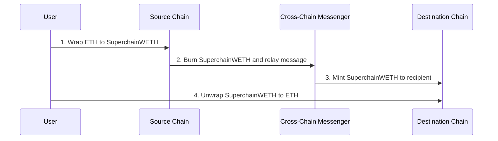

import { Callout } from 'nextra/components'

# SuperchainWETH (Interoperable ETH)

<Callout>
  Interop is currently in active development and not yet ready for production use. The information provided here may change. Check back regularly for the most up-to-date information.
</Callout>

Superchain WETH or Interoperable ETH is a specialized version of the standard WETH (Wrapped Ether) contract designed to enable seamless movement of ETH across the Superchain. It addresses the liquidity constraints and usability issues that arise when transferring ETH between different chains.

## Features and benefits

*   Enables seamless ETH transfers across different chains in the Superchain
*   Maintains fungibility of ETH across the Superchain
*   Provides liquidity for cross-chain transactions
*   Improves user experience by abstracting complex bridging processes

<Callout>
  The `SuperchainTokenBridge` can only rebalance assets across chains. It cannot mint or increase/decrease the total circulating supply.
</Callout>

## How it works

Currently, L2-to-L2 ETH transfers between two interoperable chains require four separate transactions:

1.  Wrap `ETH` to `SuperchainWETH`.
2.  Call `SuperchainTokenBridge#SendERC20` to burn `SuperchainWETH` on source chain and relay a message to the destination chain that mints `SuperchainWETH` to the recipient (`crosschainBurn` is used).
3.  Execute the message on the destination chain, triggering `SuperchainTokenBridge#RelayERC20` to mint `SuperchainWETH` to the recipient (`crosschainMint` is used). If the destination is a non-custom gas token chain, ETH is sourced from the `ETHLiquidity` contract.
4.  Unwrap the received `SuperchainWETH` to `ETH`.

<Callout type="info">
Abstraction is a possible future consideration to reduce this process to two transactions, which can be followed in the [design docs](https://github.com/ethereum-optimism/design-docs/pull/146/files).
</Callout>

_Figure 1: Superchain WETH transfer process between two interoperable L2 chains._

<Callout type="warning">
  `crosschainBurn` and `crosschainMint`can only be called by the `SuperchainTokenBridge`. 
</Callout>

## Major components

### `SuperchainWETH` contract

This contract implements the core functionality for wrapping, unwrapping, and cross-chain transfer of ETH. It integrates with the `SuperchainTokenBridge` for interoperable actions.

*   Contract address: `0x4200000000000000000000000000000000000024`

### `ETHLiquidity` contract

A predeploy contract with a large pool of ETH that provides liquidity for cross-chain transfers. It allows "burning" and "minting" of ETH for cross-chain transfers. ETH is associated with bridge ETH from the L1 lockbox, making ETH available to interop chains through a shared lockbox rather than fragmented amongst the existing portal contracts.

*   Contract address: `0x4200000000000000000000000000000000000025`

### `L2ToL2CrossDomainMessenger` contract

This predeploy contract facilitates general message passing between different chains in the Superchain. It also securely transfers ERC20 tokens between L2 chains.

*   Contract address: `0x4200000000000000000000000000000000000023`

<Callout type="info">
  `SuperchainWETH` implements strict access controls to ensure security (e.g., only `SuperchainWETH` can call `ETHLiquidity` functions).
</Callout>

## Next steps

*   Explore the [`SuperchainWETH`](https://specs.optimism.io/interop/superchain-weth.html) specs for in-depth implementation details.
*   Review the [Superchain Interop Explainer](explainer) for answers to common questions about interoperability.
