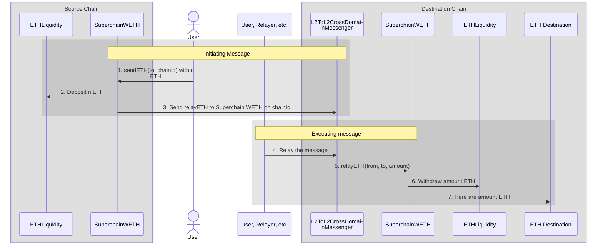

import { Callout } from 'nextra/components'

import { InteropCallout } from '@/components/WipCallout'

<InteropCallout />

# Interoperable ETH

InteroperableETH is implemented using three contracts:

*   [`SuperchainWETH`](https://github.com/ethereum-optimism/optimism/blob/develop/contracts-bedrock/src/L2/SuperchainWETH.sol) is the bridge that lets you move ETH from one Superchain blockchain to another.
*   [`ETHLiquidity`](https://github.com/ethereum-optimism/optimism/blob/develop/packages/contracts-bedrock/src/L2/ETHLiquidity.sol), which serves as a liquidity provider for ETH transfers.
    It is used by `SuperchainWETH` as a liquidity repository to be able to provide ETH on the destination chain when transferring.
*   [`L2ToL2CrossDomainMessenger`](https://github.com/ethereum-optimism/optimism/blob/develop/packages/contracts-bedrock/src/L2/L2ToL2CrossDomainMessenger.sol) is used to [pass messages between different chains](./message-passing).

InteroperableETH works by depositing ETH on the source chain's `ETHLiquidity` and withdrawing an equivalent amount on the destination chain.
This approach addresses issues such as liquidity fragmentation and poor user experiences caused by asset wrapping or reliance on liquidity pools.

## Features and benefits

*   Enables seamless ETH transfers across different chains in the Superchain
*   Maintains fungibility of ETH across the Superchain
*   Provides liquidity for cross-chain transactions
*   Improves user experience by abstracting complex bridging processes

## How it works

#### Initiating message

1.  The user (or a contract operating on a user's behalf) calls `SuperchainWETH.sendETH` with a destination address and a chainId.
    This call should have an attached amount of ETH.

2.  `SuperchainWETH` sends the amount of ETH to `ETHLiquidity`, removing it from circulation on the source chain.

3.  `SuperchainWETH` on the source chain sends a [`relayETH`](https://github.com/ethereum-optimism/optimism/blob/develop/packages/contracts-bedrock/src/L2/SuperchainWETH.sol#L125-L145) call to the `SuperchainWETH` on the destination chain using [`L2ToL2CrossDomainMessenger`](./message-passing).

#### Executing message

4.  Some offchain entity submits a transaction with the executing message.
    Any address can submit such a transaction, but it has to have ETH on the destination chain to do so.
    We expect that usually this will be a relayer rather than the user because the user won't have ETH on the destination chain yet.

5.  `L2ToL2CrossDomainMessenger` on the destination chain calls `SuperchainWETH` with the source of the ETH, the destination address, and the amount.

    `SuperchainWETH` runs several sanity checks:

    *   The `relayETH` call has to come directly from `L2ToL2CrossDomainMessenger`.
    *   The interop message has to have been sent by `SuperchainWETH`

6.  `SuperchainWETH` withdraws the requested amount of ETH from `ETHLiquidity`.
    It is the only contract allowed to withdraw from `ETHLiquidity`, which adds to the ETH in circulation on the destination chain.

7.  `SuperchainWETH` uses [`SafeSend`](https://github.com/ethereum-optimism/optimism/blob/develop/packages/contracts-bedrock/src/universal/SafeSend.sol) to send the ETH.
    This means that even if the destination is a smart contract, its custom logic does not get called, [in contrast to normal ETH transfers](https://docs.base.org/base-learn/docs/address-and-payable/#receiving-ether-with-payable-addresses).

## L1 Treasury

Every ETH in circulation on the Superchain (all the ETH except for those held by `ETHLiquidity`) needs to be backed by ETH held on L1.
This is done using a lockbox contract on L1 that holds all the ETH ever bridged to [chains in the Superchain interop cluster](explainer#superchain-interop-cluster) and not yet withdrawn.
New ETH can only be minted on L2 when it is locked on L1, and it is burned on L2 before it can be released from the lockbox.

Here is an example of how this works.

| Step | User on L1 | Lockbox | User on chain A | ETHLiquidity on chain A | User on chain B | ETHLiquidity on chain B |
| ---: | ---------: | ------: | --------------: | ----------------------: | --------------: | ----------------------: |
|    1 |          7 |     200 |               0 |                  100000 |               0 |                  100000 |
|    2 |          4 |     203 |               3 |                  100000 |               0 |                  100000 |
|    3 |          4 |     203 |               2 |                  100001 |               0 |                  100000 |
|    4 |          4 |     203 |               2 |                  100001 |               1 |                   99999 |
|    5 |          4 |     203 |               2 |                  100001 |               0 |                   99999 |
|    6 |          5 |     202 |               2 |                  100001 |               0 |                   99999 |

1.  The initial state. The user has 7 ETH on L1, and nothing on chains A and B.

2.  The user bridges 3 ETH to chain A.
    The user sends 3 ETH on L1 to the bridge, which is locked in the lockbox.
    The bridge on chain A then mints 3 ETH for the user.

3.  The user sent the initiating message to `SuperchainWETH` on chain A, along with 1 ETH to bridge to chain B.
    This 1 ETH is sent to `ETHLiquidity` on chain A.

4.  Somebody (the user, a relayer action on behalf of the user, etc.) sent the corresponding executing message to chain B.
    `SuperchainWETH` transfers 1 ETH from `ETHLiquidity` on chain B to the user.

5.  The user decides to withdraw 1 ETH from chain B back into L1.
    Normally, a user would do this through a third-party bridge, which is faster and usually cheaper, but for illustration purposes this user uses the standard OP bridge.
    The user starts with an initiating message on chain B, which burns 1 ETH and sends a message to L1.

6.  After the week long [challenge period](/connect/resources/glossary#challenge-period), the user finalizes the withdrawal on L1.
    The lock box releases 1 ETH, which is then sent to the user.

## Next steps

*   Explore [the `SuperchainWETH` specs](https://specs.optimism.io/interop/superchain-weth.html) for in-depth implementation details.
*   Read the [interop message passing](./message-passing) page for more information about how `L2ToL2CrossDomainMessenger` passes messages.
