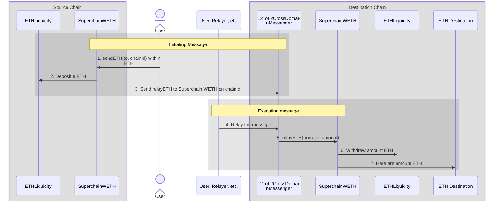

import { Callout } from 'nextra/components'

import { InteropCallout } from '@/components/WipCallout'

<InteropCallout />

# Superchain ETH

<Callout>
  This is an explanation of how interop ETH works.
  You can find a step by step tutorial [here](tutorials/bridge-crosschain-eth).
</Callout>

InteroperableETH enables seamless ETH transfers across Superchain blockchains. It is implemented using three key contracts:

*   [`SuperchainWETH`](https://github.com/ethereum-optimism/optimism/blob/develop/packages/contracts-bedrock/src/L2/SuperchainWETH.sol): A bridge contract that facilitates ETH transfers between Superchain blockchains.
*   [`ETHLiquidity`](https://github.com/ethereum-optimism/optimism/blob/develop/packages/contracts-bedrock/src/L2/ETHLiquidity.sol): A liquidity provider for ETH transfers. 
`SuperchainWETH` uses this contract as a liquidity repository to ensure ETH availability on the destination chain.
*   [`L2ToL2CrossDomainMessenger`](https://github.com/ethereum-optimism/optimism/blob/develop/packages/contracts-bedrock/src/L2/L2ToL2CrossDomainMessenger.sol): A messaging contract that [facilitates cross-chain communication](/stack/interop/message-passing).

Superchain ETH deposits ETH into the `ETHLiquidity` contract on the source chain and withdraws an equivalent amount on the destination chain. 
This mechanism improves capital efficiency and eliminates liquidity fragmentation and poor user experiences caused by asset wrapping or reliance on liquidity pools.

## Features and benefits

*   Enables seamless ETH transfers across different chains in the Superchain interop cluster 
*   Maintains fungibility of ETH across the Superchain interop cluster 
*   Provides liquidity for cross-chain transactions
*   Improves user experience by abstracting complex bridging processes

## How it works

#### Initiating message

1.  The user (or a contract operating on a user's behalf) calls `SuperchainWETH.sendETH` with a destination address and a chainId.
    ETH, in the amount to transfer must be attached to this call.

2.  `SuperchainWETH` transfers the specified ETH amount to `ETHLiquidity`, removing it from circulation on the source chain.

3.  `SuperchainWETH` on the source chain sends a [`relayETH`](https://github.com/ethereum-optimism/optimism/blob/develop/packages/contracts-bedrock/src/L2/SuperchainWETH.sol#L125-L145) message to `SuperchainWETH` on the destination chain using the [`L2ToL2CrossDomainMessenger`](/stack/interop/message-passing).

#### Executing message

4.  An off-chain entity submits a transaction to execute the message.
    Any address can submit this transaction, but it must have ETH on the destination chain.
    Typically, this would be the chain's autorelayer.

5.  `L2ToL2CrossDomainMessenger` on the destination chain calls `SuperchainWETH` with the following details:

    *   Source of the ETH
    *   Destination address
    *   Amount of ETH

    `SuperchainWETH` performs several sanity checks:

    *   The `relayETH` call must originate from `L2ToL2CrossDomainMessenger`.
    *   The interop message must have been sent by `SuperchainWETH`

6.  `SuperchainWETH` withdraws the specified amount of ETH from `ETHLiquidity`.
    Only `SuperchainWETH` can withdraw from `ETHLiquidity`, ensuring that the ETH is correctly reintroduced into circulation on the destination chain.

7.  `SuperchainWETH` uses [`SafeSend`](https://github.com/ethereum-optimism/optimism/blob/develop/packages/contracts-bedrock/src/universal/SafeSend.sol) to send ETH.
    This ensures that even if the destination is a smart contract, its custom logic is not executed.
This behavior differs from [standard ETH transfers](https://docs.base.org/learn/address-and-payable/address-and-payable#receiving-ether-with-payable-addresses), where smart contracts can trigger custom logic upon receiving ETH.

## L1 Treasury

Every ETH in circulation on the Superchain—excluding ETH held by `ETHLiquidity`—must be backed by ETH on L1.

This is enforced by a lockbox contract on L1, which holds all ETH bridged to [Superchain interop cluster chains](/stack/interop/explainer#superchain-interop-cluster) that has not yet been withdrawn.
New ETH can only be minted on L2 when it is locked on L1, and it is burned on L2 before it can be released from the lockbox.

Here is an example of how this works.

| Step | User on L1 | Lockbox | User on chain A | ETHLiquidity on chain A | User on chain B | ETHLiquidity on chain B |
| ---: | ---------: | ------: | --------------: | ----------------------: | --------------: | ----------------------: |
|    1 |          7 |     200 |               0 |                  100000 |               0 |                  100000 |
|    2 |          4 |     203 |               3 |                  100000 |               0 |                  100000 |
|    3 |          4 |     203 |               2 |                  100001 |               0 |                  100000 |
|    4 |          4 |     203 |               2 |                  100001 |               1 |                   99999 |
|    5 |          4 |     203 |               2 |                  100001 |               0 |                   99999 |
|    6 |          5 |     202 |               2 |                  100001 |               0 |                   99999 |

1.  The initial state. The user has 7 ETH on L1, and nothing on chains A and B.

2.  The user bridges 3 ETH to chain A.
    The user sends 3 ETH on L1 to the bridge, which is locked in the lockbox.
    The bridge on chain A then mints 3 ETH for the user.

3.  The user sent the initiating message to `SuperchainWETH` on chain A, along with 1 ETH to bridge to chain B.
    This 1 ETH is sent to `ETHLiquidity` on chain A.

4.  Somebody (the user, a relayer action on behalf of the user, etc.) sent the corresponding executing message to chain B.
    `SuperchainWETH` transfers 1 ETH from `ETHLiquidity` on chain B to the user.

5.  The user decides to withdraw 1 ETH from chain B back into L1.
    Normally, a user would do this through a third-party bridge, which is faster and usually cheaper, but for illustration purposes this user uses the standard OP bridge.
    The user starts with an initiating message on chain B, which burns 1 ETH and sends a message to L1.

6.  After the week long [challenge period](/connect/resources/glossary#challenge-period), the user finalizes the withdrawal on L1.
    The lock box releases 1 ETH, which is then sent to the user.

## Next steps

*   Build a [revolutionary app](/app-developers/get-started) that uses multiple blockchains within the Superchain.
*   Learn about [SuperchainERC20](/stack/interop/superchain-erc20).
*   Practice [transferring ETH across chains using Superchain interop](/stack/interop/tutorials/bridge-crosschain-eth).
