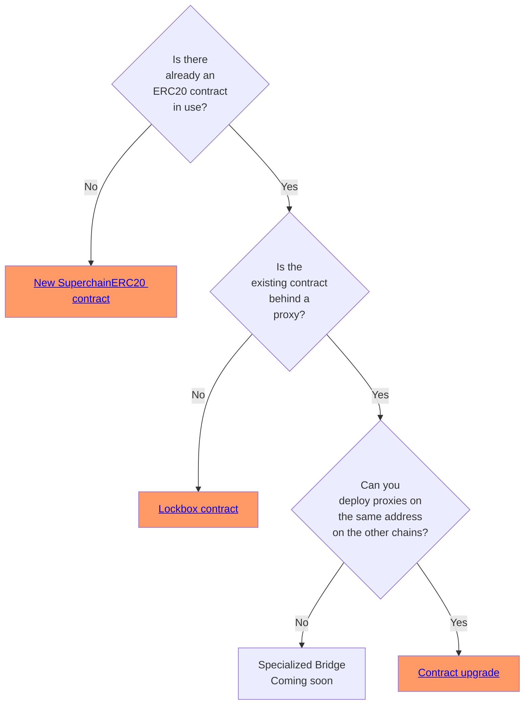

import { Callout } from 'nextra/components'
import { Steps } from 'nextra/components'

<Callout>
  The SuperchainERC20 standard is ready for production deployments.
  Please note that the OP Stack interoperability upgrade, required for crosschain messaging, is currently still in active development.
</Callout>

# Upgrading ERC20 to SuperchainERC20

## Overview

This guide explains how to upgrade an ERC20 to a [`SuperchainERC20`](https://github.com/ethereum-optimism/optimism/blob/develop/packages/contracts-bedrock/src/L2/SuperchainERC20.sol) that can teleport across the [Superchain interop cluster](/stack/interop/explainer#superchain-interop-cluster) using the [`SuperchainTokenBridge`](https://github.com/ethereum-optimism/optimism/blob/develop/packages/contracts-bedrock/src/L2/SuperchainTokenBridge.sol) contract. For more information on how it works, [see the explainer](/stack/interop/superchain-erc20).

<Callout type="warning">
  The code on the documentation site is sample code, *not* production code.
  This means that we ran it, and it works as advertised.
  However, it did not pass through the rigorous audit process that most Optimism code undergoes.
  You're welcome to use it, but if you need it for production purposes you should get it audited first.
</Callout>

{/* 

I put this warning here, when we don't have it on most pages, because this tutorial
has, IMHO, code that is a lot more likely to be used in production. It doesn't just
show what is possible, it does the exact job needed.

*/}

There are several ways to upgrade an existing ERC20 for interop, depending on the exact circumstances. Click any of the green rectangles for directions.

## Next steps

*   Deploy a [SuperchainERC20](./deploy-superchain-erc20) to the Superchain
*   [Learn more about SuperchainERC20](/stack/interop/superchain-erc20)
*   Build a [revolutionary app](/app-developers/get-started) that uses multiple blockchains within the Superchain
