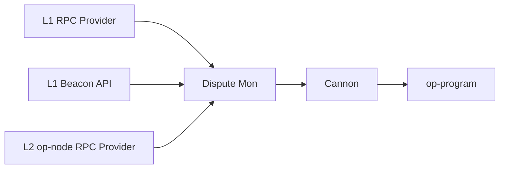

import { Callout } from 'nextra/components'
import Image from 'next/image'

# OP-Challenger Explainer

The `op-challenger` operates as the *honest actor* in the fault dispute system and defends the chain by securing the `OptimismPortal` and ensuring the game will always resolve to the correct state of the chain. For verifying the legitimacy of claims, `op-challenger` relies on a synced, trusted rollup node as well as a trace provider (e.g., [Cannon](/stack/protocol/fault-proofs/cannon)).

Specifically, `op-challenger` performs the following actions:

*   monitors and interacts with dispute games
*   defends valid output root proposals
*   challenges invalid output root proposals
*   assists `op-proposer` by resolving claims and games once chess clocks expire
*   claims paid out bonds for both the challenger and proposer

## Architecture

<Callout>
  The `cannon` and `op-program` executables are run in the `op-challenger` docker container as sub-processes when required to generate game trace data.
</Callout>

## Fault Detection Responses

`op-challenger` makes a decision on each claim in each game and decides whether to counter it or not based on it's view of the validity of the claim. An honest challenger uses this basic logic:

1.  If the trusted node agrees with the output, `op-challenger` takes no action. An honest challenger does nothing because there are no claims it disagrees with. It continues to monitor the game in case someone posts a counter claim to the valid root claim, in which case the challenger will participate in the game to defend the proposal.
2.  If the trusted node disagrees, `op-challenger` creates a new dispute game. In contrast to the above, an honest challenger aims to delete any output roots that its trusted node disagrees with in order to claim the bond attached to it. The honest challenger assumes that their rollup node is synced to the canonical state and that the fault proof program is correct, so it is willing to put its money on the line to counter any faults.

## Fault Dispute Game Responses

`op-challenger` determines which claims to counter by iterating through the claims in the order they are stored in the contract. This ordering ensures that a claim's ancestors are processed prior to the claim itself. For each claim, the honest challenger determines and tracks the set of honest responses to all claims, regardless of whether that response already exists in the full game state.

### Root Claim

The root claim is considered to be an honest claim if and only if it has a [state witness Hash](https://specs.optimism.io/fault-proof/stage-one/fault-dispute-game.html#claims) that agrees with the honest challenger's state witness hash for the root claim.

### Counter Claims

When a new claim is made in a dispute game, the honest challenger processes it and performs a response. The honest challenger should counter a claim if and only if:

1.  The claim is a child of a claim in the set of honest responses
2.  The set of honest responses, contains a sibling to the claim with a trace index greater than or equal to the claim's trace index

<Callout>
  This implies the honest challenger never counters its own claim, since there is at most one honest counter to each claim, so an honest claim never has an honest sibling.
</Callout>

### Possible Moves

A move is a challenge against an existing claim and must include an alternate claim asserting a different trace. The honest challenger must first decide if it should counter the existing claim or if it should ignore it. It can wind up ignoring claims either because it agrees with them or because responding to that claim could lead it to have a "poisoned prestate" where it's implicitly agreeing to something false.

Then, once the honest challenger decides to move, it has these options:

*   **Attack** if it sees the value of the claim as incorrect
*   **Defend** if the value is correct; it's effectively disagreeing with the claim position
*   **Step** based on the game depth; steps can be attack or defend steps too, and it's the same contract method that gets called

<Callout type="warning">
  See the [specs](https://specs.optimism.io/fault-proof/stage-one/honest-challenger-fdg.html) for the full scope of the honest actor algorithm.
</Callout>

 

<Image src="/img/op-stack/protocol/challenger-moves.png" alt="Challenger Moves flow" width={700} height={600} />

## Resolution

When one side of a `FaultDisputeGame`'s chess clock runs out, the honest challenger's responsibility is to resolve each claim in the game by calling the `resolveClaim` function on the `FaultDisputeGame` contract. Once the root claim's subgame is resolved, the challenger then finally calls the `resolve` function to resolve the entire game.

The `FaultDisputeGame` does not put a time cap on resolution - because of the liveness assumption on honest challengers and the bonds attached to the claims they've countered,  challengers are economically incentivized to resolve the game promptly in order to make their funds liquid again and capture their reward(s).

## Next Steps

*   Ready to get started? Read our guide on how to [configure op-challenger on your OP Stack chain](/builders/chain-operators/features/op-challenger).
*   For more info about how `op-challenger` works under the hood, [check out the specs](https://specs.optimism.io/fault-proof/stage-one/honest-challenger-fdg.html).

## FAQs

### If I don't have a blob archiver with access to historical data, can I lose the game?

Most likely, yes. If nobody has access to the historical data. All the honest actors work together without needing to coordinate offense because they're all trying to play the same moves. So, if you're the only honest actor and you don't have a blob archiver and you get pushed down to the bottom half of the game (\~ 32 claims deep in the game), then you would just see errors coming out of the challenger and wouldn't be able to respond without the blob archiver. You'd have 3.5 days on your side of the game to fix the problem by switching to a beacon node that does have blobs, and then you'll be able to carry on as usual.

Note: You would only be pushed down to the bottom half of the game if the block being disputed is older than the blob retention period (\~18 days).  If valid proposals are resolving regularly, this is not possible because each valid proposal becomes the starting point for newly created dispute games. So if there are regular valid proposals, you're normally only disputing \~3.5 days worth of blocks which is well within the retention period.

### How many CPUs should I run for challenger to work efficiently?

The default value for `--max-concurrency`will work for most chain operators. However, if you are seeing challenger progress too slowly, you might need to increase `--max-concurrency` , and if you're seeing challenger sending too many concurrent requests, then reduce `--max-concurrency`.

For example, you might want to increase `--max-concurrency`, if you have a small number of CPUs by default because most of the time you won't actually need to run Cannon, so it's actually reasonable to put Challenger on quite a small box and it'll be fine. But then, if challenger starts having to execute Cannon, you need to respond and scale up and give more CPUs. Increasing `--max-concurrency` will also allow challenger to be making requests your L1 in parallel. Otherwise, it'll be quite slow to iterate through every game. 
Alternatively, you might want to reduce `--max-concurrency` if you have a lot of CPUs, and you find that challenger is flooding the L1 with concurrent requests.

### How much ETH do you need to challenge in a game?

The honest challengers need to have more combined ETH than the attacker, or they may run out of funds and be unable to respond to games (requiring the security overrides to be used to protect funds). So, there's no strict amount you need to have, but here are some general guidelines you can use to estimate.

*   Generally speaking: a minimum to play 1 game = bond amount \* game max depth + gas costs for each move
*   To play one game all the way down to the final step call in a single "chain" costs just over 631.2 ETH in total, so about 315.6 ETH per "side".

### What is the bond? What is the bond's role in the FP system?

Each *claim* pays a bond, including the root claim created when the game is created (thus the bond is paid when the game is created). Every time you post a new claim to the game you have to pay an additional bond based on the depth of the claim you're posting. You don't have to prepay bonds (i.e., its not like staking). Instead, you just send the bond amount as the value of the transaction when calling `attack` or `defend` on `FaultDisputeGame` or calling `create` on `DisputeGameFactory`.

Claims that are found to be correct have their bonds refunded. Claims that are found to be incorrect have their bonds paid to the account that posted the left-most uncountered child claim of the incorrect claim. The important point there is really just that the bond for invalid claims is paid to whoever successfully counters the claim, but its setup so that the bond is only ever paid to a single person and never shared.

*   There is a delay on claiming bonds of 7 days after the claim is resolved.
*   The 7 day period restarts each time a new bond from that game is paid to the same user. Typically this means that bonds are claimable 7 days after the game is resolved.

For reference, you can find the size of bond required for each depth in the game in [Bond Amounts](https://www.notion.so/Bond-Amounts-49453c2789d640179422355b2d6a824a?pvs=21).  The calculation for them is hard coded in the [`FaultDisputeGame` contract](https://github.com/ethereum-optimism/optimism/blob/547ea72d9849e13ce169fd31df0f9197651b3f86/packages/contracts-bedrock/src/dispute/DisputeGameFactory.sol#L99-L100).

### How much ETH is required for the challenger bond?

The dispute game factory has the bond value set. To ensure correct game outcomes, the combined funding of all honest actors must be more than the funding available to an attacker. Otherwise the attacker can just post so many claims that the honest actors run out of funds and can no longer counter them. There isn't a fixed amount that guarantees this, so chain operators should have significant funds available at short notice to respond to claims.

Given the guardian can intervene and reallocate bond payments if needed, attackers who try to outspend the honest actors are guaranteed to lose their funds because the guardian will just intervene and pay all their bonds to the honest actors which is a very strong disincentive against trying to win games by outspending people.

