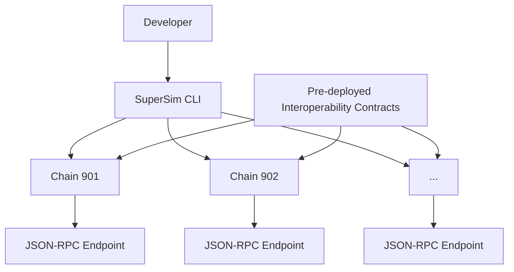

import { Callout } from 'nextra/components'

# SuperSim Explainer

<Callout>
  Interop is currently in active development and not yet ready for production use. The information provided here may change, so we recommend checking back regularly for the most up-to-date information.
</Callout>

[SuperSim](https://github.com/ethereum-optimism/supersim) is a local development environment tool designed to simulate the Optimism Superchain for developers building multi-chain applications. It provides a simplified way to test and develop applications that interact with multiple chains within the Superchain ecosystem.

## SuperSim Workflow

This diagram illustrates the typical workflow for developers using SuperSim, from writing smart contracts to testing and refining cross-chain interactions.

## Features and Benefits

*   Simulates multiple OP Stack chains locally (e.g., chain 901, 902)
*   Supports testing of cross-chain messaging and interactions
*   Includes pre-deployed interoperability contracts
*   Offers a CLI interface for starting and managing SuperSim instances
*   Provides JSON-RPC endpoints for each simulated chain
*   Allows for custom configuration of chain parameters
*   Facilitates testing of Superchain-specific features like SupERC20 tokens
*   Integration with common Ethereum development tools (e.g., Hardhat, Foundry)

## SuperSim CLI Interaction

This diagram illustrates how developers interact with SuperSim through the CLI, which then manages multiple simulated chains, each with its own JSON-RPC endpoint and pre-deployed interoperability contracts.

## Next Steps

*   Check out the dedicated [SuperSim docs](https://supersim.pages.dev/) for tutorials and specific use cases.
*   Questions about Interop? Check out the FAQ section in the [Superchain Interop Explainer](/stack/protocol/interop/explainer#faqs) or check out this [Superchain interop design video walk-thru](https://www.youtube.com/watch?v=FKc5RgjtGes).
*   For more info about how Superchain interoperability works under the hood, [check out the specs](https://specs.optimism.io/interop/overview.html).
