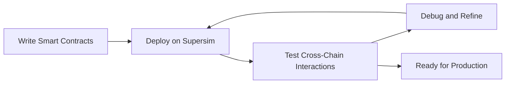
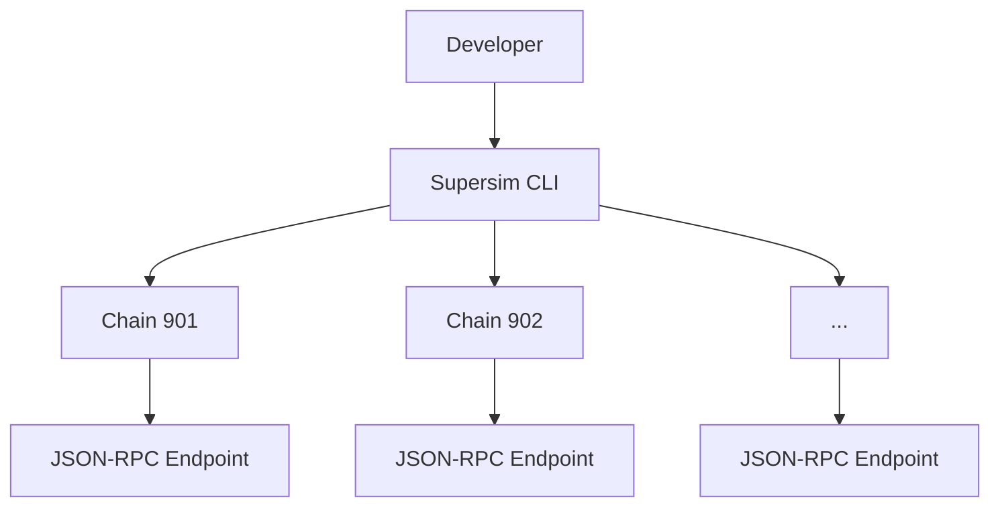

import { Callout } from 'nextra/components'

# Supersim multichain development environment

<Callout>
  Interop is currently in active development and not yet ready for production use. The information provided here may change. Check back regularly for the most up-to-date information.
</Callout>

[Supersim](https://github.com/ethereum-optimism/Supersim) is a local development environment tool designed to simulate the Optimism Superchain for developers building multi-chain applications. It provides a simplified way to test and develop applications that interact with multiple chains within the Superchain ecosystem.

## Supersim workflow

This diagram illustrates the typical workflow for developers using Supersim, from writing smart contracts to testing and refining cross-chain interactions.

## Features and benefits

*   Simulates multiple OP Stack chains locally (e.g., chain 901, 902)
*   Supports testing of cross-chain messaging and interactions
*   Includes pre-deployed interoperability contracts
*   Offers a CLI interface for starting and managing Supersim instances
*   Provides local JSON-RPC endpoints for each simulated chain
*   Allows for custom configuration of chain parameters
*   Facilitates testing of Superchain-specific features like SuperchainERC20 tokens
*   Easy to use with common Ethereum development tools 
*   Supports chain forking

## Supersim CLI interaction

This diagram illustrates how developers interact with Supersim through the CLI, which simulates OP Stack specific features (specifically interop) on locally run chains, each with its own JSON-RPC endpoint and pre-deployed interoperability contracts.

## Next steps

*   Check out the dedicated [Supersim docs](https://Supersim.pages.dev/) for tutorials and specific use cases.
*   Questions about Interop? Check out the FAQ section in the [Superchain Interop Explainer](/stack/protocol/interop/explainer#faqs) or check out this [Superchain interop design video walk-thru](https://www.youtube.com/watch?v=FKc5RgjtGes).
*   For more info about how Superchain interoperability works under the hood, [check out the specs](https://specs.optimism.io/interop/overview.html).
