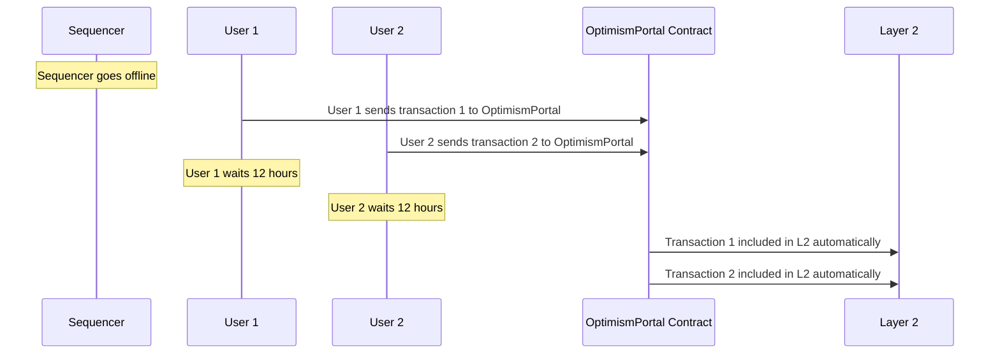
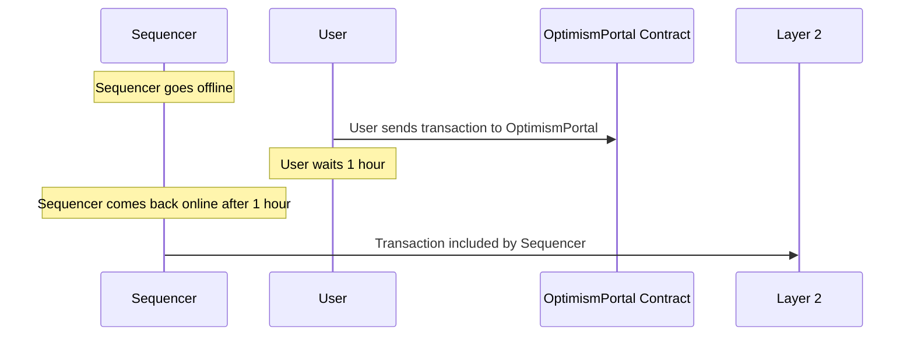
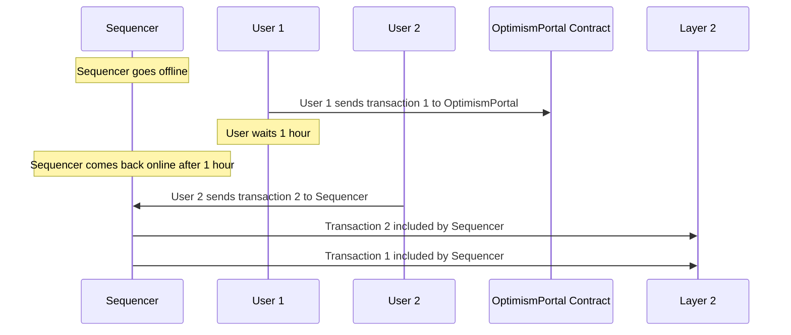

# Sequencer outages

All OP Stack chains have a Sequencer that can receive, order, and publish L2 transactions to L1.
Like any software system, a Sequencer could potentially become unavailable for any number of different reasons.
It's important to be aware of the implications of a Sequencer outage and how you can be prepared for it.

Sequencer outages can broadly be categorized into two different types:

1.  **Sequencer Downtime Outages** occur when the Sequencer is entirely unable to receive and/or process L2 transactions from users. Outages of this type will appear to users as a complete inability to submit transactions to the Sequencer.
1.  **Transaction Submission Outages** occur when the Sequencer is still able to receive and process L2 transactions from users but is unable to publish these transactions to L1. Outages of this type generally do not impact users unless they remain unresolved for an extended period of time.

Both outage types can be circumvented by submitting transactions directly to the [`OptimismPortal`](https://github.com/ethereum-optimism/optimism/blob/111f3f3a3a2881899662e53e0f1b2f845b188a38/packages/contracts-bedrock/src/L1/OptimismPortal.sol#L209) contract on L1 with certain important caveats.
Keep reading to learn more about these potential outages and how to handle them.

## Sequencer downtime outages

### Description

Sequencer downtime outages occur when the Sequencer is unable to receive and/or process L2 transactions from users.
Outages of this type may be caused by any number of different issues, including bugs in client software, cloud outages, or other similar errors.
Exact causes of Sequencer downtime outages can be dependent on the specific infrastructure used to run the Sequencer for any given OP Stack chain.

### Impact

Sequencer downtime outages can have a significant impact on the user experience.
During an outage of this type, users will be unable to submit transactions directly to the Sequencer.
Users may observe that the network appears to be "stuck" at a particular block height.

### Mitigation

Users can always bypass the Sequencer by sending L2 transactions directly to the [`OptimismPortal`](https://github.com/ethereum-optimism/optimism/blob/111f3f3a3a2881899662e53e0f1b2f845b188a38/packages/contracts-bedrock/src/L1/OptimismPortal.sol#L209) contract on L1.
Refer to the [Bypassing the Sequencer](#bypassing-the-sequencer) section below for more information about this functionality.

## Transaction submission outages

### Description

Transaction submission outages occur when the Sequencer is still able to receive and process L2 transactions from users but is unable to publish these transactions to L1.
Outages of this type may be caused by any number of different issues including unexpected L1 network conditions, bugs in transaction submission software, or other similar errors.

### Impact

Transaction submission outages generally do not have a significant impact on the user experience unless they remain unresolved for an extended period of time.
During an outage of this type, users will be able to submit transactions directly to the Sequencer but the blocks including these transactions will not be published to L1.
Users may observe that the "safe" and "finalized" block heights of the L2 chain appear to remain stuck while the "unsafe" block height continues to increase.

Transaction submission outages can cause a more significant impact if they remain unresolved.
Crucially, L2 transactions sent directly to the Sequencer must be published within a certain amount of time after they are included in an L2 block by the Sequencer.
If this time limit is exceeded, the L2 chain must be reorganized to include these transactions in a later block.
This can appear to users as a large change in the expected state of the L2 chain.

### Mitigation

Users can always bypass the Sequencer by sending L2 transactions directly to the [`OptimismPortal`](https://github.com/ethereum-optimism/optimism/blob/111f3f3a3a2881899662e53e0f1b2f845b188a38/packages/contracts-bedrock/src/L1/OptimismPortal.sol#L209) contract on L1.
Refer to the [Bypassing the Sequencer](#bypassing-the-sequencer) section for more information about this functionality.

## Bypassing the sequencer

A core security goal of OP Stack chains is that the Sequencer should not be able to prevent users from submitting transactions to the L2 chain.
Users of OP Stack chains can always bypass the sequencer and include transactions in the L2 chain by sending their L2 transactions directly to the [`OptimismPortal`](https://github.com/ethereum-optimism/optimism/blob/111f3f3a3a2881899662e53e0f1b2f845b188a38/packages/contracts-bedrock/src/L1/OptimismPortal.sol#L209) contract on L1.

### About the OptimismPortal

The `OptimismPortal` contract is an L1 smart contract that can be used by both smart contracts and EOAs to create L2 transactions without the direct involvement of the Sequencer.
Many users already interact with this contract indirectly when they bridge ETH or other tokens between L1 and L2 via the Standard Bridge system available on all OP Stack chains.

The `OptimismPortal` contract is currently a unique contract for each OP Stack chain.
Refer to the contract addresses page for your OP Stack chain to find the address of the `OptimismPortal` contract.
L2 transactions can be triggered on L1 by calling the `depositTransaction` function on the `OptimismPortal` contract.

### Capabilities

Users can send any type of L2 transaction to the `OptimismPortal` contract including contract creations and transactions that carry ETH value.
As a security measure, transactions sent via the `OptimismPortal` are indistinguishable from transactions sent via the Sequencer from the perspective of smart contracts on L2.

### Address aliasing

Transactions triggered via the `OptimismPortal` contract will appear to have been sent by the L1 address that triggered the transaction **unless** the transaction was sent by a smart contract.
L2 transactions sent by smart contracts via the `OptimismPortal` contract will appear to have been sent by an "aliased" version of the smart contract's address.
Refer to the [address aliasing](/stack/differences#address-aliasing) explainer for more information about address aliasing.

### Inclusion rules

Transactions sent to the `OptimismPortal` contract are processed according to a set of rules designed to limit the impact of a failed Sequencer.
It's important to understand these rules in detail to properly mitigate the effects of an outage.

For all transactions sent to the `OptimismPortal`:

1.  Transactions sent within a specific L1 block are processed together.
2.  Transactions are given a timestamp no more than [`max_sequencer_drift`](https://specs.optimism.io/protocol/derivation.html#overview) in the future.
3.  Transactions are processed in the order they are received.
4.  Transactions are processed within the [`sequencer_window`](https://specs.optimism.io/glossary.html#sequencing-window).

In practice, this means that transactions sent to the `OptimismPortal` contract will always be processed in the order they are received and within a maximum delay of the `sequencer_window` (set to 12 hours by default but may differ from chain to chain).
If the Sequencer is unavailable or transactions are not published to L1 within this `sequencer_window`, OP Stack chains will automatically reorganize themselves to guarantee that these transactions are included in the L2 chain.

Refer to the [L2 Chain Derivation Specification](https://specs.optimism.io/protocol/derivation.html) for a much more detailed explanation of how transactions sent to the `OptimismPortal` contract are processed.

### Inclusion scenarios

It can be helpful to understand how transactions sent to the `OptimismPortal` contract are processed in different scenarios.
The following scenarios make different assumptions about the state of the Sequencer and the L2 chain to illustrate how transactions sent to the `OptimismPortal` contract are processed.

#### Total sequencer outage

In this scenario we'll assume that the Sequencer is completely unavailable and unable to process any transactions.
Users must send transactions directly to the `OptimismPortal` contract to have them included in the L2 chain.
We'll also assume that the `sequencer_window` has been set to 12 hours.
Here, two users are sending transactions to the `OptimismPortal` contract.

Observe how the transactions sent by both users are included in the L2 chain automatically after the `sequencer_window` has elapsed.
The transactions are included in the L2 chain in the order they were received by the `OptimismPortal` contract.

#### Partial sequencer outage

In this scenario we'll assume that the Sequencer is down for some period of time but comes back online before the `sequencer_window` has elapsed.
A user sends a transaction to the `OptimismPortal` during the downtime and but the Sequencer comes back online and includes the transaction in an L2 block before the full `sequencer_window` ends.

#### Partial outage ordering

Here we'll again assume that the Sequencer is down for some period of time but comes back online before the `sequencer_window` has elapsed.
In this scenario, we'll observe the ability that the Sequencer has to include additional transactions in the L2 chain in between transactions sent to the `OptimismPortal` contract.

Here, even though the first user sends their transaction to the `OptimismPortal` contract before the second user sends their transaction to the Sequencer, the Sequencer is able to include the second user's transaction before the first user's transaction is included.
**Sequencers will typically choose to include transactions sent to the `OptimismPortal` contract before any other transactions but this is not guaranteed.**

