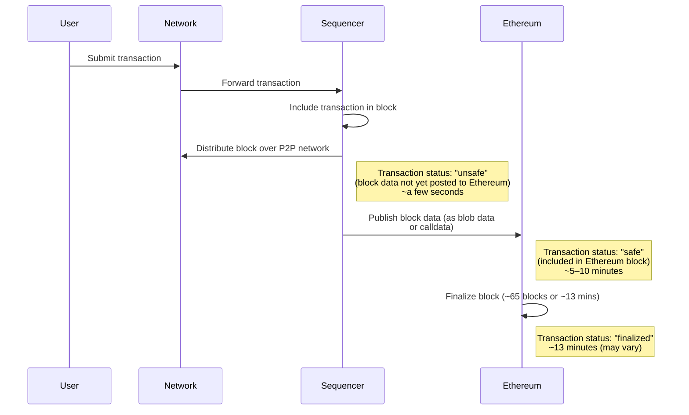

import Image from 'next/image'
import { Callout } from 'nextra/components'

# Transaction finality

This guide explains when transactions on OP Stack chains are considered finalized and addresses common misconceptions about transaction finality on the OP Stack.

## Basics of finality

Transaction finality refers to the point at which a transaction becomes irreversible under certain assumptions. For example, Ethereum transactions are considered finalized when specific conditions in Ethereum's consensus mechanism are met. Many applications built on Ethereum rely on this property when making decisions, such as crediting a user's account after they deposit funds.

## OP Stack finality

OP Stack chains in the standard configuration are Rollups that use Ethereum's consensus mechanism to order and finalize transactions rather than running a separate consensus protocol. Therefore, OP Stack chains inherit Ethereum's ordering and finality properties.

## Steps to finality

Transactions on OP Stack chains go through the following process to reach finality:

1.  A user submits a transaction to the network, which forwards it to the Sequencer.
2.  The Sequencer includes the transaction in a block and distributes it over a public peer-to-peer network. At this point, the transaction is considered **"unsafe"** - a technical term indicating that the transaction is in a block but its data has not yet been posted to Ethereum. This process typically takes a few seconds from transaction submission.
3.  The Sequencer publishes this block's data to Ethereum, either as [blob data](https://www.eip4844.com/) or as calldata attached to a standard Ethereum transaction. Once included in an Ethereum block, the transaction is considered **"safe"**. This step usually takes 5–10 minutes from transaction submission.
4.  The Ethereum block containing the Sequencer's transaction is finalized. At this point, the transaction reaches a **"finalized"** state. Ethereum finalization typically takes about 2 epochs (approximately 12.8 minutes from transaction submission) under normal network conditions, but may take longer during adverse conditions. Finality depends entirely on [Ethereum's consensus mechanism](https://ethereum.org/en/developers/docs/consensus-mechanisms/pos/#finality).

## Common misconceptions

### Transactions take 7 days to finalize

A common misconception is that transactions on OP Stack chains take 7 days to finalize. **This is incorrect.** Transactions on OP Stack chains become finalized when their data is included in a finalized Ethereum block, typically around 20–30 minutes after submission. To reorg a finalized OP Stack chain transaction, a reorg of the corresponding Ethereum block would be required.

This misconception often arises due to the OP Stack's Standard Bridge, which includes a 7-day delay on *withdrawals* of ETH and ERC-20 tokens. Withdrawing tokens from an OP Stack chain to Ethereum using the Standard Bridge requires a minimum 7-day wait. This delay affects only withdrawals through the Standard Bridge and does not impact transaction finality on the OP Stack chain.

### Challenges in the Standard Bridge can cause a chain reorg

Another misconception related to the belief that [finalization takes 7 days](#misconception-transactions-take-7-days-to-finalize) is that **Fault Proof challenges** created in response to withdrawals in the Standard Bridge can reorganize the OP Stack chain. **This is incorrect.** OP Stack transactions are not reorganized in response to Fault Proof challenges.

The [Standard Bridge](/app-developers/bridging/standard-bridge) is a bridge application that is included by default with any OP Stack chain and connects the chain to its "parent" blockchain (usually Ethereum). It offers a high level of security for ETH and ERC-20 tokens moved through the bridge.

When using the Standard Bridge, users who send ETH or ERC-20 tokens to Ethereum must first burn those tokens on the OP Stack chain and then create a **withdrawal claim** on Ethereum.

Because the Standard Bridge cannot immediately verify withdrawal claims, it delays the claim by 7 days to allow the OP Stack Fault Proof system to filter out any invalid claims. Challenges only remove bad claims without affecting the Standard Bridge or the OP Stack chain.

### The Sequencer can always reorg the chain

A common misconception is that the Sequencer can trigger reorganizations of the OP Stack chain at any time. However, while the Sequencer can reorganize **"unsafe"** blocks (not yet published to Ethereum), reorganizations become more challenging once blocks are **"safe"** and become effectively impossible once blocks are **"finalized."**

*   **Unsafe blocks:** The Sequencer can reorganize these blocks (typically within \~5–10 minutes).
*   **Safe blocks:** The Sequencer would need to trigger a reorg on Ethereum itself, which is complex and unlikely.
*   **Finalized blocks:** Once blocks are included in a finalized Ethereum block (typically after \~15–30 minutes), the Sequencer cannot reorganize them without compromising Ethereum's finality guarantees.

### Ethereum reorgs cause OP Stack chain reorgs

If Ethereum experiences a reorg, OP Stack chains will attempt a graceful recovery. OP Stack nodes will downgrade **"safe"** transactions to **"unsafe"** if needed, while the Sequencer republishes transaction data to maintain chain continuity. Although extreme Ethereum network conditions could potentially affect the OP Stack chain, **"finalized"** OP Stack transactions are protected from reorgs.

## Conclusion

Transaction finality on the OP Stack is simpler than it may seem. OP Stack chains inherit Ethereum's finality guarantees, so once a transaction is **"finalized,"** it cannot be reversed.
